# websearch 技术详细设计文档

> 版本 1.0.0 · 五运行时真实搜索引擎 · parrot 引擎完整能力演示应用

---

## 1. 项目定位

`apps/websearch` 是一个**面向真实互联网的搜索引擎**，同时是 **parrot 引擎全能力范围的
演示项目**：它像一个真实的搜索公司一样，把「搜集、调度、分词索引、检索服务」拆分为四
个独立服务，每个服务落在最适合其负载特征的运行时上，由 parrot 统一组网、部署、通信。

与 `apps/crawler-lab`（合成页·回归基线）的区别：

| 维度 | crawler-lab | websearch |
|---|---|---|
| 数据源 | 合成页面（内存生成） | 真实互联网 HTTPS 爬取 |
| URL 形态 | docId 压缩（u32） | 任意长度真实 URL 字符串 |
| 持久化 | 无（进程态） | 段文件落盘（重启回放） |
| 索引内容 | 英文合成词 | 中英文混合（jieba 分词） |
| 用户接口 | CLI 断言 | 浏览器百度式页面 |
| 运行形态 | 一次性场景 | 常驻服务（可独立运行检索） |

---

## 2. 总体架构

### 2.1 架构图

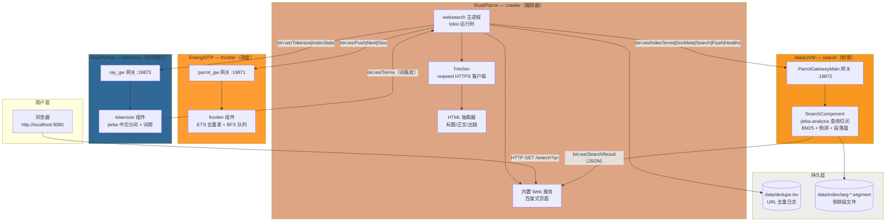

### 2.2 职责切分逻辑（为什么这么拆）

| 服务 | 运行时 | 为什么是这个运行时 |
|---|---|---|
| URL Frontier | Erlang/OTP | 去重（ETS set O(1)）+ BFS 队列（ordered_set 首 N 即 BFS 序）——海量轻量状态操作的天然形态 |
| 漫爬 worker | Rust/Parrot | tokio 异步并发 IO + reqwest rustls HTTPS + 零拷贝 HTML 抽取——高性能网络客户端 |
| 中文分词 | Ray/Python | jieba 原版实现（词典+DAG+Viterbi），CPU 密集且 Python 生态最全——Ray actor 化后天然横向扩展 |
| 检索服务 | Akka/JVM | jieba-analysis（jieba 的成熟 JVM 移植）+ 高并发短查询 ask 模型 + 磁盘段管理 |

**关键洞察**：中文分词选型决定语言分布——jieba 家族（Python 原版 / JVM 移植 / Rust 移植）
是唯一同时覆盖三语言且词典算法一致的开源分词体系，恰好匹配 parrot 的多运行时网关形态。

### 2.3 数据流全景

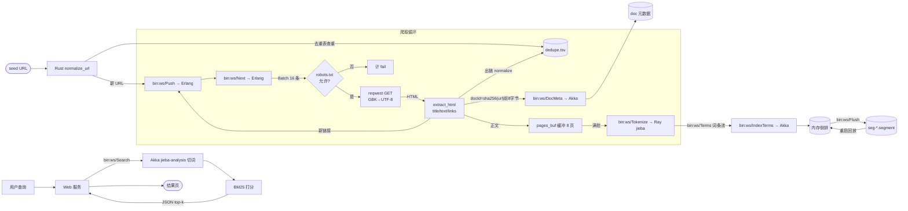

---

## 3. 模块详细设计

### 3.1 Rust 编排器（apps/websearch/src/main.rs）

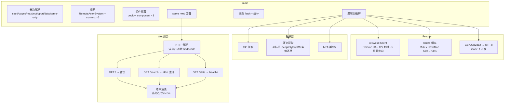

**并发模型**：主循环单线程 tokio 任务——每轮「补批 → 派发 8 并发 spawn → join 全部 →
逐页处理」。同域节流（200ms）经 `host_last` HashMap；节流中的 URL 回队尾，`throttled`
计数防死循环。

**docId 设计**：`sha256(url)[0..8]` → u64 LE。跨重启稳定（URL 相同 → docId 相同），
重爬幂等（倒排 upsert 同 docId 覆盖）。

### 3.2 Erlang Frontier（apps/websearch/erlang/frontier.erl）

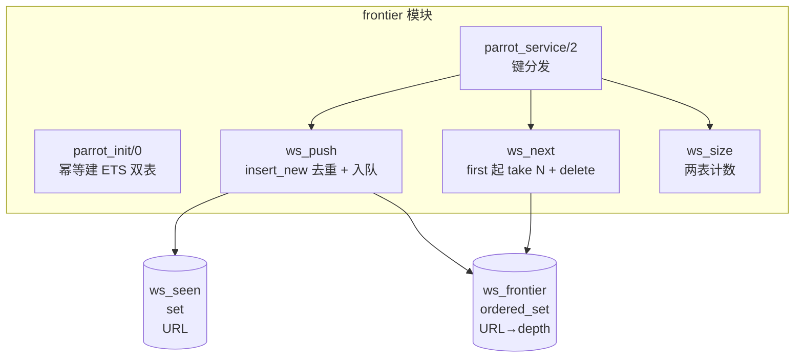

**为什么 ordered_set**：Erlang ordered_set 的 `first/next` 遍历天然有序——BFS 取批就
是「取前 N 条」，无需额外排序结构。去重用独立 set 表 `insert_new`（原子判重）。

**与 crawler-lab 版差异**：URL 是任意长度 binary（真实 URL），无 docId 压缩；depth 用
u16（深网剪枝）。

### 3.3 Ray Tokenizer（apps/websearch/python/tokenizer.py）

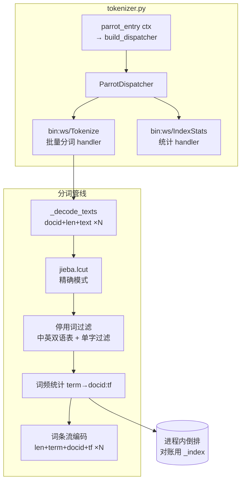

**协议契约**：`bin:ws/Terms` 载荷布局 `[n u32][{len u32|term utf8|docid u64|tf u32}...]`
与 JVM `bin:ws/IndexTerms` **逐字节同构**——Rust 透传零转换（这是开发中实际踩过并修复
的对齐 bug：两侧布局不一致会导致词条乱码）。

**双重职责**：返回词条流给 Rust（→ Akka 建正式倒排）同时维护进程内 `_index`（对账
统计——`bin:ws/IndexStats` 可独立验证分词侧完整性）。

### 3.4 Akka SearchComponent（apps/websearch/jvm/）

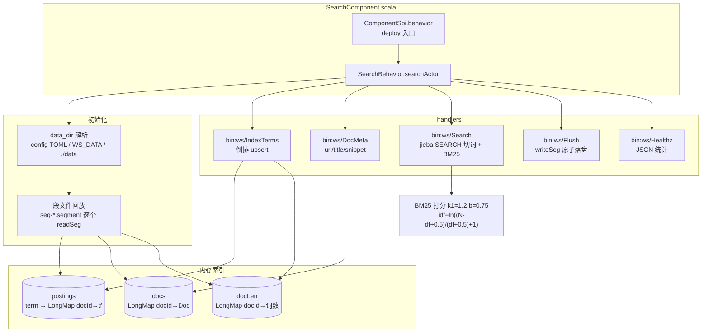

**BM25 公式**（k1=1.2, b=0.75）：

\[
score(t,d) = idf(t) \cdot \frac{tf(t,d) \cdot (k_1+1)}{tf(t,d) + k_1\left(1-b+b\cdot\frac{|d|}{avgdl}\right)}
\]

**段落盘格式**（DataOutputStream 原生）：

```
[docs n i32]
  [{docId i64}{url utf}{title utf}{snippet utf}] × n
[terms n i32]
  [{term utf}{df i32}{docId i64}{tf i32} × df] × n
```

**原子写**：先写 `seg-XXXXX.segment.tmp` → `renameTo` 原子替换——崩溃不产生半段。

**回放幂等**：启动扫 `seg-*.segment` 全量 readSeg 合并——多段叠加 upsert，重启零丢失。

### 3.5 Rust Web 服务（serve_web）

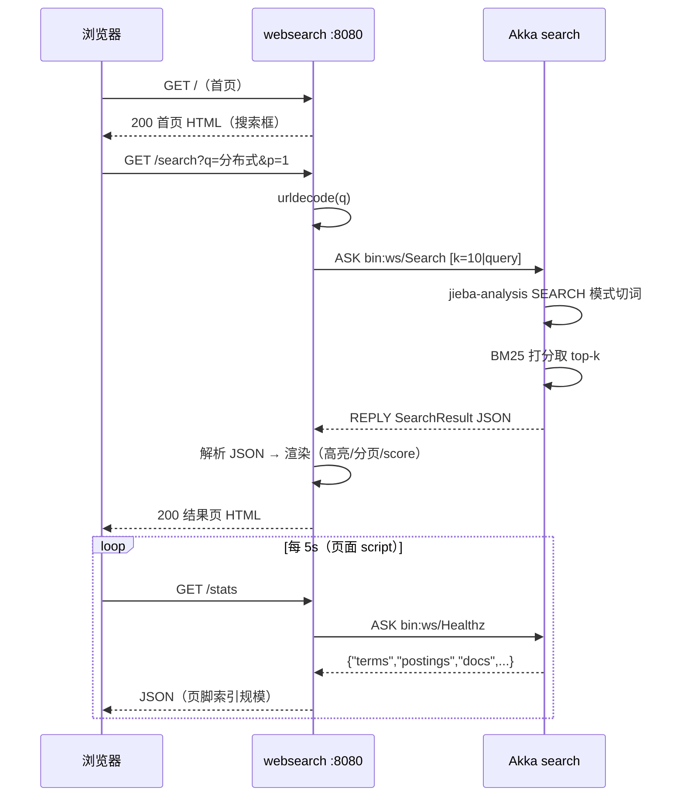

---

## 4. Wire 协议（bin:ws/* 键空间）

### 4.1 全部消息一览

| 键 | 方向 | 载荷布局 | 用途 |
|---|---|---|---|
| `bin:ws/Push` | Rust→Erl | `[n u32][{len u32\|url\|depth u16}...]` | 新 URL 入队 |
| `bin:ws/PushAck` | Erl→Rust | `[n u32]`（队列现存） | 确认 |
| `bin:ws/Next` | Rust→Erl | `[n u32]` | 取批 |
| `bin:ws/Batch` | Erl→Rust | 同 Push 布局 | 批返回 |
| `bin:ws/Size` | Rust→Erl | `[]` | 计数探针 |
| `bin:ws/SizeR` | Erl→Rust | `[pending u32][seen u32]` | 双表计数 |
| `bin:ws/Tokenize` | Rust→Ray | `[n u32][{docid u64\|len u32\|text}...]` | 批量分词 |
| `bin:ws/Terms` | Ray→Rust | `[n u32][{len u32\|term\|docid u64\|tf u32}...]` | 词条流 |
| `bin:ws/IndexStats` | Rust→Ray | `[]` | ray 侧统计 |
| `bin:ws/IndexStatsR` | Ray→Rust | `[terms u32][postings u64]` | 对账 |
| `bin:ws/IndexTerms` | Rust→Akka | 同 Terms 布局 | 建倒排 |
| `bin:ws/IndexAck` | Akka→Rust | `[n u32]` | 确认 |
| `bin:ws/DocMeta` | Rust→Akka | `[docid u64\|len url\|len title\|len text(≤4K)]` | doc 元数据 |
| `bin:ws/DocAck` | Akka→Rust | `[1 u32]` | 确认 |
| `bin:ws/Search` | Rust→Akka | `[k u32\|len u32\|query utf8]` | 查询 |
| `bin:ws/SearchResult` | Akka→Rust | JSON `[{doc,score,url,title,snippet}]` | 结果 |
| `bin:ws/Flush` | Rust→Akka | `[]` | 落盘命令 |
| `bin:ws/FlushAck` | Akka→Rust | `[segs u32]` | 确认 |
| `bin:ws/Healthz` | Rust→Akka | `[]` | 健康统计 |
| `bin:ws/HealthzR` | Akka→Rust | JSON | 统计 |

### 4.2 CodecRegistration（Rust 侧类型系统）

每键一个新类型（wire_msg! 宏），inventory 注册到全局 CodecRegistry——同 TypeId 多键
会互串，所以 `WsPush`/`WsBatch` 等各自独立类型：

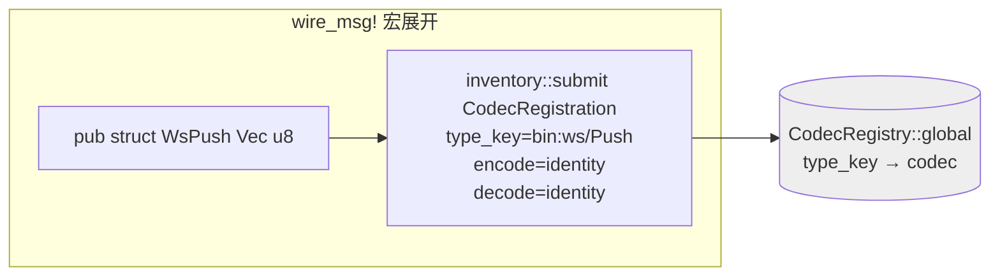

**为什么裸字节**：业务载荷是四方言自定义布局（非 serde 结构）——Rust 侧只做 identity
编解码，真正的布局语义由各组件的编解码函数（`enc_push`/`dec_batch`/...）承担。这样
Rust 编排器不解析词条内容，纯管道。

---

## 5. 关键时序

### 5.1 全链启动时序

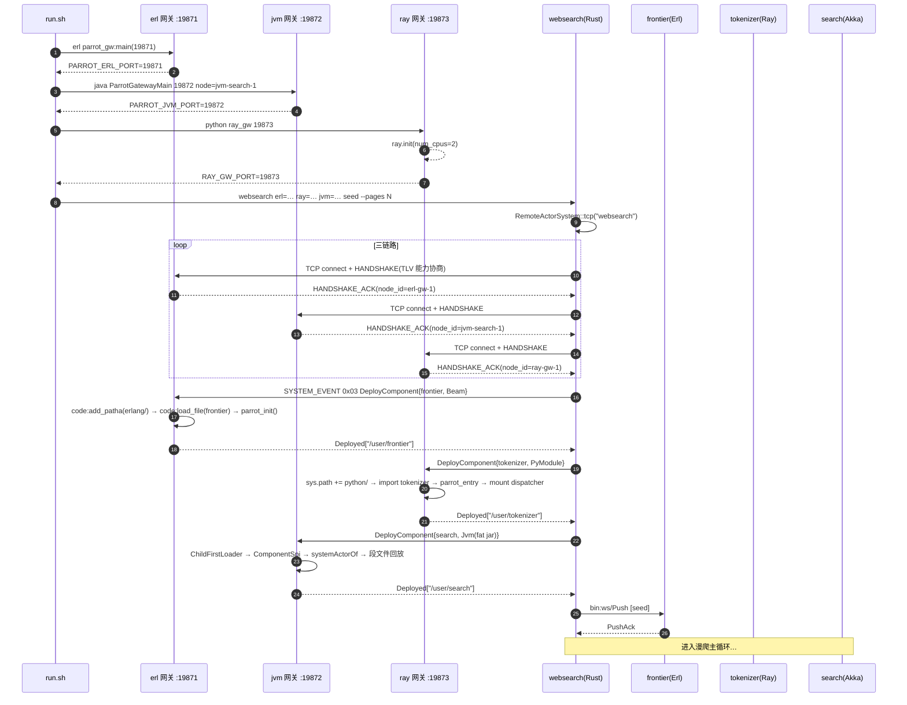

### 5.2 爬取-索引流水线时序（单批 8 页）

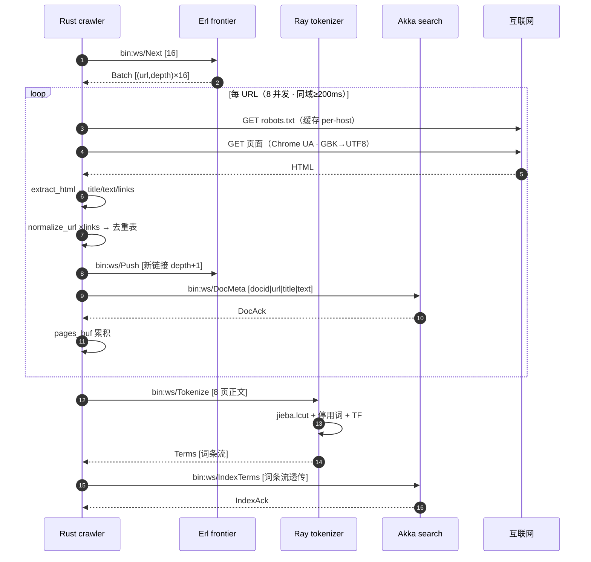

### 5.3 查询时序（浏览器）

见 3.5。

### 5.4 重启回放时序（serve-only 形态）

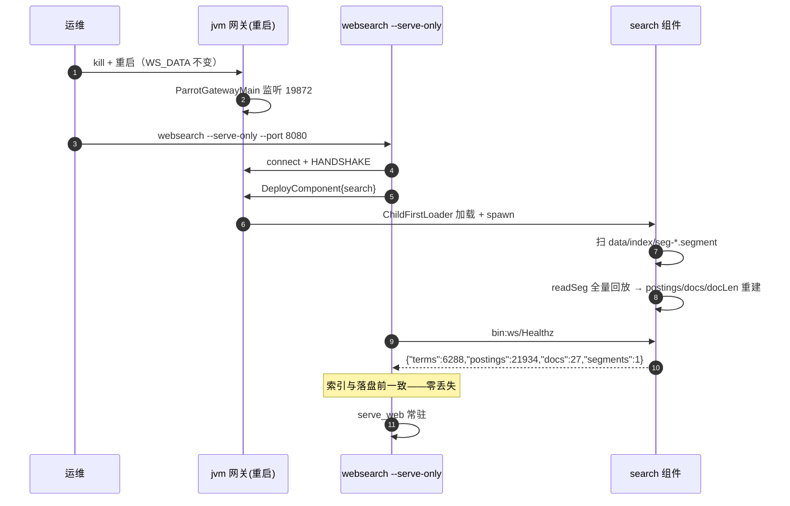

---

## 6. 持久化设计

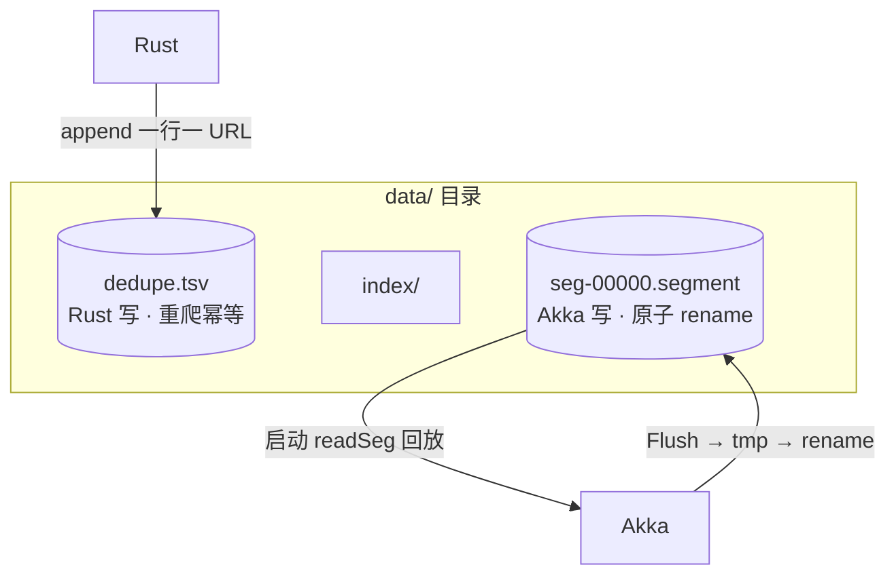

**两层持久化职责**：

- `dedupe.tsv`（Rust 侧）：URL 级去重持久化——重启后重爬不重复入 frontier。为什么放
  Rust 而非 Erlang：去重判定发生在「出链 normalize 之后、Push 之前」，与 frontier 的
  ETS seen 表是两道独立防线（ETS 是 frontier 内部 O(1) 快路径；tsv 是跨进程慢路径）。
- `seg-*.segment`（Akka 侧）：倒排段——检索服务的全部状态。段化（而非单文件）为后续
  多段合并/增量爬留扩展位。

---

## 7. 设计决策记录

| # | 决策 | 备选 | 理由 |
|---|---|---|---|
| 1 | UA 用 Chrome 真实串 | WebSearchLab/1.0 | 多数中文站对非浏览器 UA 返 403（实测） |
| 2 | 分词 jieba 家族三语言 | ansj/HanLP/自研 | 三语言同词典算法、开源成熟、中文效果实证好 |
| 3 | JVM fat jar 打平 jieba | thin jar + lib/ classpath | child-first loader 与 fat jar 自洽；漏 prob_emit.txt 的坑一次修死 |
| 4 | Terms 布局四方言同构 | 各方言自定义 | Rust 零转换透传；曾因布局不一致出词条乱码 |
| 5 | docId=sha256(url)[:8] | 自增 id | 跨重启稳定 + 重爬幂等（upsert 覆盖） |
| 6 | 段文件 DataOutputStream 原生格式 | JSON/protobuf | JVM 侧零依赖读写；readUTF/writeUTF 天然字符串 |
| 7 | robots 缓存在 Fetcher（Mutex HashMap） | 每次现取 | 同 host 大量页面——省 90%+ robots 请求 |
| 8 | Web 服务在 Rust 进程内 | Akka HTTP / nginx | 单二进制交付；检索高并发由 akka 承担，页面渲染轻 |
| 9 | `--serve-only` 独立形态 | 只保留全链 | 检索服务独立运行=用户四分离诉求的直接呈现 |
| 10 | frontier ETS 不持久化 | dets | 去重真源在 Rust tsv——ETS 是会话级快路径 |

---

## 8. 已知边界与反爬现实

- **baike.baidu.com 返回 403**（百度安全验证拦截数据中心/脚本流量——curl 同样被拦）。
  默认种子改用可爬中文站：runoob.com / developer.mozilla.org 中文 / w3school.com.cn /
  oschina.net。应用本身不绕反爬（robots + 礼貌节流是设计约束）。
- Wikipedia / GitHub 当前网络不可达（探测 000）——环境限制非应用问题。
- 单机演示形态：三网关与本机端口绑定（19871/72/73）；多机部署改 `erl=/ray=/jvm=` 参数
  即可（见运维文档）。
