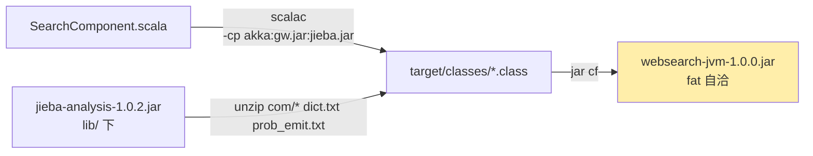
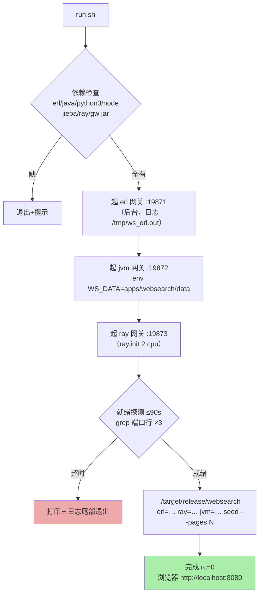
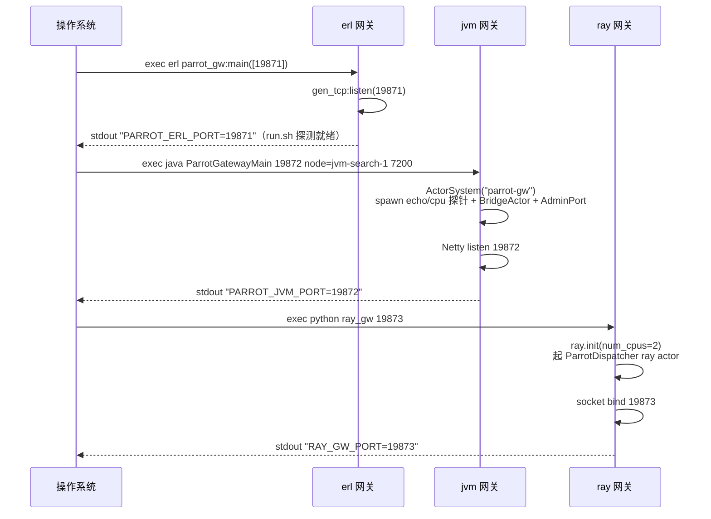
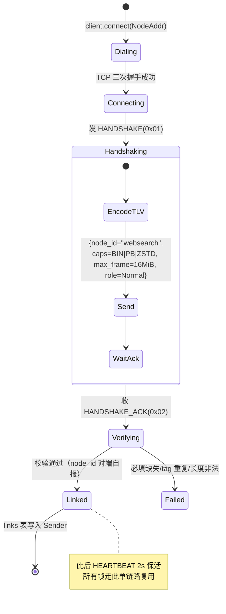
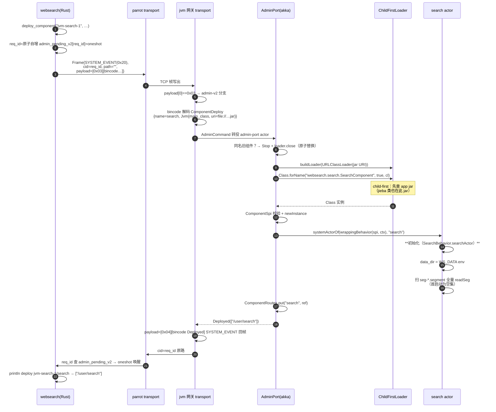
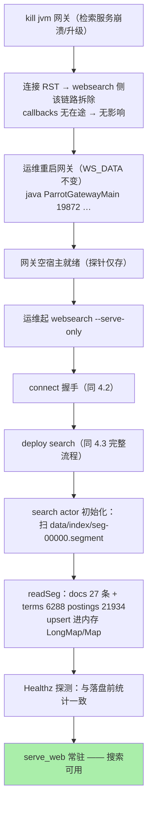

# websearch 运维手册

> 编译 · 部署 · parrot 部署机制的执行过程推演 · 常见故障排查

---

## 1. 环境依赖

| 依赖 | 版本要求 | 检查命令 | 用途 |
|---|---|---|---|
| Rust | stable（cargo） | `cargo --version` | 编排器 + workspace |
| Erlang/OTP | ≥ 24（erl + erlc） | `erl -noshell -eval 'io:format("~s~n",[erlang:system_info(otp_release)]),halt().'` | frontier 网关 + beam 编译 |
| Java | ≥ 11（java + jar） | `java -version` | akka 网关 + scalac 编译 |
| Scala 库 | 2.13.16（~/.m2） | 见 §2.1 依赖检查 | SearchComponent 编译 |
| Python | ≥ 3.9 | `python3 --version` | ray 网关 |
| ray | ≥ 2.0 | `python3 -c "import ray"` | tokenizer 宿主 |
| jieba | ≥ 0.42 | `python3 -c "import jieba"` | 中文分词 |
| iconv | 系统自带 | `iconv --version` | GBK 页面转码 |

一键检查：

```bash
apps/websearch/build.sh   # 内置依赖自检（缺什么提示什么）
```

---

## 2. 编译

### 2.1 全量构建

```bash
cd /path/to/parrot
apps/websearch/build.sh          # 或 build.sh --release（默认 release）
```

构建脚本四步（含产物）：

| 步骤 | 命令 | 产物 |
|---|---|---|
| [1/4] Rust 应用 | `cargo build -p websearch --release` | `target/release/websearch` |
| [2/4] JVM 检索组件 | `apps/websearch/jvm/build.sh` | `jvm/target/websearch-jvm-1.0.0.jar`（fat，2.2MB） |
| [3/4] Erlang frontier | `cd erlang && erlc frontier.erl` | `erlang/frontier.beam` |
| [4/4] 依赖自检 | python jieba/ray 探测 | 输出 ✓/⚠ |

### 2.2 JVM 组件构建细节（fat jar 打包链）



**为什么要 fat**：网关的 ChildFirstLoader 只认 app jar 一个数据源。曾试 thin jar +
外挂 lib classpath → jieba 类找不到。fat jar 把 jieba class + **dict.txt（5MB 词典）+
prob_emit.txt（Viterbi 模型）**全部解包进制品——部署单元零外部依赖。

### 2.3 前置：JVM 网关 jar

```bash
make build-jvm        # 产出 interop/jvm/target/parrot-protocol-jvm-0.1.0.jar + cp.txt
```

---

## 3. 部署与运行

### 3.1 一键全链（单机演示形态）

```bash
cd /path/to/parrot
apps/websearch/run.sh https://www.runoob.com --pages 100 --port 8080
```

run.sh 编排（六步）：



**端口约定**（websearch 用 1987x 段，与 crawler-lab 的 1986x 段错开——两应用可并存）：

| 端口 | 网关 | 启动就绪标志（stdout） |
|---|---|---|
| 19871 | Erlang frontier | `PARROT_ERL_PORT=19871` |
| 19872 | JVM akka search | `PARROT_JVM_PORT=19872` |
| 19873 | Ray tokenizer | `RAY_GW_PORT=19873` |
| 8080 | websearch Web UI（可 --port 改） | `浏览器打开 http://…` |

### 3.2 常驻形态：网关与应用分离

生产形态网关先起（systemd/launchd 托管），应用按需连：

```bash
# 网关侧（长期驻留）
(cd interop/erlang && erl -noshell -pa . -eval 'parrot_gw:main(["19871"])' &)
(cd interop/jvm/target && env WS_DATA=/data/ws java -cp "parrot-protocol-jvm-0.1.0.jar:$(cat cp.txt)" parrot.protocol.jvm.ParrotGatewayMain 19872 node=jvm-search-1 7200 &)
(cd interop/python && env PYTHONPATH=. python3 -m parrot_protocol.ray_gw 19873 &)

# 应用侧（爬取任务，完成即退，Web 服务常驻到 Ctrl-C）
./target/release/websearch \
  erl=10.0.0.1:19871 ray=10.0.0.2:19873 jvm=10.0.0.3:19872 \
  https://site-a.com https://site-b.com \
  --pages 500 --maxdepth 3 --port 80 --data /data/ws
```

多机要点：三网关可分布三机；`erl=/ray=/jvm=` 参数指定地址；`--data` 用共享盘或每检索
节点本地段目录。

### 3.3 仅检索形态（serve-only）

```bash
# 场景：检索服务重启 / 单独提供搜索
./target/release/websearch --serve-only --port 8080 --data apps/websearch/data
```

只连 jvm 网关 + 只部署 search 组件——段文件回放后直接服务（见 §4.4 推演）。

### 3.4 增量重爬

直接再次运行全链命令——`data/dedupe.tsv` 持久去重保证已爬 URL 不重复入队；新发现的
URL 入 frontier；akka 侧 docId（sha256(url)）幂等 upsert。`--data` 指向同一目录即可。

---

## 4. 部署过程的 parrot 机制沙盘推演

本章逐步推演「`run.sh` 起来到浏览器可搜索」之间，parrot 在每一层做了什么。

### 4.1 阶段一：网关自举（无 parrot 控制面参与）

三个网关进程各自独立启动，行为对等：



此刻三个网关是「空宿主」：协议栈在线、探针在位、**没有任何 websearch 业务代码**。

### 4.2 阶段二：组网握手（parrot 传输层）

`websearch` 进程启动后，parrot 传输层为每个网关执行同一握手状态机：



**网关侧对偶逻辑**（以 erl 为例）：accept → 读帧 → `?HANDSHAKE` 分支 → 回
`handshake_ack_body("erl-gw-1")`——对端 node_id 从 ACK 里学得，存连接态。

### 4.3 阶段三：组件部署（parrot admin-v2 执行推演）

websearch 依次发三个 DeployComponent。以 **search 组件（JVM 方言，最复杂）** 为例做
完整沙盘：



**失败推演**（沙盘备选路径）：

| 异常点 | parrot 行为 | websearch 表现 |
|---|---|---|
| jar 路径不存在 | loader 构造抛 → SPAWN_FAILED 0x0A00 | deploy panic 带 detail |
| main_class 不实现 ComponentSpi | 校验抛 → SPAWN_FAILED | 同上 |
| 已 spawn 部分实例后失败 | 回滚循环 stopper()（同族回滚语义） | Deployed 不到达 |
| Beam 发给 jvm 网关 | DIALECT_MISMATCH 0x0A02 | deploy panic |
| 网关 30s 不回 | admin 超时 | Transport("admin v2 timeout 30s") |

Erlang/Ray 方言的部署推演（同构流程，差异点）：

| 步骤 | Erlang frontier | Ray tokenizer |
|---|---|---|
| 制品定位 | `file://erlang/` 目录 add_patha | `file://python/` 目录入 sys.path |
| 加载 | code:purge + load_file（热替换） | importlib + parrot_entry(ctx) |
| 初始化 | parrot_init()（幂等建 ETS） | dispatcher 构建 |
| 特殊 | 无需 spawn（模块即组件） | **mount_module.remote 进 ray actor 进程** |
| 登记 | ADMIN_TAB {Name,Ver,Paths,Module} | 网关 dispatcher.mount + ray actor mounted 链 |

### 4.4 阶段四：业务运转 + 重启回放推演

**爬取期**（见架构文档 5.2 时序）——parrot 视角就是海量 ASK/REPLY 经三条链路复用流动。

**重启回放**（运维最关心的恢复路径）沙盘：



**推演结论**：检索服务恢复 = 网关自举 + 一次 deploy + 段文件回放，全程无手工数据操作；
`dedupe.tsv` 在 Rust 侧同理保障重爬幂等。**数据零丢失的两道防线各自独立**。

### 4.5 部署能力全景对照

| parrot 能力 | 部署中的体现 |
|---|---|
| SYSTEM_EVENT admin 通道 | 部署命令不占业务帧型，带独立 req_id 空间 |
| bincode 四方言同构 | 一个 Rust 结构 → erl/py/scala 三解码器一致解析 |
| 能力协商 ARTIFACTS 位 | 发起侧预判（未置位节点不发 Deploy——防老网关崩） |
| 方言 executor | Beam/PyModule/Jvm 三加载器各按运行时惯例 |
| 原子替换语义 | 同名重部署先 Stop 旧实例（jvm）/ purge 旧版（erl） |
| 装配回滚 | jvm 多实例部分失败 → 已 spawn 全停 |
| deploy 返回实例路径 | websearch 直接用于 remote_ref 寻址（闭环） |

---

## 5. 运行参数速查

```
websearch <seed-url>... [erl=HOST:PORT] [ray=HOST:PORT] [jvm=HOST:PORT]
          [--pages N] [--maxdepth D] [--port P] [--data DIR] [--serve-only]

seed-url      种子 URL（可多个；支持 http/https）
erl/ray/jvm=  网关地址覆盖（缺省 127.0.0.1:19871/19873/19872）
--pages       爬取预算（成功+失败计数），缺省 200
--maxdepth    BFS 深度上限，缺省 2
--port        Web UI 端口，缺省 8080
--data        数据目录（dedupe.tsv + index/），缺省 ./data
--serve-only  仅检索形态（跳过爬取；无需 seed/erl/ray）
```

---

## 6. 监控与观测

### 6.1 应用内探针

| 探针 | 途径 | 返回 |
|---|---|---|
| 检索索引规模 | `curl localhost:8080/stats` | `{"terms","postings","queries","docs","segments"}` |
| frontier 队列 | `bin:ws/Size`（代码内） | pending/seen 双计数 |
| 分词侧对账 | `bin:ws/IndexStats` | ray 进程内倒排 terms/postings |
| 爬取进度 | stdout 每 3s | `fetched/fail/pending/inflight` |

### 6.2 日志位

| 日志 | 内容 |
|---|---|
| `/tmp/ws_erl.out` | erl 网关（端口行 + admin 错误） |
| `/tmp/ws_jvm.out` | jvm 网关（SLF4J + `[ws-search] 回放/落盘` 行 + 异常栈） |
| `/tmp/ws_ray.out` | ray 网关（ray.init + worker 日志） |
| 应用 stdout | 爬取进度 / deploy 结果 / flush 统计 |

### 6.3 关键健康判据

```bash
# 三网关活着
lsof -nP -iTCP:19871 -sTCP:LISTEN   # 同理 19872/19873

# 索引一致性（ray 对账 vs akka 真源——两数字应相等）
grep "ray 分词统计" app.log; grep "akka 索引" app.log

# 段文件在长
ls -la apps/websearch/data/index/
```

---

## 7. 故障排查表

| 症状 | 根因 | 处置 |
|---|---|---|
| `connect … Connection refused` | 对应网关没起/端口错 | 查 `lsof -i:1987x`；看网关日志尾部 |
| deploy panic `SPAWN_FAILED load_file` | erlang/ 无 .beam | `cd apps/websearch/erlang && erlc frontier.erl` |
| deploy panic `ClassNotFoundException: …JiebaSegmenter` | thin jar（旧构建） | 重跑 `jvm/build.sh`（fat 打包） |
| search actor 起后连接断 + `prob_emit` NPE | fat jar 缺 viterbi 资源 | 确认 build.sh 含 `prob_emit.txt` 解包 |
| 词条乱码 / terms 异常少 | Terms 布局方言不一致（回归） | 校验 tokenizer.py `len+term+docid+tf` 序 |
| 爬取全 403 | 目标站反爬（如 baike.baidu.com） | 换种子（runoob/MDN 中文/w3school） |
| 爬取卡住 inflight 不降 | 旧版并发计数 bug（已修） | 确认二进制为修复后构建 |
| 重启后索引空 | WS_DATA 指向变了 | 网关 env 与 --data 必须同目录 |
| ray 网关起不来 Address in use | 旧进程残留 | `pkill -f ray_gw`；等 2s 重试 |
| 查询无结果 | 查询词被停用词表滤光 | 换词；或查 stats 确认有索引 |

---

## 8. 卸载/清理

```bash
# 进程
pkill -f "parrot_gw:main"
pkill -f "ParrotGatewayMain 19872"
pkill -f "ray_gw 19873"
pkill -f "target/(release|debug)/websearch"

# 数据（彻底重来）
rm -rf apps/websearch/data

# 构建产物
cargo clean -p websearch
rm -rf apps/websearch/jvm/target apps/websearch/erlang/*.beam
```
