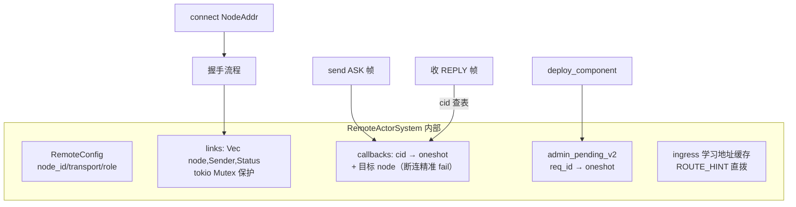
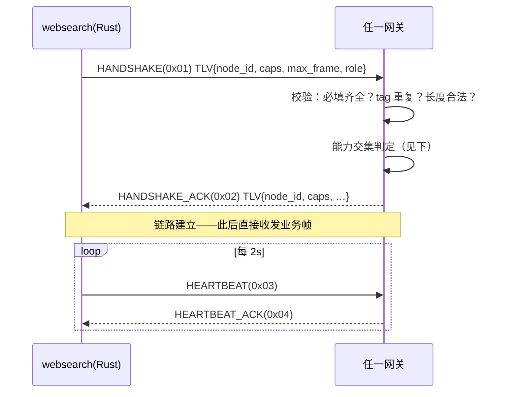
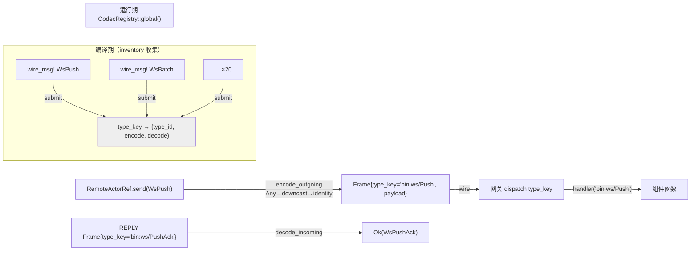
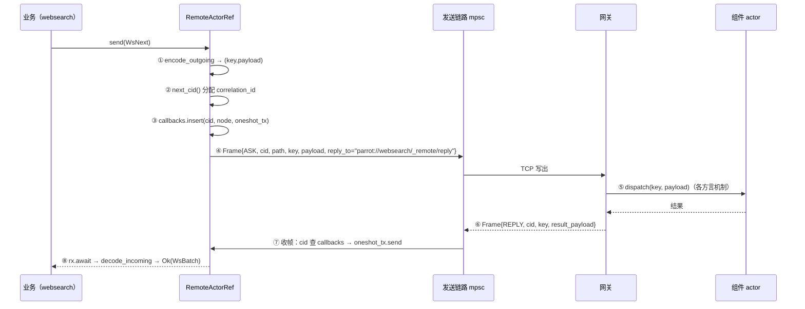
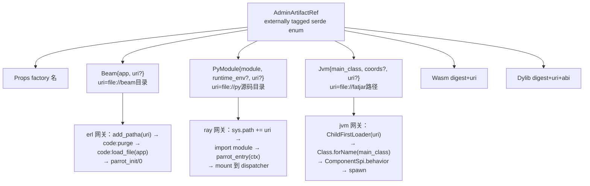
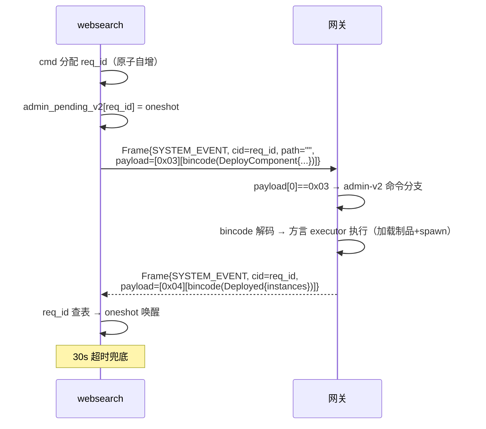
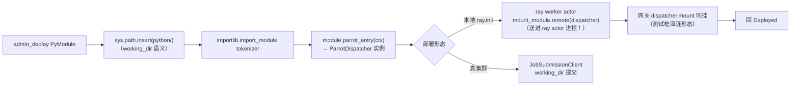
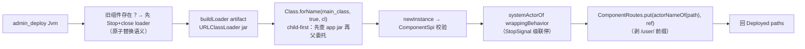
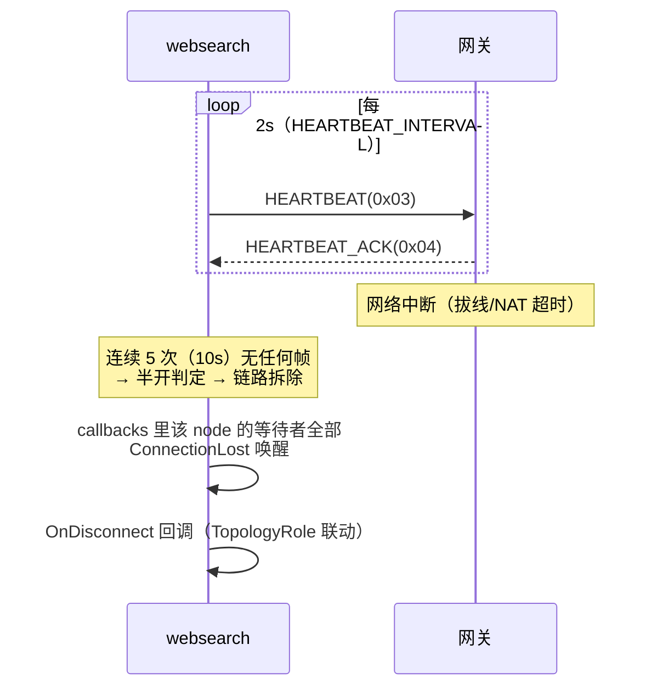
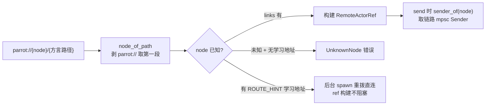

# websearch 如何使用 parrot —— 引擎能力全景详解

> 本文档从**使用的能力视角**回答：websearch 用了 parrot 的什么、为什么用、parrot 对应
> 能力的内部原理是什么。是 parrot 引擎的「实战说明书」。

---

## 0. 总览：websearch 用到的 parrot 能力清单

| # | parrot 能力 | websearch 使用点 | 本文详述节 |
|---|---|---|---|
| 1 | RemoteActorSystem 多链路 TCP 组网 | Rust 主进程 ↔ 三网关 | §1 |
| 2 | TLV 握手 + 能力协商 | 每条链路建立时 | §2 |
| 3 | CodecRegistry 类型注册（type_key 路由） | 20 个 bin:ws/* 消息 | §3 |
| 4 | ASK/REPLY RPC 语义（cid 配对） | 全部组件调用 | §4 |
| 5 | admin-v2 组件部署（DeployComponent） | 三组件动态加载 | §5 |
| 6 | AdminArtifactRef 四方言制品形态 | Beam/PyModule/Jvm | §5.2 |
| 7 | 方言网关（erl/ray/jvm 三宿主） | 运行时落地机制 | §6 |
| 8 | 心跳保活 + 半开检测 | 链路健康 | §7 |
| 9 | 远程引用 remote_ref 寻址 | parrot://node/path | §8 |
| 10 | 应用清单 websearch.app.toml | 声明式拓扑 | §9 |

---

## 1. RemoteActorSystem：多链路 TCP 组网

### 使用方式

```rust
let client = RemoteActorSystem::new(
    RemoteConfig::tcp("websearch", None),  // node_id=websearch，不监听（纯客户端形态）
    Arc::new(NoopLookup),
).unwrap();
client.start().await.unwrap();
client.connect(&NodeAddr::tcp("erl-gw-1", "127.0.0.1:19871".parse().unwrap())).await?;
```

### 为什么用

websearch 的编排器（Rust）需要同时与三个异构网关保持长连接——Erlang frontier、Ray
tokenizer、Akka search 各说各的「方言」，parrot 把它们统一在一个 actor 寻址空间里：
`parrot://erl-gw-1/user/frontier`、`parrot://ray-gw-1/user/tokenizer`、
`parrot://jvm-search-1/jvm/user/search`。业务代码里没有 socket、没有序列化差异——
只有 `remote_ref.send()`。

### parrot 原理



- **connect 三步**：TCP 拨号 → 发 HANDSHAKE 帧 → 收 HANDSHAKE_ACK 后把 mpsc Sender
  写入 `links` 表。此后该 node 的所有发送共享此链路（**连接复用**——不是每消息一连接）。
- **回调表带 node 信息**：`callbacks.insert(cid, node_id, tx)`——链路断开时只 fail 该
  node 的等待者（其他链路的在途请求不受影响），这是 parrot 的精准故障隔离。
- **NoopLookup**：websearch 是纯客户端（不接收外部 actor 寻址），LocalLookup 返回
  None 即可——parrot 允许「只出不进」的节点形态。

---

## 2. TLV 握手与能力协商

### 使用方式

`client.connect()` 内自动完成——业务零感知。但理解它才能理解为什么 erl/python/scala
三种语言能同处一个网络。

### parrot 原理

握手体是 TLV 序列 `[u8 tag][u16 len][bytes]`，必填 4 项 + 可选 3 项：

| tag | 含义 | websearch 场景值 |
|---|---|---|
| 1 NODE_ID | 节点名（全网唯一） | websearch / erl-gw-1 / jvm-search-1 / ray-gw-1 |
| 4 CAPABILITIES | u32 LE 位域 | 见下表 |
| 5 MAX_FRAME_LEN | u32 LE | 16 MiB（四侧一致） |
| 6 TOPOLOGY_ROLE | u8（0 普通/1 hub…） | 全 0（点对点星形） |
| 8 DIRECT_ADDR | 可选直拨地址 | 未用（无 hub） |



**能力位域**（caps）与 websearch 的关系：

| bit | 能力 | 谁置位 | 对 websearch 的意义 |
|---|---|---|---|
| 0 | bincode 栈 | 四侧全置 | admin 命令用 bincode 序列化——部署得以工作 |
| 1 | pb 栈 | 置 | 未用（bin:ws 是裸字节键） |
| 2 | zstd | 置 | 未用（本地流量小） |
| 3 | quic | — | 未用（TCP 形态） |
| 5 | **ARTIFACTS** | 三网关全置 | **部署的前提**——发起侧预判：未置位不发 DeployComponent |
| 6/7 | WASM/DYLIB | 网关侧 | 未用（crawler-lab 的形态） |

**前向兼容设计**：未知 tag 跳过不报错——parrot 未来加新握手项不会 break 老网关。这是
websearch 这类长生命周期应用平滑升级 parrot 版本的保障。

---

## 3. CodecRegistry：type_key 路由的消息类型系统

### 使用方式

```rust
macro_rules! wire_msg {
    ($t:ident, $key:literal) => {
        pub struct $t(pub Vec<u8>);
        inventory::submit! {
            CodecRegistration {
                type_key: $key,             // "bin:ws/Push"
                type_id: TypeId::of::<$t>(),
                encode: |msg| Ok(msg.0.clone()),   // identity
                decode: |b| Ok(Box::new($t(b.to_vec()))),
            }
        }
    };
}
wire_msg!(WsPush, "bin:ws/Push");
```

### 为什么用

websearch 有 20 个 wire 消息（见架构文档 §4.1）。每个消息需要：Rust 侧类型（编译期类
型安全）+ 线上 type_key（跨语言路由）。parrot 的 inventory 注册把两者绑定——`send()`
时自动按类型查 key 编码帧头，收到 REPLY 时按帧头 key 反解出类型。

**关键约束（parrot 设计）**：注册表按 type_key 索引但 encode 入口拿的是 `&BoxedMessage`
——必须 `downcast_ref::<$t>()`。如果两个 key 共用一个类型，注册表互串。所以 websearch
20 个消息 = 20 个独立包装类型。

### parrot 原理



- **出口编码**：`encode_outgoing(&BoxedMessage)` → downcast 具体类型 → codec.encode
  → `(type_key, payload)`。NotRemotable 类型在此立即失败（RC6 规则——不发帧）。
- **入口解码**：`decode_incoming(key, bytes)` → codec.decode → BoxedMessage。网关回
  的 key 若未注册 → UnknownTypeKey 错误（而不是静默丢弃）。
- **命名规范**：`bin:{app}/{Message}`（07 §2.1）——`bin:` 前缀 = 裸字节 codec 栈。
  crawler-lab 用 `bin:crawl/*`，websearch 用 `bin:ws/*`——**键空间隔离**，两个应用可
  共存同一网络。

---

## 4. ASK/REPLY：跨语言 RPC 语义

### 使用方式

```rust
let reply = frontier.send(Box::new(WsNext(n_bytes))).await?;  // ActorRef trait
let batch = reply.downcast_ref::<WsBatch>().unwrap().0;
```

### 为什么用

爬虫对 frontier 的 Next/Push、对 tokenizer 的 Tokenize、对 search 的 IndexTerms/Search
全是「请求-响应」模式——ASK 帧语义天然匹配，且 parrot 的 ask 在四方言语义对齐
（Erlang gen_tcp 回帧 / Ray dispatch 返回 / Akka AskPattern）。

### parrot 原理



帧类型码点（frame_type 模块）：

| 码 | 帧 | websearch 用途 |
|---|---|---|
| 0x10 | ASK | 全部组件调用 |
| 0x11 | REPLY | 组件返回 |
| 0x12 | REPLY_ERR | 组件报错（erlang throw / python KeyError / scala 失败） |
| 0x13 | TELL | 未用（websearch 全是 ask） |
| 0x03/0x04 | HEARTBEAT/ACK | 保活（§7） |
| 0x20 | SYSTEM_EVENT | admin-v2 通道（§5） |

**帧头关键位**：`correlation_id`（u64，配对键）、`hop_count/hop_limit`（8 跳防环——
websearch 星形 1 跳）、`seq`（端到端重排——网关侧发 SEQ_NONE 不参与）。

**为什么 reply_to 回程路径写进帧**：parrot 支持非对称拓扑（对端可能没有发起方的反向
连接）。websearch 的星形形态下 reply_to 恒为 `parrot://websearch/_remote/reply`，
网关侧 erl 直接剥掉 reply_to 前缀用 cid 配对（ray/jvm 同理经 cid 关联连接）。

---

## 5. admin-v2：运行时组件部署

这是 websearch 对 parrot 最核心的能力使用——**应用的全部业务代码（frontier/tokenizer/
search 三组件）不在网关进程里，而是启动时经 admin 通道动态部署进去**。

### 5.1 使用方式

```rust
client.deploy_component(
    "erl-gw-1",
    ComponentDeploy {
        name: "frontier".into(),
        version: "1.0.0".into(),
        artifact: AdminArtifactRef::Beam {
            app: "frontier".into(),
            uri: Some(format!("file://{}", app_root.join("erlang").display())),
        },
        instances: AdminInstancePolicy::Singleton,
        config: None,
    },
).await?;  // → Ok(["/user/frontier"])
```

### 为什么用

用户架构裁定（R1-R5）的核心：**应用代码住在 app 目录，网关是通用宿主**。没有部署机制
的话，frontier 逻辑就得写进 parrot_gw.erl（侵入框架）。有了 DeployComponent：

- 网关出厂只带协议骨架 + 探针（echo/cpu）
- 业务组件（beam/py/jar）作为「制品」在运行时加载
- 同一网关可先后部署不同应用的组件（crawler-lab 与 websearch 键空间不冲突）

### 5.2 AdminArtifactRef：四方言制品形态



**websearch 三组件的制品链**：

| 组件 | 制品 | 构建产物 | 部署动作 |
|---|---|---|---|
| frontier | Beam | `erlang/frontier.beam`（build.sh 里 erlc） | code path 注入 + 热加载 |
| tokenizer | PyModule | `python/tokenizer.py`（源码即制品） | working_dir + import + entry |
| search | Jvm | `jvm/target/websearch-jvm-1.0.0.jar`（fat，2.2MB 含 jieba+词典） | child-first classload + spawn |

**一个真实踩坑（为什么 fat jar）**：最初 thin jar + `lib/jieba-analysis.jar` 外挂
classpath，网关的 ChildFirstLoader 只加载 app jar——jieba 类 `ClassNotFoundException`。
修法是 build 时解包 jieba 的 class + `dict.txt` + `prob_emit.txt` 进 app jar（fat 形
态）——部署单元自洽，不依赖网关侧任何预置。

**serde 细节（BD-1 镜像）**：`Option<String>` 字段线上**恒写存在字节**（0=None）——不
能加 `skip_serializing_if`，否则四方言按位置解码会错位崩溃。这是 parrot 跨语言 bincode
兼容的硬约束。

### 5.3 admin-v2 协议通道原理

admin 命令不走业务帧（无 path），而是复用 SYSTEM_EVENT(0x20) 帧型 + payload 首字节子
标签：



**四命令全集**（websearch 主要用第 1 个）：

| 命令 | 语义 | websearch 场景 |
|---|---|---|
| DeployComponent | 部署/替换组件 | 启动时 ×3 |
| DrainComponent | 优雅排空（等在途消息） | 未用（预留优雅下线） |
| StopComponent | 立即停 | 未用 |
| ComponentStatus | 状态查询 | 未用（Healthz 业务级替代） |

**错误码**：方言不匹配（Beam 发给 jvm 网关）→ `0x0A02 DIALECT_MISMATCH`；加载失败 →
`0x0A00 SPAWN_FAILED`——websearch 部署失败会 panic 带 detail，一眼定位。

### 5.4 各方言加载机制深挖

#### Erlang（code replacement 语义）


后续 ASK 到达时，erl 网关 service 分发查 ADMIN_TAB 拿 Module，调
`Module:parrot_service(Key, Payload)`。**这就是 OTP 热替换**：不停网关进程，beam 换
版本即刻生效——websearch 重新部署 frontier 无需重启 erl 节点。

#### Ray（dispatcher 挂载）



**关键设计**（开发中实际修过的 bug）：dispatcher 在网关进程 import 时构建的对象，**对
ray actor 进程不可见**（进程隔离）。正确做法是 `mount_module.remote(...)` 让 ray actor
进程**自己 import + 构建 + 挂载**——ASK 到达 ray actor 后 dispatch 在 actor 进程内查
mounted 链。

dispatch 顺序：`reversed(_mounted)` 先查组件 handler，网关内置探针兜底——**业务键优先**。

#### Akka（child-first loader + 路由登记）



**路由闭环**：wire 地址 `parrot://jvm-search-1/jvm/user/search` → transport 剥
`/jvm/user/` 前缀得 `search` → BridgeActor resolve `ComponentRoutes.get("search")` →
AskPattern 问 search actor。deploy 与 ask 的键空间对齐是 R4 阶段修的对偶 bug（曾因
注册 `/user/search` 查 `search` 不中）。

---

## 6. 方言网关：三运行时的 parrot 宿主

websearch 复用 parrot interop 层的三个网关（不含业务代码——业务全在 app 制品里）：

| 网关 | 入口 | 并发模型 | websearch 组件载体 |
|---|---|---|---|
| `interop/erlang/parrot_gw.erl` | `parrot_gw:main([Port])` | 每连接一进程 + **每 ASK spawn worker**（慢 service 不阻塞收帧） | frontier（deploy 加载） |
| `interop/python/…/ray_gw.py` | `python -m …ray_gw Port` | 收包线程解码派发 + **ASK 的 ray.get 在 worker 线程池** + out 队列 writer | tokenizer（mount 进 ray actor） |
| `interop/jvm/…/ParrotGatewayMain.scala` | `java …ParrotGatewayMain Port node=… idle` | Netty transport + **akka dispatcher 池** + BridgeActor AskPattern(5s) | search（ComponentRoutes） |

**DEV_08 并发原则的体现**：三个网关都遵循「收帧循环永不阻塞」——erl spawn、python 线
程池、jvm 异步 future。websearch 的 Tokenize（jieba 全量切词，CPU 数百 ms）若阻塞收
帧循环，心跳会断——ray_gw 的 worker 线程池正是为此。

---

## 7. 心跳保活与半开检测

### parrot 原理



对 websearch 的实际意义：爬取循环中网关若崩溃，`frontier.send()` 会立刻返回
`ConnectionLost` 而非永久挂起——主循环容错分支（`match ... Err(e) => eprintln!`）记
日志继续，避免单点故障炸全局。这个容错形态在开发中验证过（fat jar 缺词典时 search
actor 崩 → 连接断 → flush 失败但进程不 panic）。

---

## 8. remote_ref 寻址与路径文法

```rust
client.remote_ref("parrot://erl-gw-1/user/frontier")?;      // erl 方言
client.remote_ref("parrot://ray-gw-1/user/tokenizer")?;     // ray 方言
client.remote_ref("parrot://jvm-search-1/jvm/user/search")?; // jvm 方言（/jvm 前缀！）
```

### parrot 原理



- **erl/ray**：deploy 返回路径 `/user/{name}` 直接作 wire path——网关查 ADMIN_TAB /
  mounted dispatcher。
- **jvm**：路径多一段 `/jvm` 前缀（`/jvm/user/{akkaPath}`）——transport 层剥前缀得
  akka 路径查 ComponentRoutes。**前缀是 jvm 网关的方言标记**（区分未来的 /ln/
  receptionist 键空间）。
- **UnknownNode 语义**：remote_ref 构建时若 node 既不在 links 也无学习地址——立即报
 错。websearch 的 connect 失败 panic（`.expect("connect")`）是刻意的 fail-fast：启动
  阶段组网不齐就该死，不要带病运行。

---

## 9. websearch.app.toml：声明式应用清单

```toml
[[components]]
name = "frontier"
engine = "erlang"
artifact = { Beam = { app = "frontier", uri = "file://erlang/" } }
```

### 为什么用 + 与运行形态的关系

manifest 是 parrot 应用体系的**声明式拓扑**（DEV_09）：组件、依赖序（Kahn 拓扑装配）、
制品引用、wiring 路由、config overlay。websearch 当前由 Rust main 内嵌 deploy 序列
（编程式），manifest 同时维护——两者一致性由结构对应保证：

| manifest 声明 | Rust main 里的对应执行 |
|---|---|
| `[[components]] frontier/erlang/Beam` | `deploy_component("erl-gw-1", …Beam{app:"frontier", uri:file://erlang/})` |
| `[[components]] tokenizer/ray/PyModule` | `deploy_component("ray-gw-1", …PyModule{module:"tokenizer", uri:file://python/})` |
| `[[components]] search/akka/Jvm` | `deploy_component("jvm-search-1", …Jvm{main_class, uri:file://jvm/target/…jar})` |
| `deps = ["frontier","tokenizer"]` | deploys Vec 的顺序（frontier→tokenizer→search） |
| `[config_overlay] pages/maxdepth/port/data` | CLI 参数解析的同名字段 |

**价值**：多机部署形态（编排器集群/parrot-node 分发）走 manifest + `app run` 通道时
无需改 app 代码——websearch 的组件/制品/路由已是标准形态。

---

## 10. 能力-场景速查表

| 你想用 parrot 做什么 | websearch 里的样例 | 关键 API/机制 |
|---|---|---|
| 连一个异构 actor 节点 | `client.connect(&NodeAddr::tcp(...))` | TLV 握手 + links 表 |
| 定义跨语言消息 | `wire_msg!(WsPush, "bin:ws/Push")` | inventory CodecRegistration |
| 远程调用 | `ref.send(Box::new(msg)).await?` | ASK 帧 + cid 配对 |
| 运行时加载业务组件 | `deploy_component(node, ComponentDeploy{…})` | SYSTEM_EVENT 0x03 + 方言 executor |
| 让 Python 组件跑在 ray actor 里 | `parrot_entry(ctx)` 工厂 + dispatcher.handler | mount_module.remote 隔离修复 |
| 让 JVM 组件可被远程 ask | `ComponentSpi.behavior` 实现 | ComponentRoutes 键空间 |
| 让 Erlang 组件热更新 | beam 制品 + parrot_init/0 | code:purge + load_file |
| 链路故障隔离 | 单链路断只 fail 该 node 等待者 | callbacks 带 node |
| 应用声明式描述 | websearch.app.toml | parrot-app manifest 模型 |
