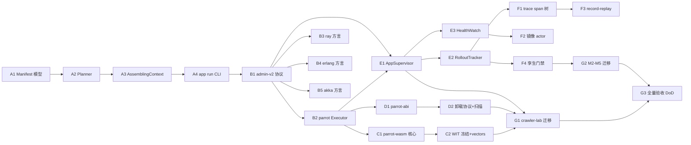

# DEV_09 · 应用体系与多引擎统一编排开发文档（A-G 施工合同）

> 定位：**开发文档 = 实施合同**。本文是 [TECH_DESIGN_09](./TECH_DESIGN_09_应用体系与多引擎统一编排设计.md)（2026-10-06 定稿，决策 D1-D4 已冻结）的逐函数级施工图——开发者照此实现，评审者照此验收。
> 状态基准：2026-10-06 · commit `48b34e7`（TECH_DESIGN_08/09 编号重排后）· workspace 1740+ 测试全绿 · 配置切面已交付（[TECH_DESIGN_08](./TECH_DESIGN_08_配置切面设计.md)）
> 上位约束：[DEV_00 §1/§4](./DEV_00_总体测试与验收计划.md)（测试金字塔与验收流程）· [07 §14](./TECH_DESIGN_07_异构联邦协议设计.md)（工程验收基线）· 冲突时以 TECH_DESIGN 为准并先修文档再写代码。
> 本文规则：所有设计决策引 09 条款号（D1-D4/Y1-Y6/§n.n），DEV 不新造决策。

---

## 1. 范围与红线

**做**（09 §11.1 A-G 全量）：

| 阶段 | 交付 |
|---|---|
| A | crate `parrot-app`：AppManifest 数据模型 + Planner + AssemblingContext + `parrot app run` 本地宿主 |
| B | admin-v2 统一部署协议 + parrot Executor artifact 通道 + ray/erlang/akka 三网关方言 |
| C | crate `parrot-wasm`：wasmtime + WIT `parrot:actor@0.1.0` + 沙箱限额（D1） |
| D | crate `parrot-abi` + dylib 加载器 + 四步卸载协议 + 禁止清单 CI 扫描（D1） |
| E | Orchestrator：AppSupervisor/Planner/HealthWatch/RolloutTracker（D2 内嵌自举） |
| F | 调试五件套：app run 同构 / trace span 树 / 镜像 actor / record-replay / 孪生门禁（D4） |
| G | M1-M5 存量迁移（09 §11.3）+ 全量验收 |

**不做**（红线，引 09）：

1. 配置热重载 / SIGHUP 热更（08 §10.1——变更走组件升级通道）
2. WIT ctx 网络能力（09 §4.2——1.0 只给 log/config/clock，网络能力 P2 再议）
3. 外部编排服务依赖：etcd/k8s API/Redis（09 D2、X12——控制面 parrot 自举）
4. HOCON/include 多文件合并（08 §10.2）
5. JVM classloader 强卸载保证（09 §5.2 诚实声明表——软卸载+计划性重启）
6. WIT 接口破坏性变更（09 §8.2——semver 冻结管理）

---

## 2. 任务分解（T 任务表 + 依赖序）

### 2.1 依赖图



### 2.2 T 任务表（估算为含测试的工程日）

| 任务 | 内容 | 依赖 | 估算 | 测试义务归属 |
|---|---|---|---|---|
| A1 | `parrot-app/src/manifest.rs` 全类型 + 校验器 + TOML 双形态 | — | 3d | §5.1 Manifest 25+ |
| A2 | `planner.rs` DAG 拓扑排序 + placement 过滤 | A1 | 2d | §5.1 Planner 15+ |
| A3 | `assemble.rs` 依赖序装配 + 失败回滚 + config_overlay（Y3） | A2 | 3d | §5.1 Assembling 20+ |
| A4 | `parrot app run`（本地四引擎 mem 组装，§3.4） | A3 | 3d | MG12 前置 |
| B1 | `AdminCommandV2` 四命令 + 码点 0x03/0x04（Y1）+ golden vectors | A1 | 2d | §5.1 admin-v2 20+ |
| B2 | parrot-node artifact 通道 + caps bit `1<<5`（ARTIFACTS）+ 就绪协议兼容 | B1 | 3d | §5.1 Executor 15+ |
| B3 | ray_gw.py admin handler → ray job API | B1 | 2d | MG11 ray 侧 |
| B4 | parrot_gw.erl admin → `code:load_abs` 热加载 | B1 | 2d | MG11 erl 侧 |
| B5 | JVM ParrotGatewayMain AdminPort + child-first loader | B1 | 3d | MG11 jvm 侧 |
| C1 | `parrot-wasm`：wasmtime 集成 + fuel/epoch + 句柄表 + panic 边界 | B2 | 4d | §5.1 wasm 30+ |
| C2 | WIT world 冻结 + 四语言编解码 vectors | C1 | 1d | Vectors 行 |
| D1 | `parrot-abi`（repr(C) 协议）+ 加载器 + digest 校验 | B2 | 3d | §5.1 dylib 35+ |
| D2 | 四步卸载协议 + 禁止清单扫描脚本（CI 挂接） | D1 | 3d | 同上 |
| E1 | AppSupervisor 调和循环 + desired 持久化（Raft 复用） | B1/B2 | 4d | §5.1 Orchestrator 40+ |
| E2 | RolloutTracker 状态机 + 回滚 | E1 | 3d | 状态机全弧 |
| E3 | HealthWatch（心跳半开/SWIM 事件接调和） | E1 | 2d | 失联/重启 diff |
| F1 | cid 贯穿 trace span 树 + `app trace` CLI | E1 | 3d | MG 观测断言 |
| F2 | 镜像 actor（路由层双写） | E3 | 2d | 零干扰断言 |
| F3 | record-replay（trace 落盘 + 回放器） | F1 | 3d | 确定性 hash |
| F4 | 孪生输入 Manifest 化 + CI 门禁 | E2 | 2d | §11.2.3 六场景 |
| G1 | M1：crawler-lab → `crawler.app.toml`（编排 ≤50 行） | B/C/D/E | 3d | 行为等价（cid 轨迹一致） |
| G2 | M2-M5：孪生输入 / parrot-node builtin.app.toml / 网关 fixture / 既有测试入口 | G1 | 4d | 各自断言（09 §11.3 表） |
| G3 | 全量验收：§5.6 命令表逐项 + 覆盖率报告 + 性能门禁 | 全部 | 2d | DoD 核销 |

关键路径：A1→A2→A3→A4→B1→B2→E1→E2→G1→G3（约 32 工程日）；B3/B4/B5、C、D 可并行分流。

---

## 3. 逐模块施工图（文件 → 签名 → 行为规约 → 测试义务）

### 3.1 A 阶段：`crates/parrot-app`（新 crate）

Cargo.toml 依赖：`parrot-api`（remote feature）、`parrot-config`、`parrot-remote`、`serde`、`toml`、`thiserror`、`tracing`。**不依赖 `parrot` 主 crate**（引擎访问经 parrot-remote 的 LocalLookup/facade 协议——09 §2.2 分层铁律；本地组装用 parrot-api 的 ActorSystem trait）。

```rust
// crates/parrot-app/src/manifest.rs —— A1
pub struct AppManifest {
    pub name: String,
    pub version: String,                       // semver 文法校验（不引 semver crate，手写校验省依赖）
    pub components: Vec<ComponentSpec>,
    pub wiring: Vec<WireSpec>,
    pub config_overlay: Option<toml::value::Table>,
}

pub struct ComponentSpec {
    pub name: String,
    pub engine: EngineKind,                    // enum { Parrot, Akka, Ray, Erlang, LiteTs, LiteCpp }
    pub artifact: ArtifactRef,
    pub instances: InstancePolicy,             // enum { Singleton, Sharded(usize), Pool(usize), Ephemeral }
    pub placement: PlacementConstraint,
    pub upgrade: UpgradePolicy,                // enum { HotSwap{drain_timeout_ms:u64}, Rolling{max_surge:u8}, Recreate{state_snapshots:u8} }
    pub deps: Vec<String>,
    pub config: Option<toml::value::Table>,
    pub hooks: ComponentHooks,                 // struct { on_start: Option<String>, on_stop: Option<String>, on_drain: Option<String> }（路径引用——宿主解析）
}

pub enum ArtifactRef {   // 09 §2.2 原样
    Props { factory: String },
    Wasm { digest: String, uri: String },
    Dylib { digest: String, uri: String, abi: u32 },
    Jvm { main_class: String, coords: Option<String> },
    PyModule { module: String, runtime_env: Option<toml::value::Value> },
    Beam { app: String },
}

/// 校验器：返回逐项错误（不 panic——错误驱动测试的全部分支源）。
pub fn validate(m: &AppManifest) -> Result<(), Vec<ManifestError>>;
pub enum ManifestError {
    DuplicateComponent(String), UnknownDependency{comp:String, dep:String},
    CycleDetected(Vec<String>),              // 环路径回放
    WiringUnreachable{from:String, to:String},
    BadSemver(String), EngineArtifactMismatch{comp:String, engine:EngineKind, artifact:String},
    EmptyComponents,
}

impl AppManifest {
    pub fn to_toml(&self) -> Result<String, toml::ser::Error>;
    pub fn from_toml(s: &str) -> Result<Self, toml::de::Error>;
    pub fn from_file(path: &std::path::Path) -> Result<Self, AppLoadError>;
}
```

行为规约：① 校验全项通过才可进 Planner；② TOML roundtrip 字节稳定（`to_toml(from_toml(x)) == to_toml(x)`）；③ `engine-artifact` 匹配表：Parrot→Props/Wasm/Dylib、Akka→Jvm、Ray→PyModule、Erlang→Beam、Lite*→无（网关进程自备）。

```rust
// crates/parrot-app/src/planner.rs —— A2
pub struct Plan { pub order: Vec<PlannedComponent>, pub warnings: Vec<String> }
pub struct PlannedComponent { pub spec: ComponentSpec, pub shard_plan: Option<Vec<String>> /*路径分配*/ }

pub fn plan(m: &AppManifest, topology: &TopologyView) -> Result<Plan, PlanError>;
pub enum PlanError { Manifest(Vec<ManifestError>), Unplaceable{comp:String, reason:String} }

/// 拓扑视图（测试替身友好——真实实现查 SWIM/Directory）。
pub trait TopologyView: Send + Sync {
    fn candidates(&self, c: &PlacementConstraint) -> Vec<CandidateNode>;
    fn self_is(&self, role: Option<&str>) -> bool;
}
pub struct CandidateNode { pub node_id: String, pub role: String, pub labels: Vec<String>, pub load: f32 }
```

行为规约：① Kahn 算法确定性排序（同输入同序——稳定性测试锁）；② deps 缺失报 `UnknownDependency` 带组件名；③ placement 无候选 → `Unplaceable` 带原因串；④ Sharded(n) 生成 n 个路径（`/user/{name}-{i}`）。

```rust
// crates/parrot-app/src/assemble.rs —— A3
pub struct AssemblingContext { /* registry: 组件名→BoxedActorRef 集合; started: Vec<String>（逆序停用栈）*/ }

pub struct LocalDeployer<'a> { pub topology: &'a dyn TopologyView, pub gateway_factory: &'a dyn GatewayFactory }

/// 本地网关工厂（A4 的四引擎内嵌实现点；测试替身=memory transport 对）。
pub trait GatewayFactory: Send + Sync {
    /// 为非 parrot 组件建本地执行面：返回该组件的入口 ActorRef（经 Wire 编解码——与生产同路径）。
    fn start_gateway(&self, comp: &ComponentSpec) -> Result<BoxedActorRef, DeployError>;
    fn stop_gateway(&self, comp: &ComponentSpec) -> Result<(), DeployError>;
}

pub enum DeployError { Artifact(String), Engine(String), Config(String), HookPanic{comp:String, hook:String} }

impl AssemblingContext {
    pub fn new() -> Self;
    /// 按 Plan.order 依序装配；任一失败 → 已启动组件逆序 stop 后返回错误（原子性）。
    pub async fn assemble(&mut self, plan: &Plan, deployer: &LocalDeployer<'_>, cfg: &parrot_config::Resolved) -> Result<(), DeployError>;
    /// 逆依赖序停用（优雅关闭）。
    pub async fn teardown(&mut self) -> Result<(), DeployError>;
    pub fn component_ref(&self, name: &str) -> Option<&BoxedActorRef>;
}
```

行为规约：① config_overlay 并入 parrot-config（Y3：overlay > 代码 > parrot.toml > 默认——用 08 的合并函数，overlay 以代码层语义注入）；② hooks 路径解析：on_start 是组件内 actor 路径，宿主发一条 `ParrotAppHook::Start` 消息（type_key `bin:app.hook#v1`）并等回执，超时=装配失败；③ 失败回滚逆序保证（started 栈）。

```rust
// crates/parrot-app/src/cli.rs —— A4（bin 名 parrot-app；后续阶段并入统一 CLI）
// Usage: parrot-app run --manifest crawler.app.toml [--profile local]
pub async fn cmd_run(manifest_path: &std::path::Path) -> Result<(), Box<dyn std::error::Error>>;
```

A4 本地形态（09 §2.3）：parrot 组件→`ThreadActorSystem::shared` + PropsFactory spawn；akka/ray/erlang→`GatewayFactory` 的进程内/本机子进程实现（ray: `python3 -m parrot_protocol.ray_gw` 子进程；erlang: `escript parrot_gw.erl` 子进程；akka: `mvn exec` 或内嵌——首期统一走**本机子进程 + memory→tcp 回环**，断点可打两侧）；wiring 解析后全链冒烟（每组件 ask 一发 HealthPing）。

### 3.2 B 阶段：admin-v2 协议 + 四方言

```rust
// crates/parrot-remote/src/admin.rs 扩展 —— B1（锚点：sys_event_tag mod @ admin.rs:22）
pub mod sys_event_tag {
    pub const ADMIN_CMD: u8 = 0x01;      // v1（不变——Y1）
    pub const ADMIN_REPLY: u8 = 0x02;    // v1
    pub const ADMIN_CMD_V2: u8 = 0x03;   // 新增
    pub const ADMIN_REPLY_V2: u8 = 0x04; // 新增
    // 0x10/0x20 不变
}

#[derive(Debug, Clone, PartialEq, serde::Serialize, serde::Deserialize)]
pub enum AdminCommandV2 {
    DeployComponent { req_id: u64, component: ComponentDeploy },
    DrainComponent  { req_id: u64, path_prefix: String, timeout_ms: u64 },
    StopComponent   { req_id: u64, path_prefix: String },
    ComponentStatus { req_id: u64, path_prefix: String },
}

#[derive(Debug, Clone, PartialEq, serde::Serialize, serde::Deserialize)]
pub struct ComponentDeploy {
    pub name: String, pub version: String,
    pub artifact: parrot_app::ArtifactRef,   // serde 透传——各引擎方言各自解释
    pub instances: parrot_app::InstancePolicy,
    pub config: Option<bytes::Bytes>,        // toml 片段
}

#[derive(Debug, Clone, PartialEq, serde::Serialize, serde::Deserialize)]
pub enum AdminReplyV2 {
    Deployed { req_id: u64, instances: Vec<String> },
    Drained  { req_id: u64, drained: usize, aborted: usize },
    Stopped  { req_id: u64 },
    Status   { req_id: u64, states: Vec<ComponentStateReport> },
    Failed   { req_id: u64, code: u16, detail: String },   // code=ErrCode 扩展段 0x0A00+
}
pub struct ComponentStateReport { pub path: String, pub state: String, pub version: String }
```

依赖方向注意：`parrot-remote` 依赖 `parrot-app`（仅 manifest 类型）——`parrot-app` 已只依赖 parrot-api/config/remote，**循环依赖禁止**：ComponentDeploy 内嵌 `parrot_app::ArtifactRef` 改为 parrot-remote 本地镜像类型 `AdminArtifactRef`（serde 兼容同形），由 parrot-app 侧 `From` 转换。**施工裁定 BD-1**（不引 09 新决策，纯工程消解）。

v1 兼容（Y1）：老节点收到 0x03/0x04 tag → `SysEvent` 解码失败按现有防御路径回 `Unsupported` ERROR 帧；发起侧能力位预判（见 B2）不发即不问。`system.rs` 新增：

```rust
// crates/parrot-remote/src/system.rs —— B1（锚点：admin_roundtrip @ system.rs:544 同族）
impl RemoteActorSystem {
    pub async fn deploy_component(self: &Arc<Self>, node: &str, c: ComponentDeploy) -> Result<Vec<String>, RemoteError>;
    pub async fn drain_component(self: &Arc<Self>, node: &str, prefix: &str, timeout: Duration) -> Result<(usize, usize), RemoteError>;
    pub async fn component_status(self: &Arc<Self>, node: &str, prefix: &str) -> Result<Vec<ComponentStateReport>, RemoteError>;
}
```

```rust
// crates/parrot-node/src/lib.rs 扩展 —— B2（锚点：spawn_builtin @ lib.rs:316）
pub struct ArtifactChannel { /* digest 校验 + 本地缓存目录 + 三形态分发 */ }
impl ArtifactChannel {
    pub fn cache_dir() -> std::path::PathBuf;                       // $PARROT_ARTIFACT_DIR 或 /tmp/parrot-artifacts
    pub fn fetch(&self, artifact: &AdminArtifactRef) -> Result<std::path::PathBuf, String>;  // uri→本地（file/http 首期 file）
    pub fn verify(&self, path: &std::path::Path, digest: &str) -> Result<(), String>;        // sha256
}
/// Props 方言执行器：AdminCommandV2 → find_factory spawn（复用 K0 机制）
pub async fn exec_deploy_v2(ts: &Arc<ThreadActorSystem>, cmd: ComponentDeploy) -> Result<Vec<String>, String>;
```

握手能力位（锚点 `handshake.rs:28` caps mod）：`pub const ARTIFACTS: u32 = 1 << 5;`——parrot-node 启动默认置位；Wasm/Dylib 形态按 feature gate 追加位 `WASM=1<<6`/`DYLIB=1<<7`（节点如实上报，C/D 阶段接入）。

```text
B3 ray 方言（锚点 ray_gw.py:72 serve）：
  interop/python/parrot_protocol/ray_gw.py 增 admin 分支：
  - DeployComponent{PyModule} → ray.job_submission submit(working_dir=module 目录, runtime_env)
    → 命名 actor 起 ParrotDispatcher（module 内 def parrot_entry(dispatcher_ctx)）
  - Drain/Stop → ray kill named actors；Status → ray state 查询
  - 测试：interop/python/tests/test_admin_v2.py（无 ray 集群时 mock ray API——契约与真 ray 双跑）

B4 erlang 方言（锚点 parrot_gw.erl:139 service/1）：
  interop/erlang/parrot_gw.erl 增 admin 帧分支（cid 通道复用 ASK/REPLY）：
  - DeployComponent{Beam} → code:add_patha(ArtifactDir) + code:load_abs(Module)
    + supervisor:restart_child（OTP 热替换语义）
  - 测试：interop/erlang/test_admin_v2.erl（热加载新旧模块消息行为切换断言）

B5 akka 方言（锚点 ParrotGatewayMain.scala:61-63 bridge+Netty）：
  interop/jvm .../ParrotGatewayMain.scala：
  - AdminPort handler：DeployComponent{Jvm} → child-first URLClassLoader(jar)
    → loader.loadClass(main_class) 反射构造 Behavior → 网关 system.spawn
  - Drain → graceful stop（PoisonPill 等价）；Status → ActorSelection identify
  - 测试：BridgeAdminV2Spec.scala（child loader 隔离断言：两版本同名类并存）
```

### 3.3 C 阶段：`crates/parrot-wasm`（新 crate，feature gate）

Cargo：`wasmtime`（workspace dep，feature `component-model`）；`parrot-node` 侧 `wasm = ["parrot-wasm"]` 默认关（09 风险 R1）。WIT 文本与生成绑定随 C2 冻结入库 `crates/parrot-wasm/wit/parrot-actor.wit`（09 §4.2 原文）。

```rust
// crates/parrot-wasm/src/lib.rs —— C1
pub struct WasmRuntime { /* wasmtime::Engine（pooling allocator 配置）*/ }
pub struct WasmComponent { /* store + instance + 句柄表 */ }

impl WasmRuntime {
    pub fn new(cfg: WasmConfig) -> Result<Self, WasmError>;
    pub fn instantiate(&self, wasm_path: &std::path::Path, ctx: HostCtx) -> Result<WasmComponent, WasmError>;
}
pub struct WasmConfig { pub fuel_per_message: u64 /*默认 100_000*/, pub epoch_deadline: u64, pub memory_limit_mb: usize }
pub struct HostCtx { pub self_path: String, pub config_overlay: toml::value::Table, pub log_sink: tracing::Level }

impl WasmComponent {
    /// actor 消息入口：bytes→wit→handle→bytes（与 codec_registry 同构）
    pub fn handle(&mut self, type_key: &str, payload: &[u8]) -> Result<Vec<u8>, ComponentError>;
    pub fn tell(&mut self, type_key: &str, payload: &[u8]) -> Result<(), ComponentError>;
    pub fn on_drain(&mut self) -> Result<(), ComponentError>;
    pub fn take_metrics(&mut self) -> WasmMetrics;   // fuel 用量/实例化耗时——基准门禁数据源
}
pub enum ComponentError { Trap(String), OutOfFuel, EpochDeadline, AbiVersion(String), Panic(String) }
```

行为规约：① fuel 耗尽 → `OutOfFuel` → 宿主转 `ActorError::OverQuota` 语义交监督（与 native 同一套监督——09 §4.2）；② epoch 用 tokio 信号驱动（tokio::runtime 的 worker 更新 epoch——注册 `store.set_epoch_deadline`）；③ 组件 panic（wasm trap）不污染宿主；④ 实例 drop 后同 digest 重建断言无状态残留。

**Executor 接线**（B2 扩展）：`exec_deploy_v2` 遇 `Wasm` artifact → `WasmRuntime::instantiate` → 包装为 `WasmActor`（impl parrot-api `Actor`，消息转 `handle`）→ thread 系统 spawn。三形态统一经 Props/Wasm/Dylib→`BoxedActorRef`——下游无感知。

### 3.4 D 阶段：`crates/parrot-abi` + dylib 加载器

```rust
// crates/parrot-abi/src/lib.rs —— D1（09 §4.3 原样 repr(C)；双端共同依赖，零 std 之外依赖）
pub const PARROT_ABI_VERSION: u32 = 1;
#[repr(C)] pub struct AbiMeta { pub abi_version: u32, pub parrot_min: u32, pub name: *const u8, pub name_len: u32, pub hooks: AbiHooks }
#[repr(C)] pub struct AbiHooks { pub construct: extern "C" fn(AbiStr, *mut *mut AbiComponent) -> AbiResult, pub destroy: extern "C" fn(*mut AbiComponent) }
#[repr(C)] pub struct AbiComponent { pub vt: *const AbiVt, pub self_: *mut () }
#[repr(C)] pub struct AbiVt { pub handle_msg: extern "C" fn(*mut (), AbiMsg, *mut AbiReplyBuf) -> AbiResult, pub on_drain: extern "C" fn(*mut ()) -> AbiResult }
#[repr(C)] pub struct AbiMsg { pub type_key: *const u8, pub key_len: u32, pub payload: *const u8, pub payload_len: u32 }
pub const ABI_OK: u32 = 0; pub const ABI_ERR_PANIC: u32 = 1; pub const ABI_ERR_STATE: u32 = 2;
```

```rust
// crates/parrot-abi/src/loader.rs —— D2（宿主侧，libloading）
pub struct DylibHandle { /* libloading::Library + 活跃实例计数 + drain 栅栏 */ }
pub struct DylibLoader;
impl DylibLoader {
    pub fn load(path: &std::path::Path, digest: &str) -> Result<DylibHandle, LoadError>;  // meta 校验：abi_version==PARROT_ABI_VERSION 且 parrot_min<=当前
    pub fn construct(&self, h: &DylibHandle, cfg: AbiStr) -> Result<*mut AbiComponent, LoadError>;  // catch_unwind 包裹
    /// 四步卸载（09 §4.3 ②）：Quarantine→Drain(in-flight 计数归零/timeout)→Destroy→Dlclose
    pub async fn unload(&self, h: DylibHandle, drain_timeout: Duration) -> Result<UnloadReport, UnloadError>;
    pub fn scan_violations(path: &std::path::Path) -> Vec<Violation>;   // 禁止清单：TLS 析构注册/线程创建引用库内符号/signal——nm+otool 扫描
}
pub struct UnloadReport { pub drained: usize, pub aborted: usize, pub force_closed: bool }
```

测试载体：`crates/parrot-abi/tests/fixtures/` 下用 `crate-type=["cdylib"]` 的示例组件（`testcomp/`，violating/ 规范双份）——CI 同一 workspace 构建，跨平台（macOS `.dylib`/Linux `.so`）。**施工裁定 BD-2**：violating fixture 用 `#[used]` static 模拟 TLS 注册扫描目标，不真制造 UB。

### 3.5 E 阶段：Orchestrator（`crates/parrot-app/src/orchestrator/`）

```rust
// orchestrator/supervisor.rs —— E1
pub struct AppSupervisor { /* desired: AppManifest（Raft 持久化）; observed: HashMap<String, ComponentStateReport> */ }
impl AppSupervisor {
    pub fn new(manifest: AppManifest, sys: Arc<RemoteActorSystem>) -> Self;
    /// 调和循环一步（测试逐 diff 形态驱动——不依赖定时器）。
    pub async fn reconcile_once(&mut self) -> ReconcileReport;
    pub async fn submit(&mut self, m: AppManifest) -> Result<(), PlanError>;   // 新版本 desired（升级入口）
}
pub struct ReconcileReport { pub actions: Vec<ReconcileAction>, pub converged: bool }
pub enum ReconcileAction { Deploy{comp:String,node:String}, Drain{comp:String}, Stop{comp:String}, Wait{comp:String,reason:String} }

// orchestrator/rollout.rs —— E2（状态机：显式 enum + 转移表——测试穷举源）
pub enum RolloutPhase { Pending, Planning, Draining, Deploying, Verifying, Switching, Running, RollingBack, Done }
pub struct RolloutTracker { pub phase: RolloutPhase, pub steps_done: Vec<RolloutPhase> }
impl RolloutTracker {
    pub fn advance(&mut self, event: RolloutEvent) -> Result<RolloutAction, RolloutError>;   // 事件驱动——每条转移弧一个用例
}
pub enum RolloutEvent { PlanReady, Drained{aborted:usize}, DeployOk, VerifyOk, VerifyFail(String), NodeLost(String), SwitchDone }

// orchestrator/health.rs —— E3：订阅链接状态（links_snapshot 差分）+ admin ComponentStatus 轮询 → observed 更新
```

Raft 持久化：`desired` 序列化为 Raft proposal（复用 `raft/` 内核的 `step/poll` 驱动，宿主 DirectoryStore 模式——锚点见 raft/mod.rs 头注释）；单节点模式退化为本地 KV（开发/本地 app run 共用代码路径）。**施工裁定 BD-3**：首期 Orchestrator 常驻形态=parrot-node 内 `#[cfg(feature="orchestrator")]` 的可选组件 + `parrot app deploy` CLI 直连目标节点 admin 口——Singleton 选举在双/多 Orchestrator 节点时启用（复用 singleton.rs lease）。

### 3.6 F 阶段：调试五件套

| 件 | 落点 | 锚点复用 |
|---|---|---|
| F1 trace span 树 | `parrot-remote/src/frame.rs` trace_line 扩展 `trace_id` 字段透传（Wire flags 预留位 bit）；`parrot app trace <app>` 聚合 cid→span | cid 关联现有实现 |
| F2 镜像 actor | `parrot/src/system.rs` facade 路由层插 `MirrorPolicy{src_prefix, mirror_path}` 双写 | prefix_handlers（system.rs:167 既有） |
| F3 record-replay | `parrot-app/src/debug/replay.rs`：record=全帧 trace 落盘（JSONL）；replay=按 cid 序重放到本地组件 | durable.rs WAL 格式参考 |
| F4 孪生门禁 | `tools/federation-lab/src/twin.rs` 输入改 AppManifest；`make twin-app` CI 目标 | twin.rs 既有 |

### 3.7 G 阶段：M1-M5 迁移施工序（09 §11.3 表为验收合同）

1. **G1/M1**：`apps/crawler-lab/src/app_manifest.rs`（`crawler.app.toml` 嵌入或读文件）替换 main.rs 手写装配；保留 CLI 参数→config_overlay 注入；断言：爬取 N 页结果与迁移前 golden 输出一致 + cid 轨迹 hash 一致。
2. **G2/M2**：twin.rs 输入 Manifest 化（G4 联动）。
3. **G2/M3**：`crates/parrot-node/src/builtin_app.toml`（echo/counter/kv/slow 四组件 Manifest）+ main.rs 启动走 `cmd_run` 路径（env 语义不变：PARROT_ACTORS 变为 overlay 过滤）。
4. **G2/M4**：三网关示例 handler 收敛为 `interop/*/tests/` 的 admin-v2 fixture（MG11 数据源）。
5. **G2/M5**：`test_hub_relay.rs`/`test_config_aspect.rs` 等装配入口抽公共 `test_assemble(manifest)` helper——断言逻辑零改动。

---

## 4. 集成锚点（commit 48b34e7 核实；施工前随 master 重核）

| 锚点 | 位置 | 用途 |
|---|---|---|
| sys_event_tag mod | [admin.rs:22](../crates/parrot-remote/src/admin.rs) | B1 新码点 0x03/0x04 挂接 |
| AdminCommand 枚举 | [admin.rs:30](../crates/parrot-remote/src/admin.rs) | V2 超集不改 v1 |
| spawn_named / admin_roundtrip | [system.rs:544](../crates/parrot-remote/src/system.rs) | B1 三方法同族复用 |
| AdminHook（SysEventHook） | [system.rs:666](../crates/parrot-remote/src/system.rs) | B2 v2 命令分发点 |
| caps mod | [handshake.rs:28](../crates/parrot-remote/src/handshake.rs) | ARTIFACTS=1<<5 / WASM=1<<6 / DYLIB=1<<7 |
| serve() | [ray_gw.py:72](../interop/python/parrot_protocol/ray_gw.py) | B3 admin 分支 |
| service/1 | [parrot_gw.erl:139](../interop/erlang/parrot_gw.erl) | B4 admin 帧分支 |
| bridge + Netty ext | [ParrotGatewayMain.scala:61](../interop/jvm/src/main/scala/parrot/protocol/jvm/ParrotGatewayMain.scala) | B5 AdminPort |
| spawn_builtin | [parrot-node/src/lib.rs:316](../crates/parrot-node/src/lib.rs) | B2 Executor + G2/M3 builtin app |
| prefix_handlers | [system.rs:167](../crates/parrot/src/system.rs) | F2 镜像双写 |
| Raft 内核 step/poll | [raft/mod.rs](../crates/parrot-remote/src/raft) | E1 desired 持久化 |
| Singleton lease | [singleton.rs](../crates/parrot-remote/src/singleton.rs) | BD-3 多 Orchestrator 选举 |

**施工裁定记录**（工程消解，不属设计决策）：BD-1 AdminArtifactRef 镜像类型防循环依赖 / BD-2 violating fixture 用静态模拟非真 UB / BD-3 Orchestrator 首期形态=可选组件+直连 admin 口。

---

## 5. 测试矩阵与 DoD（09 §11.2 全量落地）

### 5.1 单元（每任务出口即跑；总数 200+）

按 §3 各模块"测试义务"列执行；补充归属：A1→25+（校验全分支+roundtrip）、A2→15+、A3→20+（含回滚逆序、overlay 优先级）、B1→20+（roundtrip/去重/超时/Unsupported 预判/四方言同向量 golden）、B2→15+、C1→30+、D1+D2→35+、E1→20+（diff 五形态+幂等）、E2→15+（状态机全弧含 Rollback 每入口）、E3→5+。

### 5.2 场景 + 集成归属

| MG | 阶段 | 说明 |
|---|---|---|
| MG12（本地/集群同构） | A4 出口 | app run 轨迹基线建立 |
| MG1-4（跨引擎部署全链） | B3/B4/B5 齐后 | CI docker 四网关起真实进程 |
| MG5-8（升级三策略） | E2 出口 | HotSwap/Rolling/Recreate 各一场 + WAL 零丢断言 |
| MG9-10（引擎重启无感） | E1 出口 | 网关 kill/重启 reconcile |
| MG11（四方言契约 golden） | B1-B5 滚动 | vectors 随方言落地即冻结 |
| 三形态 9 套生命周期 | C2/D2 出口 | 含 RSS 无泄漏断言 |

### 5.3 混沌（F4 出口 + 每夜）

09 §11.2.3 六场景原样落 CI：升级中 kill -9 / Raft 分区 / 网关双杀 / drain 风暴 / dylib 重载 / wasm fuel 风暴。

### 5.4 覆盖率铁律

新 crate 行覆盖 **100%** / 分支 ≥95%（`cargo llvm-cov` 报告归档 `docs/coverage/`）；不可测项入 `docs/coverage-waiver.md`（≤10 条，需求方签批）。

### 5.5 性能门禁（G3 独占裸机）

Dylib 增量 <1µs / Wasm 增量 <10µs / deploy 回执 P99 <1s / HotSwap 端到端 <10s / 孪生 ≤100 组件全分支 <10min / record-replay 确定性 hash。

### 5.6 DoD 验收命令表（G3 逐项执行）

```bash
# 编译与静态
cargo build --workspace --all-features && cargo clippy --workspace --all-features -- -D warnings
# 单元 + 集成全量
make test-full && MODE=polyglot make matrix && MODE=stress make test
# 覆盖率
cargo llvm-cov --workspace --ignore-filename-regex '(tests|benches)' --summary > docs/coverage/dev09.txt
# MG 跨引擎（CI 同款）
cargo test -p parrot-app --test mg_multiengine -- --ignored
# 混沌门禁
make twin-app                      # M2 孪生 Manifest 化后的入口
# 行为等价（M1/M5）
apps/crawler-lab/run_regression.sh # 迁移前后 cid 轨迹 hash 对比
# 性能
cargo bench -p parrot-wasm -- --gate c1 && cargo bench -p parrot-abi -- --gate d2
```

**G 阶段 DoD**：上表全绿 + M1-M5 各自断言（09 §11.3 表右列）+ 覆盖率报告签收 + `TECH_DESIGN_09` 决策 D1-D4 核销行勾选。

---

## 6. 实现注意事项（本仓库已知坑）

1. **inventory 注册键跨测试二进制隔离**：消息/工厂 type_key 带测试名前缀（`bin:app_tests::X#v1` 模式——crawler-lab/test_hub_relay 先例），否则跨二进制收集冲突。
2. **mem 直连对 knobs**：`connect_mem_pair` 两侧 ConnParams 各自取 config.knobs——B2 Executor 测试里双侧都要断言（配置切面 CFG2 先例）。
3. **升级路由切换 × TELL 重排 seq**：HotSwap Switching 阶段新实例从 seq=1 冷启动——接收端 reorder 冷启动路径（250ms gap）天然兼容，但 drain 中残留旧 seq 迟到帧会被 LATE_TELL_DROPPED——MG5 断言必须把这类丢弃计入预期（不是 bug）。
4. **AdminReply 码点向后兼容**：v2 回执一律走 0x04 tag；老 Rust 节点对 0x03 的防御路径已存在（ingress 未知 tag 丢帧+warn）——B1 需补"未知 sys_event tag 回 ERROR 帧"用例固化该行为。
5. **wasmtime 体积/编译时**：feature gate `wasm` 默认关；CI 加 `--all-features` 全编译档与默认档双跑（R1）。
6. **JVM 测试挂接**：B5 的 ScalaSpec 进 `interop/jvm` mvn test；`make matrix` 已含 mvn 入口（Makefile:191 风格）——新增 `test_admin_v2` 目标挂同一矩阵。
7. **Bootstrap 顺序**：parrot-app CLI 起 thread 引擎必须用 `ThreadActorSystem::shared()`（set_self_weak——CFG5 踩过的"System self reference not initialized"坑）。
8. **Raft 时钟注入**：E1 持久化测试用注入 Clock（raft/mod.rs 头注释明令禁止系统时间差判任期）。
9. **dylib 测试跨平台**：fixtures 构建产物名平台差异（.dylib/.so）——用 `env!("CARGO_CDYLIB_FILE_PREFIX_testcomp")` 类机制或 build.rs 探测，禁止硬编码后缀。
10. **行为等价基线先行**：G1 动手前先在 master 上录制 crawler-lab cid 轨迹 golden（迁移前快照）——否则"等价"无参照。
