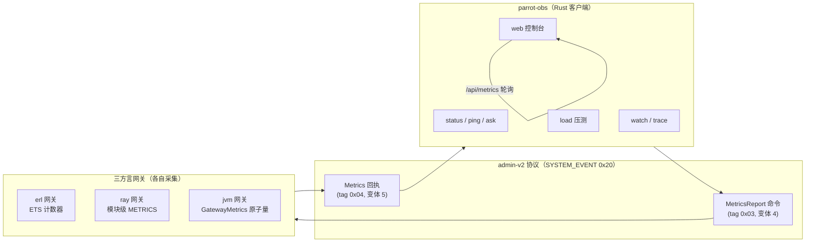

# Parrot 观测五件套（Observability）——trace / debug / metric

> 版本：v0.1（2026-10）· 对应实现：`crates/parrot-remote/src/admin_v2.rs`（协议）、
> `tools/parrot-obs`（CLI+Web）、三方言网关（`interop/{erlang,python,jvm}`）

## 1. 这是什么

一套**框架级**的可观测工具，用于全方位调试、监控整个 parrot 运行时：

| 维度 | 能力 | 工具 |
|------|------|------|
| **Metric** | 连接数、握手计数、ASK/TELL/REPLY 计数、字节吞吐、心跳数、进程/线程数、RSS 内存、组件实例状态 | `parrot-obs metrics` / `watch` / Web |
| **Debug** | 节点连通性、admin 通道 RTT、业务通道 ASK 探测（echo 探针）、组件状态表 | `parrot-obs status` / `ping` / `ask` |
| **Trace（速率）** | 窗口差分吞吐速率（asks/s、tells/s、rx/s、tx/s、hb/s） | `parrot-obs trace` |
| **Load（压测）** | 并发 ASK 压测 + P50/P95/P99 延迟分布 | `parrot-obs load` |
| **Web 控制台** | 拓扑卡片、指标总表、实时 sparkline、组件明细 | `parrot-obs web` |

## 2. 架构



### 2.1 协议层：admin-v2 第五命令

在既有四命令（Deploy/Drain/Stop/Status）基础上新增：

```
AdminCommandV2::MetricsReport { req_id }        // 变体索引 4
AdminReplyV2::Metrics { req_id, snapshot }      // 变体索引 5
```

`MetricsSnapshot`（17 字段——bincode standard varint，四方言同构）：

| 字段 | 类型 | 含义 |
|------|------|------|
| `ts_ms` | u64 | 采集时刻（unix 毫秒） |
| `runtime` | String | 如 `erl/OTP-29`、`python/3.9.6`、`OpenJDK…/21.0.9` |
| `connections` | u64 | 当前活跃连接 |
| `handshakes_ok/failed` | u64 | 累计握手成功/失败 |
| `asks_rx` / `tells_rx` | u64 | 累计接收 ASK/TELL |
| `replies_tx` / `reply_errs` | u64 | 累计回复 / 业务错误 |
| `bytes_rx` / `bytes_tx` | u64 | 累计收发字节（帧体） |
| `heartbeats_rx` | u64 | 累计心跳 |
| `components` | u64 | 在位组件数 |
| `component_states` | Vec<{path,state,version}> | 组件实例明细 |
| `processes` | u64 | erl=进程数 / py=线程+ray actors / jvm=—（0） |
| `memory_rss` | u64 | 常驻内存（erl=VM total / Linux=VmRSS / 其他=0） |
| `uptime_start_ms` | u64 | 网关启动时刻 |

**wire 关键点**：`components: u64` 与 `component_states: Vec` 是相邻两个独立字段——
serde 各编一个 varint 长度（同值双写）。三方言手工编解码均按此对齐（曾因单写导致
Rust 侧 `UnexpectedEnd` 解码失败——见 §5 踩坑）。

### 2.2 网关采集实现

| 网关 | 计数器载体 | 采集函数 | 多连接 |
|------|-----------|---------|--------|
| Erlang | ETS `parrot_gw_metrics`（跨连接累计） | `admin_metrics/0` | accept_loop 每连接 spawn 进程 |
| Python/Ray | 模块级 `METRICS`（线程安全 dict） | `RayAdminExecutor.collect_metrics()` | 每连接独立线程 |
| JVM/Akka | `GatewayMetrics` 单例（AtomicLong） | `AdminPort.metricsReply()` | Netty 天然多连接 |

三方言网关经此改造均支持**多连接并发**（探针与应用可同时连接）。

### 2.3 客户端 API

```rust
// RemoteActorSystem（crates/parrot-remote/src/system.rs）
let snap = client.metrics_report("erl-gw-1").await?;  // -> MetricsSnapshot
```

## 3. CLI 使用

### 3.1 编译

```bash
cargo build -p parrot-obs          # ./target/debug/parrot-obs
```

### 3.2 起被测网关

```bash
# erl
cd interop/erlang && erl -noinput -noshell -pa . -eval 'parrot_gw:main(["19871"])'
# jvm（先 mvn -q package -DskipTests）
cd interop/jvm/target && java -cp "parrot-protocol-jvm-0.1.0.jar:$(cat cp.txt)" \
    parrot.protocol.jvm.ParrotGatewayMain 19872 node=jvm-search-1 7200
# ray
cd interop/python && PYTHONPATH=. python3 -m parrot_protocol.ray_gw 19873
```

### 3.3 七个子命令

节点参数三形态：`erl=<addr> ray=<addr> jvm=<addr>`（任意子集）。

```bash
NODES="erl=127.0.0.1:19871 ray=127.0.0.1:19873 jvm=127.0.0.1:19872"

# 1) 连通性 + 一行摘要
parrot-obs status $NODES
# ✓ erl-gw-1  erl/OTP-29  up 0h01m02s conn=1 asks=30 replies=30 err=0 io=3.8K/1.5K rss=47.7M

# 2) admin 通道 RTT
parrot-obs ping $NODES --rounds 5

# 3) 业务通道 ASK 探测（echo 探针 Ping→Pong，按方言路径自动路由）
parrot-obs ask $NODES --rounds 3

# 4) 全宽指标表 + 组件明细
parrot-obs metrics $NODES

# 5) 持续采样差分（Ctrl-C 停）
parrot-obs watch $NODES --interval 2

# 6) 窗口差分速率（期间跑负载即见吞吐）
parrot-obs trace $NODES --seconds 10

# 7) 压测（吞吐 + P50/P95/P99 延迟）
parrot-obs load $NODES --seconds 10 --conc 4
# 完成 ok=6020 err=1 吞吐=1003.3/s  延迟 P50=0.22ms P95=12.47ms P99=13.14ms
```

### 3.4 排障开关

```bash
RUST_LOG=parrot_remote=debug parrot-obs status ray=…   # 协议层 warn/debug（解码失败可见）
```

## 4. Web 控制台

```bash
parrot-obs web $NODES --web-port 8190
# → 浏览器打开 http://localhost:8190
```

- **指标总表**：节点/运行时/uptime/conn/asks/tells/replies/errs/rx/tx/rss/实时速率
- **节点卡片**：握手统计、心跳数、进程数、内存、组件实例（path/state/version）
- **实时 sparkline**：2s 轮询 `/api/metrics`，滚动 120s 窗口 asks 增量曲线
- 零依赖单页（原生 JS——无 npm/CDN）

`GET /api/metrics` 返回：

```json
{
  "erl-gw-1": { "runtime": "erl/OTP-29", "connections": 1, "asks_rx": 30, ... },
  "ray-gw-1": { "error": "..." }
}
```

## 5. 实测基线（2026-10 · Apple Silicon · 本机三网关）

| 指标 | erl | ray | jvm |
|------|-----|-----|-----|
| 压测吞吐（4 并发轮询三方言） | ≈1003/s 合计 | 同左 | 同左 |
| P50 / P95 / P99 延迟 | 0.22ms / 12.5ms / 13.1ms | — | — |
| 心跳基线 | 0.5-0.6/s | 同 | 同 |

## 6. 踩坑记录（实现备忘）

1. **bincode Vec 双长度**：`components: u64` + `component_states: Vec` 相邻——
   serde 编码是两个独立 varint。Python/Scala 手工编码初版只写一个 → Rust 侧
   `UnexpectedEnd { additional: <ts_ms> }`（把时间戳读成长度）——三方言统一双写。
2. **Erlang 进程字典跨连接不累计**：单连接时代计数在连接进程字典；多连接改造后
   迁 ETS（`parrot_gw_metrics`），快照时合并读。
3. **erl 网关生命周期**：原单连接 accept 后即 close listener、loop 退进程死——
   探针多次连接即拒绝。改 accept_loop + 每连接 spawn（Erlang 原生形态）。
4. **JVM echo 回执 type_key**：固定 `bin:parrot.interop.Echoed#v1`（非 Pong）——
   探针 codec 注册该 key 的 decode 即可配对。
5. **erl 启动驻留**：后台跑 beam 需 `-noinput`（stdin EOF 即 halt 的默认行为）。

## 7. 演进路线

- [ ] SYSTEM_EVENT 推送模式（网关主动上报——当前为探针拉取）
- [ ] cid 级 span 追踪（跨网关全链路时序）
- [ ] Prometheus exposition 端点（`/metrics` text format）
- [ ] Grafana dashboard JSON 模板
