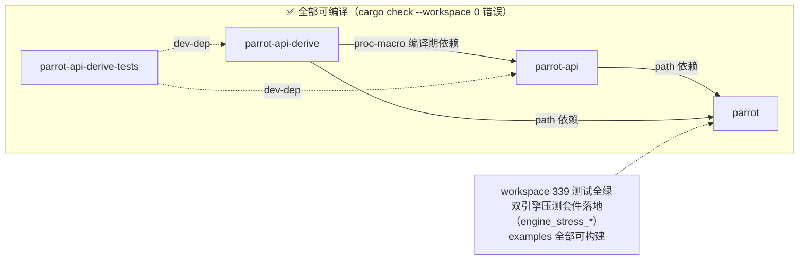
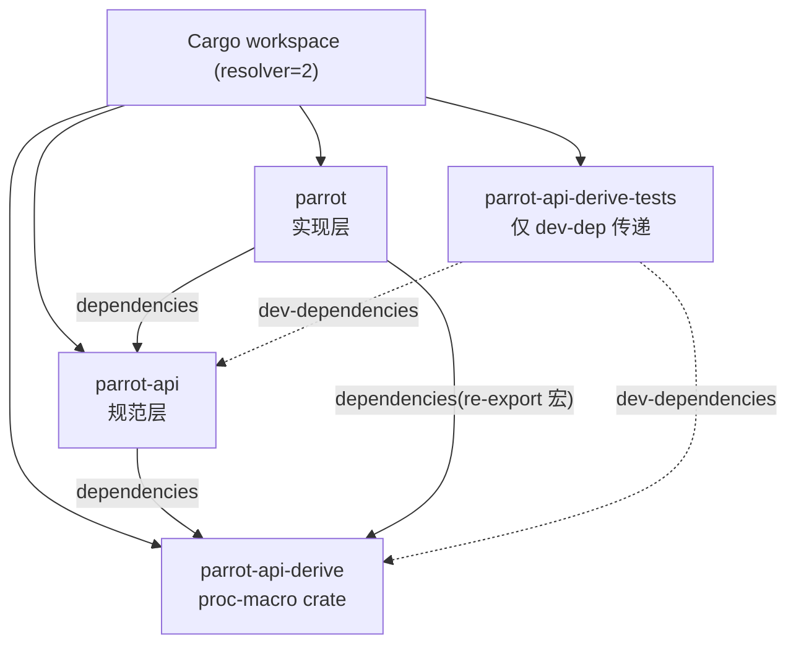
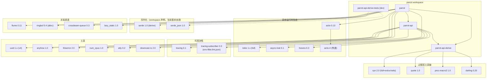
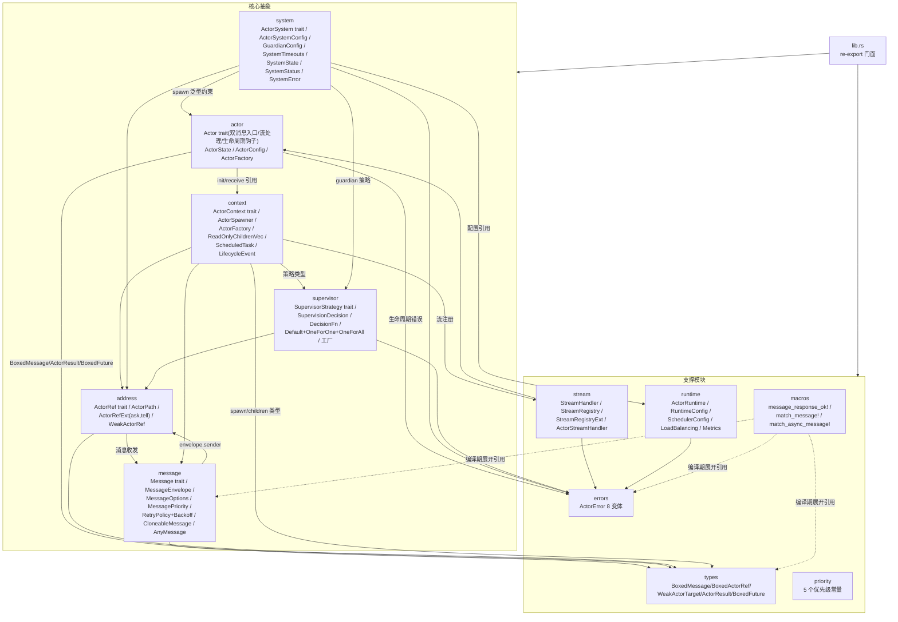
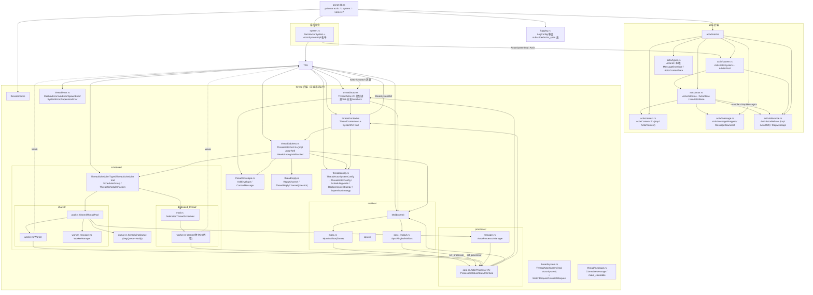

# 01 · 架构与设计原则

> 数据基准：commit `00f20c9` + 引擎压测修复轮（2026-10-01）+ 十一轮压测/正确性轮（2026-10-02，含 ADR-10~17、B 系列业务正确性、纯 actix 基准）；cargo check 现状：**全部 4 crate ✅（0 错误）**；workspace 测试 **474 通过 0 失败**（release）；外部基准资产收纳于 `bench/`（`akka-bench/`、`actix-bench/`）。

---

## 1. 项目定位与问题域

**Parrot 是一个"框架的框架"**：它不是又一个 Actor 运行时，而是一层**语言无关的 Actor 编程模型接口（Specification）+ 多后端适配器（Adapter）体系**。其核心命题是：

> 用户代码写一次（实现 `parrot-api` 的 `Actor` trait），底层执行引擎（actix、自研 thread 引擎，未来更多）可以插拔替换，且迁移成本趋近于零。

这一定位直接解释了仓库里的三个"角色"：

| 角色 | Crate | 职责 |
|------|-------|------|
| **规范（Specification）** | `parrot-api` | 定义 Actor/Message/Address/Context/Supervisor/System 六大抽象，零具体实现 |
| **语法糖（Codegen）** | `parrot-api-derive` | 两个过程宏（`Message`、`ParrotActor`）把样板代码压缩为 attribute 声明 |
| **实现（Backends）** | `parrot` | ① actix 适配层；② 自研 thread 引擎（shared pool + dedicated thread 双调度模型）；③ 多系统聚合层 `ParrotActorSystem`；④ 统一日志 |
| 测试 | `parrot-api-derive-tests` | 过程宏的行为级集成测试 |

### 1.1 Actor 模型在本项目中的具体形态

```
用户视角：一切皆消息
┌──────────────────────────────────────────────────────────┐
│  Actor（封装私有状态）                                     │
│   ├── 生命周期：Starting → Running → Stopping → Stopped   │
│   ├── 唯一行为入口：receive_message(BoxedMessage)          │
│   └── 上下文：ActorContext（self_ref/parent/children/     │
│        send/ask/schedule/watch/spawner）                  │
├──────────────────────────────────────────────────────────┤
│  Message（类型擦除后的 Box<dyn Any + Send>）               │
│   ├── 编译期类型：impl Message { type Result }             │
│   └── 运行期形态：MessageEnvelope{id,payload,sender,       │
│        options,message_type} / AskEnvelope{payload,reply} │
├──────────────────────────────────────────────────────────┤
│  寻址：ActorPath{target: WeakActorTarget, path: String}    │
│        path 形如 actix://系统/user/父子层级 或 /actor-name │
└──────────────────────────────────────────────────────────┘
```

### 1.2 两种权衡贯穿全库

**① 类型安全 vs 对象安全（最主要的张力）**

理想形态是"每个 Actor 有自己的 Message 关联类型"，但那要求系统层保存具体类型 → 无法装进统一的 `HashMap<String, BoxedActorRef>` 注册表。于是 Parrot 选择：

- **边缘类型安全，中心类型擦除**：用户 API 层保留 `M: Message`、`M::Result` 泛型与 `ask/tell`（`ActorRefExt`）；进入传输通道前统一 `Box<dyn Any + Send>`；到达目标 actor 后靠 `downcast_ref::<M>()` 恢复类型（由 `match_message!` 宏 + derive 生成代码完成）。`Message::extract_result` 同样以 downcast 恢复响应类型。
- 代价：每次消息传递 2 次装箱 + 2 次 downcast；换来的是"任意 actor 引用可以放进任意容器/跨后端传递"。

**② 统一抽象 vs 引擎特有能力**

Actix 的 `Context<A>` 不是 `Send`，无法跨 await 保存 → Parrot 折衷出双方法设计：`receive_message`（纯 Parrot 语义，异步）与 `receive_message_with_engine`（接收 `NonNull<dyn Any>` 指针直通引擎上下文，**同步**）。derive 宏在非 test 配置下让 `receive_message` 直接返回错误，强制生产路径走 engine 通道——这是一个非常"务实"的取舍（详见 02 §1.2、§2.3）。

**③ 双路径调度 vs actor 串行语义（2026-10 修复轮新增）**

actix 适配层的 `Handler` 需要同时满足"同步 handler 零开销"与"异步 handler 可表达"。解法是 `AtomicResponse` 双路径：默认走 `receive_message_with_engine` 同步快路径；`use_async_handler() == true` 时改走 `receive_message` 异步路径，future 经 `AsyncDispatchFuture` 挂到 actix `ctx.wait`——**await 期间释放 arbiter 线程给其他 actor，但本 actor 的后续消息排队等待**（与 thread 引擎的 per-actor 串行语义一致）。actor 内串行性与跨 actor 并行性由两个正交机制分别保证。

---

## 2. 设计原则体系分析（源自源码，逐条对照实现）

`parrot-api/src/lib.rs` 顶部声明了 6 条设计原则，下面逐条核实其落地情况与偏差：

### P1. Language Agnostic（语言无关）

| 声明 | 现实 |
|------|------|
| API 可在任何语言实现，语义一致 | `BoxedMessage = Box<dyn Any + Send>` 是 Rust 类型系统特有的类型擦除手法（对应 Java 的 Object/接口、Python 的鸭子类型）；`BoxedFuture<'a,T> = Pin<Box<dyn Future + Send + 'a>>` 把异步模型钉死在 Rust async 语义上；`NonNull<dyn Any>` 引擎上下文指针更是 Rust 独有 |
| **结论** | 原则目前停留在文档层。实际是"Rust 内多运行时无关（runtime-agnostic within Rust）"，而非跨语言规范。若真要跨语言，`MessageEnvelope` 需要序列化边界（serde 特性已备但未接入），`Any` 需换成 tagged union / schema registry |

### P2. Type Safety（编译期正确性）

- ✅ 落地良好：`Message::Result` 关联类型 + `ActorRefExt::ask<M>` 闭环；`message_response_ok!` 宏内 `let _result_with_type: <M as Message>::Result = $value;` 是零成本编译期类型断言（不匹配直接编译失败）。
- ⚠️ 部分缺口：`MessageEnvelope::payload` 是 `Box<dyn Any + Send>`，信封可携带任意类型，收发双方契约仅靠约定；`BoxedMessageClone/CloneableMessageTrait` 等克隆逃逸舱进一步放松了约束；`CloneableMessage::try_from_boxed` 对自定义类型直接返回 `None`（消息克隆能力表未建全）。

### P3. Fault Tolerance（监督与容错）

- 规范层完备：`SupervisionDecision{Resume,Restart,Stop,Escalate}` 四决策 + `SupervisorStrategy` trait + `Default/OneForOne/OneForAll` 三实现 + `BasicDecisionFn` 闭包注入 + `SupervisorStrategyType` 枚举统一分发。
- 实现层缺位：actix 后端完全没有实现监督；thread 后端的 `SupervisorStrategy{Restart,Stop,Escalate}` 是**独立重定义**（与 API 层枚举不同型，且无 Resume），监督执行链（谁调用 `handle_failure`、失败计数存哪、重启语义）未落地。`ActorProcessor` 有 panic 捕获（`catch_unwind`）→ 转成 `ActorError::Panic`，是容错链上唯一真实生效的环节。
- **2026-10 修复轮补充**：actix 适配层的 panic 隔离粒度是"arbiter 级"——一个 handler panic 会击穿所在 arbiter 线程上的所有 actor（actix 本体行为）；thread 引擎的 panic 隔离是 processor 级（捕获后 actor 可继续）。这是监督落地时两引擎需要拉平的语义差异。
- **结论**：容错是"规范先行、实现欠账"的典型区。

### P4. Scalability（可扩展）

- 规范：`LoadBalancingStrategy{RoundRobin,Random,LeastLoaded}`、`RuntimeMetrics`、`SystemResources` 都已声明。
- 实现：thread 后端的 SharedThreadPool 是真实的 work-stealing 调度（crossbeam `SegQueue` + `Notify`）；actix 后端 **2026-10 修复轮已内置 Arbiter 池**（默认 CPU 数个 OS 线程，spawn round-robin 经 `start_in_arbiter` 分配），path 追加 uuid 后缀**消除同名类型覆盖注册表问题**（herd-20000 实测 20,000 actor 全部独立存活）；`status()` 仍返回硬编码占位数据。分布式能力（远程 path、网络传输）完全缺失。

### P5. Flexibility（可插拔后端）

- 这是落地**最好**的一条：`ParrotActorSystem` 以 `RwLock<HashMap<String, ActorSystemImpl>>` + default 标记实现多后端注册与路由；`ActorSystemImpl` 枚举预留扩展位。但泛型擦除问题使 trait 方法 `spawn_root_typed` 对 actix 后端实际不可用（返回错误引导用户改用 `spawn_root_actix`），说明"统一入口"在 Rust 泛型约束下打了折扣。
- **2026-10 修复轮补充**：双引擎能力矩阵已实质等价——async handler（thread 原生 / actix 经 `use_async_handler()` 开关）、多 actor 真并行（thread 池化 worker / actix arbiter 池）均双向可用，同一份 async handler 代码可双引擎通用（压测验证，见 ENGINE_STRESS_REPORT §四）。

### P6. Documentation/Comment Density（文档密度）

未在 lib.rs 显式声明，但值得单列：全库采用模块级 `//!` 文档 + 类型/方法级 `///` 文档（含 Overview/Key Responsibilities/Implementation Details/Thread Safety 分节模板），并配 8 个 example + README + proposal。文档密度显著高于一般工程，且注释与代码同步度较高（少数 drift，见 03 §3）。

### 2.1 从代码反推的"隐性原则"（代码里真实存在但未声明的约束）

1. **内部容器线程安全优先**：所有跨线程共享状态一律 `Arc<RwLock<…>>` 或 `Arc<Atomic*>`，对外只暴露 `Weak`（`WeakActorTarget`、`WeakMailboxRef`、`WeakSystemRef`、`WeakSchedulerRef`）——"强引用归所有者，弱引用归旁观者"，用于打破循环引用（system ↔ scheduler ↔ context ↔ system）。
2. **消息不可变/可克隆导向**：broadcast/periodic 调度强制 `Message + Clone`；`CloneableMessage`/`make_cloneable` 提供运行期克隆逃逸舱。
3. **锁不跨 await（尽力）**：`ParrotActorSystem::internal_spawn_actor` 特意先 clone system 再 await；但 thread 模块仍存在 `MutexGuard` 跨 await 的违规（03 §3 详述）。
4. **占位符驱动演进**：大量 `TODO`/`unimplemented!`/返回假的 `status()`，先立接口再补实现，属于"规范先行"的开发范式。

---

## 3. 总体架构

### 3.1 架构分层（文字版）

```
第 4 层  用户应用层          examples/*（ping_pong、actor_ring、dedicated_thread_example…）
          ↓ 只依赖 parrot + parrot_api
第 3 层  系统聚合层          parrot::system::ParrotActorSystem
          - 多后端注册表 RwLock<HashMap<String, ActorSystemImpl>>
          - 默认后端路由 / 按名路由 / 跨后端 actor 查找 / 全系统广播 / 全系统关停
          ↓
第 3' 层 后端引擎层（两个并列实现）
          A. parrot::actix::*   → 适配 actix 0.13
          B. parrot::thread::*  → 自研引擎（注册表 + SchedulerGroup + Mailbox + Processor）
          ↓ 只依赖 parrot-api 的 trait
第 2 层  API 规范层           parrot-api::{actor,address,message,context,system,
                              supervisor,stream,runtime,errors,types,priority,macros}
第 1 层  编译期代码生成        parrot-api-derive（Message / ParrotActor 过程宏）
          + parrot-api::macros（message_response_ok! / match_message! / match_async_message! 声明宏）
横向层   可观测性             parrot::logging（tracing 封装，env-filter/json/文件/actor span）
横向层   错误体系             ActorError（API 层）→ SystemError × 2（API 层与 thread 层各一个）
                              → MailboxError/AskError/SpawnError/SupervisorError（thread 层细分）
```

### 3.2 关键设计决策记录（ADR 摘要式）

| # | 决策 | 动机 | 代价/后果 |
|---|------|------|-----------|
| ADR-1 | 消息统一类型擦除 `Box<dyn Any + Send>` | 后端无关 + 注册表统一 | 每 msg 2 次装箱+2 次 downcast；丢失编译期穷尽匹配。**复审（2026-10）**：擦除是注册表/跨后端的根基，压测非瓶颈，保持 |
| ADR-2 | 双消息入口 `receive_message` / `receive_message_with_engine(EngineContextHandle)` | 规避 actix Context 非 Send，同时保留引擎能力直通 | ~~API 出现 unsafe 语义泄漏（裸指针进公共 trait）~~ **已缓解（2026-10）**：第三参数改为安全包装 `EngineContextHandle`（仅暴露 `downcast_ref/downcast_mut` 借用），unsafe 收敛到引擎侧唯一铸造点 `ActixActor::handle`；用户代码零裸指针 |
| ADR-3 | ~~derive 宏在 `#[cfg(not(test))]` 下让 `receive_message` 直接报错~~ **已修复（2026-10）**：`receive_message` 无条件转发用户 `handle_message` | ~~防止用户在 actix 后端误用异步通道~~ 该防护实际令 derive+thread 引擎生产全断（thread 主路径即 `receive_message`），且阻断 ADR-8/9 的异步能力 | 测试语义 = 生产语义；derive actor 可用 thread 引擎与异步路径；新增 `#[ParrotActor(async_handler = true)]` 生成 `use_async_handler() == true`（ADR-9 的 derive 属性支持，原为宏缺口）。**注意**：`handle_message_engine` 返回 `None` 时 actix 侧现在返回可诊断错误（提示补 handler 或改 async 路径），不再静默丢消息 |
| ADR-4 | thread 后端双调度模型（SharedPool+DedicatedThread） | IO 密集 vs 计算密集 workload 分治 | 系统复杂度陡增（曾引发 38 错重构阵痛，已清零，见 03 §1）。**实验复审（2026-10）**：单 actor 场景 batch_size 不放大 HOL（batch=1 反而慢 ~2×，见 `worker.rs::batch_size_hol_experiment`）；knob 的真实杠杆是跨 actor 公平性，模型保留 |
| ADR-5 | 弱引用治理循环依赖 | system↔scheduler↔context 成环 | 运行期可能"目标已死"需到处 upgrade+报错。**复审（2026-10）**：防御性设计的合理代价，保持 |
| ADR-6 | `ParrotActorSystem` 只聚合、不执行 | 多后端对等、可并行注册 | 泛型 `spawn_root_typed` 无法转发到具体后端（类型约束不同），被迫暴露后端特化方法。**复审（2026-10）**：stable Rust 无 specialization，编译期统一不可行；运行时擦除 spawn 需给 thread 引擎加 dyn Actor 路径、破坏面大收益低，保持现状（`spawn_root_actix` / `spawn_root_thread` 特化入口） |
| ADR-7 | actix 适配层内置 Arbiter 池（round-robin 分配 spawn） | 单 arbiter 无跨 actor 并行、队头阻塞传染 | 每 arbiter 一个 OS 线程；线程资源与系统生命周期绑定；`System::current()` 上下文外不可用（池懒构建时 panic 转错误路径） |
| ADR-8 | actix Handler 返回 `AtomicResponse`（同步快路径 + `ctx.wait` 异步路径） | 异步 handler 可表达且同步路径零开销 | 生命周期扩展需 unsafe transmute（安全性论证见 02 §3.1a）；ask 回复经 actix oneshot，`M::Result` 保持 Send |
| ADR-9 | `use_async_handler()` 作为 actor 侧调度路径开关（默认 false） | 存量 actor 行为逐字节兼容；新能力 opt-in | 同一 actor 内不能混用两种路径；~~derive 宏尚未生成该开关的属性支持~~ **已补齐（2026-10）**：`#[ParrotActor(async_handler = true)]` |
| ADR-10 | **消息原语语义统一（2026-10-02）**：`send`/`send_with_timeout(None)` = 无界 ask（无隐式引擎默认超时）；新增 `deliver` = 纯投递（显式 tell 路径）；`ActorRefExt::tell` 改走 `deliver` | 消除跨引擎语义漂移（压测报告 §九：thread `send` 曾是 5s 默认超时 ask，actix 是无界 ask；`send_with_timeout(None)` 在 thread 是纯投递、在 actix 是无界 ask） | 长等待场景必须显式 `send_with_timeout(Some(d))`；fire-and-forget 必须显式 `deliver`/`tell`——`send` 后不再丢弃返回值即"忘掉" |
| ADR-11 | **thread 引擎双层饥饿治理（2026-10-02，release 验证）**：①`worker.rs` handler future 改经 `spawn_blocking`（阻塞池默认上限 512）——CPU handler 不再占 runtime 线程，调度器自身永不饿死（第一层根因：12 个 CPU future 曾占满 8 runtime 线程，弹性巡检全部停摆，M1 probe max 67.5s）②SharedThreadPool 内置 `ElasticController` burst worker：backlog 持续 ≥threshold 且无 idle core worker 时 +1（`compare_exchange` 锁定首时刻——首版 `swap` 会每 probe 重置窗口的 bug 已修；wake_hook + 周期巡检双探测，解决"caller 等回复不再发消息→probe 断流"的鸡生蛋死锁）；空闲 ≥idle_timeout 由 reaper 置专属 shutdown flag 优雅收割（不 mid-batch abort）；全局上限 `pool_size + burst_workers_max`；配置经 `ThreadActorSystemConfig::shared_burst_*` 暴露，`SchedulerMetrics.burst_workers_alive` 可观测 | M1 压测发现：全部 core worker 被分钟级 CPU 任务占满时，短任务可在调度队列中饿死秒级~分钟级（debug 轮"通过"系 E 核调度巧合，release 复测暴露双层真根因） | 修复后 M1 probe max **0.9ms**（原 67492ms）；专项测试 `test_elastic_scaling.rs`（饱和保护 149ms / 收缩后复救 128ms / 线程上限不爆炸）全过 |
| ADR-12 | **actor 级背压配置必须贯通到 ref（2026-10-02，第五轮实证发现）**：`ThreadActorConfig.backpressure_strategy/mailbox_capacity/ask_timeout` 若只在邮箱构造时生效、而 `ThreadActorRef::new`（spawn 返回值与注册表 BoxedActorRef 两处）仍取系统默认策略，则用户经 `deliver`/`send` 触发的 push 实际走 `Block`——有界邮箱形同虚设（A3 首跑 200k 全收、push 被拖 23s、无界积压）。规则：**凡从 actor config 派生的行为，注入 ref 时必须 `thread_config.X.clone().unwrap_or_else(system_default)`**，杜绝"配置半路断线"。 | 优势专项验证 A2/A3：bounded(8)+Error 应拒收而 0 拒收；修复后 12/20 拒收、A3 199,744/200,000 拒收、RSS 稳定 | `tests/test_thread_advantages.rs`（A1 独占线程 4×4.5s 并行 4.95s / A2 四策略矩阵 / A3 内存防护 / A4 宿主嵌入 / A5 海量 spawn 593k actors/s）全过；workspace 457/457 |
| ADR-13 | **ask 消息路径分配最小化（2026-10-02 第七轮）**：优化前一次 ask = 3 次堆分配（payload 装箱 + `Box<dyn ReplyChannel>` + envelope 二次装箱）。优化：`AskEnvelope.reply` 内联 `oneshot::Sender`（消除 trait 对象装箱）、新增 `new_typed` 构造器（未装箱消息直移入 envelope）、回复改同步 send（消除 async 虚调用）。优化后 = **1 次分配**。收益：c64 并发 ask +12%（494k/s）、herd +4.6%（825k/s）、allocator 压力降 2/3。对照：actix 侧 `MessageEnvelope` 每条消息含 `uuid::new_v4()`（CSPRNG 读取），是待优化点 | S6 压测核对 ask 路径源码发现三重分配；分配次数直接决定高并发下的 malloc 争用与缓存污染 | `envelope.rs` 单测 + 全量 457 回归 + 压测复验（c64/herd 提升，驱动侧瓶颈场景持平） |
| ADR-14 | **Sharded 亲和性调度器（2026-10-02 第七轮）**：`SchedulingMode::Sharded { affinity_key }` → N 固定线程 × 每线程独占 MPSC 分片队列（FNV-1a+splitmix64 哈希，actor 永不迁移）。消息经 wake-hook 直推分片，**绕过中央 SegQueue**：零全局 CAS 争用、零 Notify 唤醒延迟（稳态线程自旋在私有队列）、同域消息享 L1/L2 局部性、分片间尾延迟硬隔离。代价：无 work-stealing（亲和域须大致均衡）。适用：会话粘滞、分片状态、分区 topic（Kafka partition 语义的 actor 化） | 用户提案"固定线程池+亲缘性标志匹配"；理论预期"少一层等待"被证实且量化 | S1：8 actor×20k ask **380k/s vs 共享池 216k/s（1.76×）**；S2：邻域 4×9s 重载下探针 p99=45µs max=48µs（硬隔离）；`tests/test_sharded_scheduler.rs` |
| ADR-15 | **消息池化（thread-local per-TypeId free-list）**：`Pooled<T>` wrapper 在 Drop 时归还本线程池，上限每类型 128/总 256 类型/大对象不入池；内容为脏契约（Disruptor 式）。**关键教训：首版全局 atomic 计数器使池比 malloc 慢 3.4×，改 thread-local 计数后并发 2.83×、串行 1.37×——池化组件上任何跨线程原子操作都是毒药** | 用户提议"消息 cache 复用"；业界先例 Disruptor/TLAB/Netty 验证思路成立 | P1/P2 微基准 + `message_pool.rs` 单测（复用/上限） |
| ADR-16 | **Work-stealing 审计**：现有"work-stealing"注释名不副实——实为全局 SegQueue 集中弹出（全员争一队列）。已建 `steal.rs`（无锁 StealDeque + StealRing，4 线程 5 万条无丢失）。**微基准否决默认替换**：调度粒度是 mailbox 批次，中央队列均衡度 1.05× 极佳，本地+窃取反而 7.7× 失衡，吞吐持平（1060k vs 1050k/s）。结论：中央队列在粗粒度模型下不是瓶颈；消除中央队列的路线（Sharded 1.76×）优于优化中央队列的路线（work-stealing）。steal.rs 保留供未来细粒度调度 | 用户问"是否有优化的 work-stealing"——审计发现并无，遂建基础设施并实证评估 | `tests/test_steal_bench.rs` 三轮稳定 + steal 并发正确性单测 |
| ADR-17 | **parrot-actix 包装税量化与优化红线（2026-10-02 第十一轮）**：`bench/actix-bench/`（纯 actix、零 parrot 依赖、场景逐字节对等 incl. arbiter 拓扑）实测包装税——c64 并发 ask **-45%**、flood tell **-31%**、RTT 链 -13~15%、herd spawn 慢 51%；CPU/IO/分钟级混合场景 ≈0。税构成：每消息 uuid+envelope+装箱+downcast 链+AtomicResponse 双层装箱。**优化红线**（影响评估见 ENGINE_STRESS_REPORT §11.5）：① 去 uuid 须先 profile（`new_v4` 是线程本地 PRNG 非系统调用，收益存疑；保守路线 UUIDv7 风格）；② 同步直通受四重障碍制约（Handler 关联类型单值、use_async_handler 运行时开关、AtomicResponse 是 per-actor 串行承重墙不可退化为 ResponseActFuture、unsafe 边界需重审），属 breaking change 须 profile 证装箱占比 >15% 才值得 | 用户要求验证"包了一层之后 actix 性能是否有损失"；同机背靠背实测 + 代码级税点定位 | 任何包装层改动前后必须 `bench/actix-bench` 复测；计算密集场景无税（选型时无需规避 parrot 包装） |
| ADR-18(草案) | **远程/集群/异构联邦架构（2026-10-02 提案，见 TECH_DESIGN_04）**：六层模型（线缆/传输/远程/集群/联邦/应用）。核心决策：①消息双轨制——本地路径 `Any` 零拷贝不变（ADR-1 延续），远程路径新增 `RemoteMessage` trait + 宏自动注册 + bincode(Rust↔Rust)/protobuf(跨语言) 双栈 codec；②`RemoteActorRef` 是统一 `ActorRef` 的又一实现（门面不变，位置透明）；③统一路径 `parrot://{node}/{system}/user/{uuid}` 三级路由；④集群 SWIM gossip + receptionist（端云发现承重件），sharding 复用 ADR-14 affinity_key（P4）；⑤异构联邦走协议网关（akka=JVM BridgeActor / ray=语义收窄为计算任务域），**否决** JVM/Python 进程内互通（同调度域原理，仅 C++ lite 走 C ABI 进程内） | 端云一体场景（手机 RPA/物理机器人/虚拟人 × 云中枢 ray/akka）；用户要求全局异构 actor 两两互通 | 远程消息需显式 derive；跨网 at-least-once 需幂等设计；akka 网关是 JVM 双栈工程 |

---

## 4. 架构图

### 4.1 总体分层架构图

```mermaid
flowchart TB
    subgraph L4["第 4 层 · 用户应用层"]
        EX1[examples/ping_pong]
        EX2[examples/actor_ring]
        EX3[examples/dedicated_thread_example]
        EX4[用户业务 Actor]
    end

    subgraph L3["第 3 层 · 系统聚合层 parrot::system"]
        PAS["ParrotActorSystem<br/>├ systems: RwLock<HashMap<String, ActorSystemImpl>><br/>├ default_system: RwLock<Option<String>><br/>├ register_actix_system()<br/>├ spawn_root_actix() / spawn_actor_in_system()<br/>├ internal_get_actor() 跨后端查找<br/>├ internal_broadcast() / internal_shutdown()"]
    end

    subgraph L3A["后端 A · Actix 适配层 parrot::actix"]
        AAS["ActixActorSystem<br/>├ system: Arc<actix::System><br/>├ actors: RwLock<HashMap<String, BoxedActorRef>><br/>├ arbiters: RwLock<Option<ArbiterPool>>（懒构建）"]
        APOOL["ArbiterPool<br/>├ workers: Arc<Vec<ArbiterHandle>><br/>└ next: AtomicUsize round-robin"]
        AAC["ActixActor&lt;A&gt;<br/>包装用户 actor<br/>Handler → AtomicResponse<br/>（同步快路径/异步 ctx.wait 双路径）"]
        AACTX["ActixContext&lt;A&gt;<br/>impl ActorContext"]
        AREF["ActixActorRef&lt;A&gt;<br/>impl ActorRef<br/>包装 actix::Addr"]
        AMSG["ActixMessageWrapper<br/>impl actix::Message"]
    end

    subgraph L3B["后端 B · Thread 自研引擎 parrot::thread"]
        TAS["ThreadActorSystem<br/>├ registry: RwLock<HashMap<String, ActorRegistryEntry>><br/>├ SchedulerGroup{shared, dedicated}"]
        TA["ThreadActor&lt;A&gt;<br/>控制消息/Ask 分发"]
        TCTX["ThreadContext&lt;A&gt;<br/>impl ActorContext + ActorSpawner"]
        TREF["ThreadActorRef&lt;A&gt;<br/>impl ActorRef<br/>Weak&lt;Mailbox&gt;"]
        MBOX["Mailbox trait<br/>MpscMailbox(flume) / SpscRingbufMailbox(ringbuf)"]
        PROC["ActorProcessor&lt;A&gt;<br/>初始化/批量处理/panic 捕获"]
        SS["SharedThreadPool<br/>+ SchedulingQueue + Workers"]
        DS["DedicatedThreadScheduler<br/>+ Dedicated Workers"]
    end

    subgraph L2["第 2 层 · API 规范层 parrot-api"]
        direction LR
        API1["Actor / ActorState<br/>ActorFactory / ActorConfig"]
        API2["ActorRef / ActorPath<br/>ActorRefExt(ask/tell)"]
        API3["Message / MessageEnvelope<br/>MessageOptions / Priority / RetryPolicy"]
        API4["ActorContext / ActorSpawner<br/>ScheduledTask / LifecycleEvent"]
        API5["ActorSystem / ActorSystemConfig<br/>SystemStatus / SystemError"]
        API6["SupervisorStrategy × 3<br/>SupervisionDecision"]
        API7["StreamHandler / StreamRegistry"]
        API8["ActorRuntime / RuntimeConfig<br/>LoadBalancingStrategy"]
        API9["ActorError 体系"]
        API10["match_message! 等声明宏"]
    end

    subgraph L1["第 1 层 · 编译期代码生成 parrot-api-derive"]
        DM["#[derive(Message)]<br/>result/validate/priority/<br/>timeout/retry 属性 → impl Message"]
        DA["#[derive(ParrotActor)]<br/>engine='actix' →<br/>impl Actor + IntoActorBase"]
    end

    subgraph LH["横向 · 基础设施"]
        LOG["parrot::logging<br/>tracing 封装<br/>env-filter/JSON/文件/actor_span"]
        ERRH["错误体系<br/>ActorError / SystemError×2<br/>MailboxError / AskError / SpawnError"]
    end

    EXT_ACTIX(["外部依赖 actix 0.13"])
    EXT_TOKIO(["外部依赖 tokio 1.x"])
    EXT_FLUME(["flume"])
    EXT_RB(["ringbuf"])
    EXT_CBQ(["crossbeam-queue"])
    EXT_TRC(["tracing / tracing-subscriber"])
    EXT_MISC(["uuid / anyhow / thiserror / async-trait / num_cpus / downcast-rs / lazy_static / futures"])

    L4 --> PAS
    PAS -->|"按名/默认路由"| AAS
    PAS -.->|"泛型入口(受限)"| TAS
    AAS --> L2
    TAS --> L2

    AAS --- AAC --- AACTX
    AAS --- APOOL
    AAC --- AREF
    AAC --- AMSG
    AAC --> EXT_ACTIX

    TAS --- TA --- TCTX
    TA --- TREF --- MBOX
    MBOX --- PROC
    TAS --- SS
    TAS --- DS
    SS --> EXT_CBQ
    MBOX --> EXT_FLUME
    MBOX --> EXT_RB
    TAS --> EXT_TOKIO

    L4 --> DA
    L4 --> DM
    DM -.生成代码.-> API3
    DA -.生成代码.-> API1
    DA -.生成代码.-> AAC
    L4 --> API10

    LH --- L2
    LOG --> EXT_TRC
```



### 4.2 编译态分层视图（当前真实可用边界）



> **状态变更**：b5f74e0 时代的 38 个 thread 模块编译错误已全部清零（SchedulerGroup 重构收尾 + ActorPath.target 构造顺序重排 + 签名统一），详见 03 §1 复盘。

---

## 5. Workspace 依赖关系图

### 5.1 内部依赖（cargo path 依赖）



依赖方向解读：
- `parrot-api` **编译期依赖** `parrot-api-derive`（用户在 parrot-api 命名空间下可直接 `use parrot_api::Message` 拿到 derive）。
- `parrot` 依赖两者并 **re-export** `parrot_api_derive::*`，形成"只 `use parrot::*` 即可写用户代码"的体验。
- **注意一个反向引用**：`parrot-api-derive` 生成的代码里写死了 `parrot::actix::ActixContext` / `parrot::actix::ActorBase`（见 02 §2.3），即 **derive 产物依赖实现层类型**。这使"规范层不依赖实现层"仅在 crate 图上成立，在符号级并不成立——这是架构上值得警惕的点（03 §3-D6）。

### 5.2 外部依赖全景



外部依赖选型点评：
- **双运行时并存**（actix-rt 与 tokio）：actix 0.13 内部基于 tokio，但 `actix::System` 与裸 `#[tokio::main]` 混用是 examples 里反复踩的点（`ping_pong.rs` 必须用 `actix::System::new().block_on` 包裹，另提供 `actix_basic_no_tokio.rs` 示例说明差异）。
- **三套 channel**（flume/ringbuf/crossbeam）按调度模型分治：MPSC 邮箱→flume；SPSC 环形邮箱→ringbuf；全局就绪队列→crossbeam SegQueue。选型合理但认知成本高。
- **serde 只在 workspace 与测试 crate 声明**，主链路无序列化——印证"本地多后端"而非"分布式"的现状。

---

## 6. 模块关系图

### 6.1 `parrot-api`（规范层）模块关系



关键耦合关系说明：
1. **`message ↔ address` 双向依赖**（envelope 持 sender: `Box<dyn ActorRef>`；ActorRef 发送 BoxedMessage）——规范层内部唯一的环，Rust 模块级允许。
2. **`context` 是"系统服务聚合点"**：它同时引用 address/message/supervisor/stream/types，把"actor 能对世界做什么"收敛到一个 trait。
3. **`macros` 是隐式枢纽**：用户代码大量经由 `match_message!` 触达 message/errors/types。

### 6.2 `parrot`（实现层）模块关系



结构性观察：
1. **thread 后端是"框架内框架"**：自带 system/actor/context/address/mailbox/scheduler/processor/error 全套，规模 11,709 行（含随重构增长的调度器实现与测试内联模块），远超 actix 适配层（1,302 行）——因为 actix 层只做适配，thread 层要从零造调度与执行。
2. **三处 Weak 回指 ThreadActorSystem**（scheduler worker ×2、context ×1）+ system 持 scheduler 的 Arc——形成"强指针向下、弱指针向上"的 DAG，是本项目打破循环引用的标准手法。
3. **`ActorProcessor` 是执行核心**：被 mailbox（`set_processor`）与两类 worker 共同持有，承担"初始化→批量取消息→panic 捕获→统计"的消息执行循环。
4. **actix 适配层 2026-10 修复轮引入 `ArbiterPool`**（system.rs）与双路径 Handler（actor.rs 的 `AsyncDispatchFuture`）——适配层从"纯转发"升级为"自带并行调度与异步执行桥"的自研组件。

---

## 7. 代码量与成熟度盘点

| 单元 | 行数 | 状态 |
|------|------|------|
| `parrot-api/src` | 3,433 | ✅ 可编译；文档完备；stream/spawner 等部分接口仅声明；**新增 `use_async_handler()` 调度开关（默认 false）** |
| `parrot-api-derive/src` | 780 | ✅ 可编译；仅支持 actix 引擎 |
| `parrot/src/actix` | 1,302 | ✅ 完整可用：**Arbiter 池 + 双路径 Handler（AtomicResponse）+ stop 拦截 + 唯一路径**；watch/stream_registry/spawner 仍未实现 |
| `parrot/src/thread` | 11,709 | ✅ 可编译可运行：shared pool + dedicated 双调度、async handler 原生支持、ask 语义已对齐（send 桥接真 ask）；监督/watch 通知未落地 |
| `parrot/src/system.rs + logging.rs + lib.rs` | 1,510 | ✅ 聚合层可用；泛型 spawn 受限 |
| 测试 | ~25 文件 · 339 用例 | ✅ 全绿；**新增双引擎压测套件（engine_stress_thread/actix，13 场景对齐）** |

> 续读：[02 核心机制与详细设计](./TECH_DESIGN_02_核心机制与详细设计.md) · [03 质量分析与改进路线](./TECH_DESIGN_03_质量分析与改进路线.md) · [引擎压测报告](./ENGINE_STRESS_REPORT.md)
