# 02 · 核心机制与详细设计

> 本文逐模块展开三层（规范层 / 代码生成层 / 实现层）的详细设计，并给出全部 UML 类图、状态机、时序图、ER 图、数据流图。承接 [01 架构与设计原则](./TECH_DESIGN_01_架构与设计原则.md)。
> 数据基准：commit `00f20c9` + 引擎压测修复轮（2026-10-01）。§3 Actix 后端已按 Arbiter 池 + 双路径 Handler 重写。

---

## 1. 规范层 `parrot-api` 逐模块详设

### 1.1 `actor` —— Actor trait 与生命周期

`Actor` trait 是整个体系的根抽象，采用**关联类型而非泛型参数**（`Config` / `Context`），保证 trait 对象可用性与实现自由度：

| 方法 | 签名要点 | 语义 |
|------|----------|------|
| `init` | `&'a mut self, ctx → BoxedFuture<ActorResult<()>>` | 消息处理前一次性初始化，默认空实现 |
| `receive_message` | `(msg: BoxedMessage, ctx) → BoxedFuture<ActorResult<BoxedMessage>>` | **核心异步消息入口**（唯一无默认实现的方法之一） |
| `receive_message_with_engine` | `(msg, ctx, engine_ctx: NonNull<dyn Any>) → Option<ActorResult<BoxedMessage>>` | **同步引擎直通入口**；engine_ctx 指向原生 actix Context；返回 `Option` 允许"本消息不归我管" |
| `use_async_handler` | `&self → bool`（默认 `false`） | **调度路径开关**（2026-10 新增）：actix 引擎据此选择同步快路径（false）或异步 `receive_message` 路径（true，handler 内可 `.await`，actor 串行语义保持）；thread 引擎恒走异步路径，开关对其无感 |
| `handle_stream / stream_started / stream_finished / stream_error` | 默认转发 receive_message / 空实现 / 空实现 / 透传错误 | 流式处理钩子 |
| `before_stop` | 默认空 | 清理钩子 |
| `handle_child_terminated` | `(child: BoxedActorRef, ctx)` | 监督回调入口（父感知子死亡） |
| `state` | `→ ActorState` | 当前生命周期态 |

设计细节：
- **`BoxedFuture<'a,T>` 而非 `async_trait`**：Actor trait 的异步方法手写 `Box::pin(async move {...})`，而非 `#[async_trait]` 宏——绕开关联类型与 trait 对象的组合限制（`spawn_root_boxed` 需要 `Box<dyn Actor<Context=dyn ActorContext>>` 形态）。
- **`Context: ?Sized + Send`**：允许 `Context = dyn ActorContext`（类型擦除形态）或具体 Context（actix/thread 各自泛型）。
- `ActorState{Starting,Running,Stopping,Stopped}` 为 `Copy` 枚举，无内部可变性——状态由外层包装器（ActixActor/ThreadActor）维护。
- 辅助件：`EmptyConfig`（默认配置哨兵）、`ActorConfig` 空标记 trait、`ActorFactory<A>`（泛型工厂，注意与 context.rs 里**同名**的擦除版 ActorFactory 并存——命名冲突债，见 03 §3）。

### 1.2 `address` —— 寻址与消息传递

```
ActorPath { target: WeakActorTarget(Arc<dyn ActorRef>), path: String }
  ├─ 相等性/Hash 仅基于 path 字符串（target 弱引用不参与）
  └─ URI 形态：actix://<类型名> 或 /<父子路径>

ActorRef（trait, object-safe, Send+Sync+Debug）
  ├─ send(BoxedMessage) → BoxedFuture<ActorResult<BoxedMessage>>
  ├─ send_with_timeout(msg, Option<Duration>)
  ├─ stop() / is_alive() / path() / clone_boxed() / as_any()
  ├─ eq(&dyn ActorRef) / eq_path(&str)     ← 基于 path 的默认比较
  └─ ActorRefExt（blanket impl，类型安全扩展）
       ├─ ask<M: Message>(msg) → M::Result    ← send + extract_result 闭环
       └─ tell<M: Message>(msg)               ← tokio::spawn 火后不理
```

要点：
- **`WeakActorRef::upgrade` 目前硬编码返回 `None`**（未完成功能）。
- `ActorRefExt::tell` 直接 `tokio::spawn` —— 意味着 tell 语义**绑死 tokio 运行时**（在 actix::System 下也可用，因为 actix-rt 基于 tokio）。
- `ActorPath.target` 用 `Arc<dyn ActorRef>` 而注释写"Weak reference"，命名与语义有漂移（实际"弱"体现在：该 Arc 只是共享计数，不阻止业务语义上的停止）。

### 1.3 `message` —— 消息系统（规范层最复杂的模块）

**Message trait**（面向用户的强类型层）：

```rust
pub trait Message: Send + 'static {
    type Result: Send + 'static;
    fn extract_result(result: Box<dyn Any + Send>) -> Result<Self::Result, ActorError>; // downcast 恢复
    fn validate(&self) -> Result<(), ActorError>;          // 业务校验钩子
    fn message_type(&self) -> &'static str;                 // type_name
    fn priority(&self) -> MessagePriority;                  // 默认 NORMAL
    fn message_options(&self) -> Option<MessageOptions>;    // 默认 None
    fn into_boxed(msg: Self) -> BoxedMessage;               // 类型擦除入口
}
```

**消息基础设施四件套**：

| 类型 | 职责 | 备注 |
|------|------|------|
| `MessagePriority(u8)` | 0–100，5 档预定义（10/30/50/70/90）+ 区间判定 `is_background…is_critical` | new 校验、new_unchecked debug_assert |
| `MessageOptions` | `{timeout, retry_policy, priority}` | 默认无超时无重试 NORMAL |
| `RetryPolicy` | `{max_attempts, retry_interval, backoff_strategy}` | Backoff: Fixed/Linear/Exponential{base,max_interval} |
| `MessageEnvelope` | `{id: Uuid, payload: Box<dyn Any+Send>, sender: Option<Box<dyn ActorRef>>, options, message_type}` | 传输信封；`new<M>` 自动吸收 message_options；`from_boxed` 用 `type_name_of_val` 探测类型名 |

**克隆逃逸舱**（三层设计，解决 `Box<dyn Any>` 不可 Clone）：
1. `CloneableMessageTrait{clone_message, into_boxed_message}` + blanket impl（`Message + Clone` 自动获得）；
2. `CloneableMessage` 包装器（`from_message` / `from_cloneable` / `try_from_boxed`）；
3. `BoxedMessageClone{clone_box}` blanket impl（任何 `Clone + Send`）。

> 已知缺陷：`try_from_boxed` 仅识别标量基元类型 + 显式特判字符串 "TestMessage"（返回 None），自定义消息克隆需调用方持原始类型信息——广播/周期消息对自定义类型实际不可克隆（03 §3-D4）。

**其他**：`AnyMessage`（对象安全版 Message，擦除关联类型）、`MessageContainer{Exclusive(Box)/Shared(Arc)}`（独占/共享所有权二象性，`From → BoxedMessage` 时 Shared 会被再包一层 `Box<Arc<...>>`，downcast 目标类型因此改变——使用时需注意类型双包装陷阱）。

### 1.4 `context` —— Actor 与系统的边界

`ActorContext` trait（**object-safe**，18 个方法）按职能分四组：

1. **自我与拓扑**：`get_self_ref / set_parent / parent / add_child / remove_child / children(ReadOnlyChildrenVec)`
2. **消息**：`send(target,msg)` 火后不理；`ask(target,msg)` 等回复
3. **时间**：`schedule_once(target,msg,delay)`；`schedule_periodic(target,msg: CloneableMessage,initial,interval)`；`set_receive_timeout / receive_timeout`
4. **系统服务**：`watch / unwatch`；`set_supervisor_strategy`；`path()`；`stream_registry()→&mut dyn StreamRegistry`；`spawner()→&mut dyn ActorSpawner`

配套组件：
- `ActorSpawner{spawn(BoxedMessage,BoxedMessage), spawn_with_strategy(+SupervisorStrategyType)}` + `ActorSpawnerExt{spawn_typed<A>, spawn_supervised<A>}`（类型安全门面，box 化后委托）。
- `ReadOnlyChildrenVec`：`Arc<RwLock<Vec<BoxedActorRef>>>` 的只读视图（`read_all()→ChildrenGuard`，Deref 到 slice）——**外部只读、内部可变**的封装范式。
- `ScheduledTask{id:Uuid, target:Arc<dyn ActorRef>, schedule_time}`（Eq/Hash 基于 id+time）。
- `LifecycleEvent{Started, Stopped, ChildTerminated(ref), Terminated(ref), ReceiveTimeout}`（事件枚举，目前无内部消费方）。
- 扩展 trait：`ActorContextMessage{send_self, ask_self}`、`ActorContextScheduler{schedule, cancel_schedule}`（后者**未实现**，ScheduledTask 由此成为孤儿类型）。

### 1.5 `system` —— 系统抽象

- `ActorSystem` trait（async_trait，Sized 构造）：`start(config)` / `spawn_root_typed<A>` / `spawn_root_boxed`（**全库唯一使用 `Box<dyn Actor<Config=Box<dyn Any+Send>, Context=dyn ActorContext>>` 的地方**，类型擦除 spawn 的标准位）/ `get_actor(&ActorPath)` / `broadcast<M: Message+Clone>` / `status()` / `shutdown(self)`。
- 配置链：`ActorSystemConfig{name, runtime_config: RuntimeConfig, guardian_config: GuardianConfig, timeouts: SystemTimeouts}`；`GuardianConfig{max_restarts, restart_window, supervision_strategy}`。
- `SystemError{Initialization, ActorCreation, ShuttingDown, ActorError(from), Other(anyhow)}`。
- `SystemState / SystemStatus{state, active_actors, uptime, resources}`（状态快照模型）。

### 1.6 `supervisor` —— 监督体系

```
SupervisorStrategy (async_trait, Debug+Clone+'static)
  ├─ handle_failure(failed_actor: Box<dyn ActorRef>, error: &ActorError, failure_count: u32) → SupervisionDecision
  实现族：
  ├─ DefaultStrategy{StopOnFailure|RestartOnFailure|ResumeOnFailure|EscalateFailure}（忽略参数，静态决策）
  ├─ OneForOneStrategy{max_restarts, within, decider: BasicDecisionFn}
  ├─ OneForAllStrategy{...同构...}
  └─ SupervisorStrategyType 枚举（Default|OneForOne|OneForAll）→ 转发 handle_failure（策略容器）

SupervisionDecision = Resume | Restart | Stop | Escalate
DecisionFn trait + BasicDecisionFn(Arc<dyn Fn(&ActorError)->Decision>)（闭包策略注入）
DefaultSupervisorStrategyFactory::one_for_one/one_for_all(max_restarts, within)
```

设计意图与现状：决策空间对齐 Erlang/Akka 语义；`failure_count > max_restarts → Stop` 的熔断逻辑在两个策略中均已实现。**但 `within` 时间窗参数当前未参与判断**（无时间窗计数器），且全库无调用 `handle_failure` 的实现方——监督规范是"纯预案"（03 §2 台账项）。

### 1.7 `stream` / `runtime` / `errors` / `types` / `priority` / `macros`

- **stream**：`StreamHandler<S,C>{handle/started/finished/handle_error}`（async_trait，天然背压）；`StreamRegistry{add_stream_erased, add_stream_with_handler_erased}`（object-safe 底座）；`StreamRegistryExt`（泛型→擦除适配，`Box<dyn Any+Send>` 项流）；`ActorStreamHandler<A>`（把流事件桥回 Actor 的 handle_stream/stream_* 钩子）；内部 `StreamMessage<I>`（未对外）。**两个后端均未实现 StreamRegistry**（ActixContext/ThreadContext 直接 unimplemented!/panic）。
- **runtime**：`RuntimeConfig{worker_threads, io_threads, scheduler_config}` + `SchedulerConfig{task_queue_capacity, task_timeout, load_balancing}` + `LoadBalancingStrategy{RoundRobin(默认), Random, LeastLoaded}` + `ActorRuntime{start/shutdown/spawn/metrics}` + `RuntimeMetrics`。**ActorRuntime 无实现方**；RuntimeConfig 只被当作配置袋传递。
- **errors**：`ActorError{InitializationError(String), MessageHandlingError(String), Stopped, Timeout, ProcessMessageError(String), ReplyChannelError(String), Panic(String), Other(anyhow)}`——**无 `#[from]`/panic 捕获自动转换**，panic 转换由 processor 手工完成。
- **types**：六大类型别名（见 01 §6.1）；注意 `BoxedActorRef = Box<dyn ActorRef>` 与 `WeakActorTarget = Arc<dyn ActorRef>` 的 Box/Arc 二象性贯穿全库（同一抽象两种容器，clone_boxed 用于统一克隆）。
- **macros**：三个声明宏（详见 §2.5）。
- **priority**：5 常量 + 单测（与 MessagePriority 预定义对齐性测试）。

---

## 2. 代码生成层 `parrot-api-derive` 详设

### 2.1 `#[derive(Message)]`

**属性语法**（darling 0.20 解析 `#[message(...)]`）：

```rust
#[derive(Message)]
#[message(
    result = "u32",                    // 必选级：Result 关联类型（字符串解析为 syn::Type，失败回退 ()）
    validate = "amount > 0.0",         // 可选：表达式，self 上下文中求值
    priority = "HIGH" | 70 | HIGH,     // 可选：Named / Numeric / Ident 三态（PriorityValue）
    timeout = 5,                       // 可选：秒 → Duration
    retry_max_attempts = 3,            // 可选：触发 RetryPolicy 生成
    retry_interval = 1,                // 可选：秒
    retry_strategy = "Fixed"|"Linear"|"Exponential"
)]
struct Ping(u32);
```

**生成物**：
1. `impl parrot_api::Message` —— `type Result`；`extract_result`（downcast）；`message_type`（type_name）；`priority`（三态字面量→ `MessagePriority::X` / `new_unchecked(n)`）；`validate`（表达式为真→Ok，否则 `MessageHandlingError`，**错误信息里嵌入了表达式原文**）；`message_options`（由 timeout/retry 属性组装 Some(MessageOptions)）。
2. 固有方法：`new(msg) -> Result<Self, ActorError>`（构造即校验）；`into_envelope(self) -> MessageEnvelope`。

**已知坑**：
- `priority = 75` 用 `new_unchecked`（>100 仅 debug_assert）；Named 未知值静默回退 NORMAL（无编译错误）。
- `validate` 表达式经 `parse_str::<Expr>`，类型/名称错误在**用户 crate 编译期**暴露（宏展开后），报错定位指向 derive 调用点。
- `result` 字符串 parse 失败静默回退 `()`（unwrap_or_else），**错误的结果类型会引发后续 downcast 运行期失败**而非宏期失败。

### 2.2 `#[derive(ParrotActor)]`

**属性**：`engine = "actix" | ACTIX`（Named/Ident 两态；未指定默认 actix；**tokio 值预留但走 unsupported 报错**）、`config = "MyConfig"`（默认 `parrot_api::actor::EmptyConfig`）、`supervision`、`dispatcher`（**均已解析、均未使用**——预留位）。

**生成物**（actix 分支）：
1. `impl parrot_api::actor::Actor`：
   - `type Context = parrot::actix::ActixContext<parrot::actix::ActixActor<Self>>;`（**硬编码实现层类型**）
   - `receive_message`：`#[cfg(test)]` → 调用户 `handle_message`；`#[cfg(not(test))]` → 返回 `Err(MessageHandlingError("Not use on actix engine"))`
   - `receive_message_with_engine` → 转调用户 `handle_message_engine(msg, ctx, engine_ctx)`
   - `state()` → 恒 `Running`
2. `impl parrot::actix::IntoActorBase` → `ActorBase::new(self)`（适配 ActixActor 包装协议）。

**对用户代码的隐式契约**：使用该 derive 的类型**必须**自行实现 `handle_message_engine(&mut self, msg: BoxedMessage, ctx: &mut ActixContext<ActixActor<Self>>, engine_ctx: NonNull<dyn Any>) -> Option<ActorResult<BoxedMessage>>`，否则编译失败（缺方法）。这是"duck-typing 式代码生成契约"。

### 2.3 derive 的三重身份问题

`ParrotActor` 宏同时决定三件事：① Actor trait 实现、② Context 类型绑定、③ 执行引擎选择。这带来一个架构级副作用：**同一个用户 struct 无法同时服务两个引擎**（Context 关联类型唯一），切换引擎 = 修改属性 + 重编译。这与"pluggable backend"愿景存在张力（03 §3-D2）。

### 2.4 宏编译期流程图

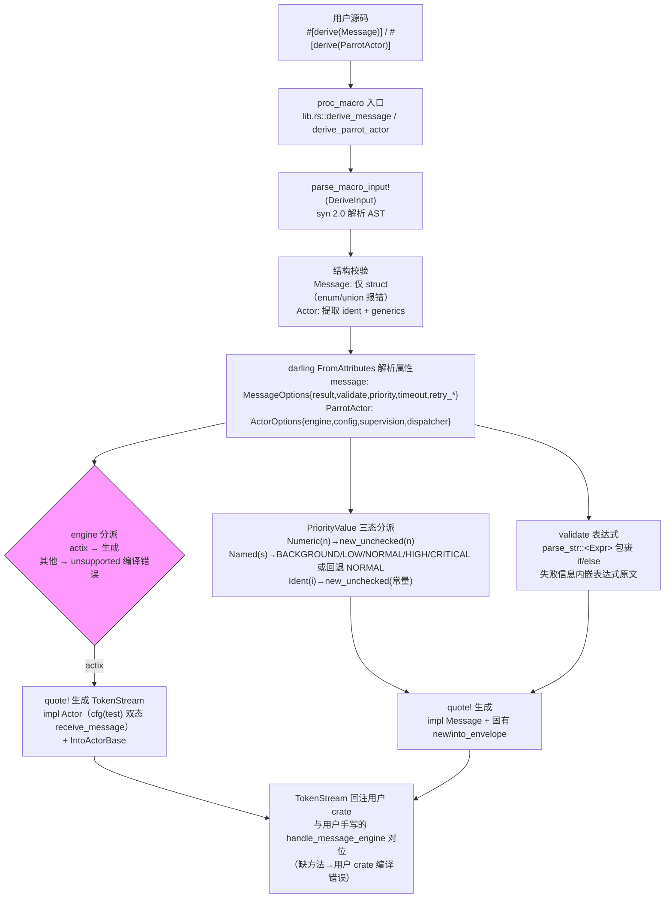

### 2.5 声明宏三件套（`parrot-api::macros`）

| 宏 | 形态 | 展开逻辑 |
|----|------|----------|
| `message_response_ok!` | 基础/`"option"`/`"result"` 三前缀 | `let _: <M as Message>::Result = $value;`（**编译期类型断言**）→ `Ok(Box::new(...))` / `Some(Ok(...))` |
| `match_message!` | 同上三前缀 + `"async"` | `match () { _ if msg.downcast_ref::<T>().is_some() => handler(self, downcast_ref.unwrap()) ... _ => Err(UnknownMessage) }`；`"async"` 版返回 `Ok(Box::pin(fut))` |
| `match_async_message!` | 基础/option/result | 同 match_message 但 handler 含 `.await` |

统一约定：未知消息 → `MessageHandlingError("Unknown message type")`。`"option"` 版正是 actix `Handler::handle` 返回 `Option<ActorResult<...>>` 所需形态。

---

## 3. Actix 后端 `parrot::actix` 详设

### 3.1 适配器模式全景（2026-10 修复轮后）

```
用户 Actor (impl ParrotActor, Context=ActixContext<ActixActor<Self>>)
   └──被包装──> ActixActor<A>（impl actix::Actor + Handler<ActixMessageWrapper>）
                 ├── inner: A
                 ├── ctx: Option<ActixContext<Self>>（started 时创建）
                 └── state: ActorState
                      started()  → state=Running；由 ctx.address() 构造 path="actix://{addr:?}"，
                                   创建 ActixActorRef 包成 Arc 作 ActorPath.target，存 ActixContext
                      stopping() → state=Stopping, Running::Stop
                      stopped()  → state=Stopped

消息通路（双路径）：
  调用方 ActorRefExt::ask(msg) → ActixActorRef::send(Box::new(msg))
    → MessageEnvelope{id,payload,sender:None,options:default,message_type:"unknown"}   ← 注意 message_type 恒 "unknown"
    → ActixMessageWrapper{envelope}（impl actix::Message<Result=Option<ActorResult<BoxedMessage>>>）
    → addr.send(wrapper).timeout(d)? （actix Request 通道）
    → ActixActor::handle(wrapper, actix_ctx) → 返回 AtomicResponse（挂 ctx.wait）
        ├─ StopMessage 拦截 → ctx.stop()，立即 Ready
        ├─ ctx 未初始化 → Ready(Err("context not initialized"))
        ├─ use_async_handler() == false（默认）
        │    → ctx_ptr = NonNull(actix_ctx)
        │    → inner.receive_message_with_engine(payload, &mut self.ctx, ctx_ptr)
        │    → Some(result) → Ready(Some(result))     ← 同步快路径，零额外分配
        │    → None       → Ready(None)               ← 保留旧版"未处理即丢弃"语义
        └─ use_async_handler() == true
             → 在 handle 内创建 inner.receive_message(payload, ctx) 的自引用 future
             → unsafe lifetime 扩展为 'static（安全性论证见 §3.1a）
             → AsyncDispatchFuture{fut} 作为 ActorFuture 返回
             → AtomicResponse 内部 ctx.wait(fut.map(|res,_,_| tx.send(res)))
             → await 期间：arbiter 线程释放（跑其他 actor/timer）；
               本 actor 邮箱被 waiting() 门控（后续消息排队）← actor 串行语义
             → future Ready → actix OneshotSender 发送回复 → ask 端 resolve
    → 原路返回 → ask 端 Message::extract_result downcast 恢复 M::Result
```

spawn 通路（arbiter 池）：

```
ActixActorSystem::spawn_root_typed(actor, config)
  → path = "actix://{type_name}/{uuid::simple()}"        ← 唯一路径，消除同名覆盖
  → arbiter_pool()（懒构建：ArbiterPool::new(arbiter_count)，默认 num_cpus）
  → actix::Actor::start_in_arbiter(&pool.next_arbiter(), |_ctx| ActixActor::new(actor))
      ← round-robin 分配；每个 arbiter = 独立 OS 线程 + 单线程 tokio runtime(enable_all)
  → ActixActorRef 包装 addr → 注册表登记 → 返回
```

### 3.1a 双路径调度的正确性论证（unsafe 边界文档）

`receive_message` 返回的 future 借用 `&'a mut A` 与 `&'a mut A::Context`（自引用），而 actix 的
`ActorFuture` 要求 `'static`。桥接处的 lifetime transmute 依赖三条不变式：

1. **地址稳定**：`ActixActor` 存在于堆上 boxed 的 `ContextFut`（actix spawn 产物），字段地址在
   actor 生命周期内不变。
2. **无别名访问**：future 挂在 `ctx.wait` 队列期间，actix 的 `waiting()` 门控使邮箱不被 poll
   ——不会有第二个 handler 并发触碰被借用字段（`AtomicResponse` 相比 `ResponseActFuture` 的
   区别正在于此：后者用 `ctx.spawn`，邮箱继续取消息，actor 语义变成并发）。
3. **不越界存活**：future 的生命周期被 `AtomicResponse` 内的 wait item 包裹，后者存于
   `ContextFut.wait: SmallVec`——ContextFut drop 时先 poll 一轮再释放 wait item（actix Drop
   实现），不存在 future 越过 actor 存活期被 poll 的路径。

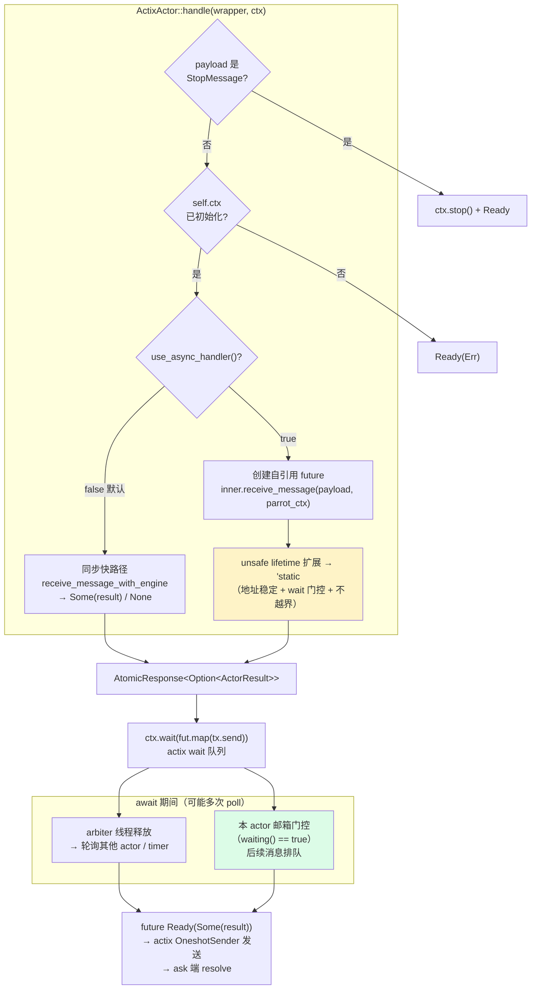

语义保证总结：
- **actor 内串行**：一条消息的 handler 未完成前，下一条消息不会被该 actor 处理（wait 门控）。
- **跨 actor 并行**：不同 actor（尤其不同 arbiter 上的）互不阻塞；同步重 handler 只冻结所在
  arbiter 的线程。
- **ask 语义不变**：回复在 future 完成后才发送；`Addr::send`/`do_send`/`send_with_timeout`
  的错误语义（mailbox closed / delivery timeout）保持。
- **兼容性**：默认路径与旧版行为一致（同步 probe + None 丢弃），存量 actor 无感。

### 3.2 各组件职责与缺口

| 组件 | 实现要点 | 缺口 |
|------|----------|------|
| `ActixContext<A>` | 持 `Arc<Addr<A>>`+path+parent+children；实现 ActorContext 全方法 | `stop` 是空 Ok；`watch/unwatch` 返回 Err 未实现；`stream_registry/spawner` unimplemented!；`schedule_periodic` 是**无限 loop 不会返回的 future**（调度即卡死调用方，见 03 §3-D7）；`set_receive_timeout/set_supervisor_strategy` 空操作 |
| `ActixActorRef<A>` | 包装 `Arc<Addr<ActixActor<A>>>`；`send_with_timeout` 用 actix `Request::timeout`；`stop` 发 StopMessage 信封（**handle 内已拦截并真正 ctx.stop()**）；`is_alive` 用 `addr.connected()`；另提供 `do_send/try_send` 便捷法 | `create_envelope` 的 message_type 恒 "unknown"（元数据丢失）；`stop` 走 do_send 不等待确认 |
| `ActixActorSystem` | 包装 `Arc<actix::System::current()>`；actors 注册表；**内置 ArbiterPool（懒构建，round-robin spawn，`with_arbiter_count(n)` 可调）**；spawn path 唯一化（uuid 后缀） | `broadcast` fire-and-forget；`shutdown` 停 actor 仅 sleep 100ms 后 `System::current().stop()`（粗粒度，不 join arbiter 线程）；registry 字段与 actors 重复（冗余债） |
| `types.rs` | 本地 `MessageEnvelope`（与 api 层**同名不同构**）、`StopMessage`、`ActorId` | ActorContextData 空占位；与 reference.rs 里的 StopMessage **重复定义**（编译靠 mod 隔离，语义靠约定） |
| `message.rs` | `ActixMessageWrapper`（孤儿规则适配：外部 trait × 外部类型不可 impl，故包一层）；`MessageDowncast` 扩展 trait（BoxedMessage 的 downcast 人体工学） | — |
| `actor.rs`（双路径 Handler） | `Handler::Result = AtomicResponse`；同步快路径 + `AsyncDispatchFuture` 异步桥；StopMessage 拦截 | lifetime transmute 依赖 §3.1a 三不变式（文档化契约，非类型系统保证）；`use_async_handler` 尚无 derive 属性入口 |

### 3.3 双通道设计与 `#[cfg(test)]` 的语义分叉

derive 生成的 `receive_message` 在 test 下走用户 `handle_message`（可异步），在正式构建下直接 Err；真正生产路径是 `receive_message_with_engine`（同步、NonNull 透传）。由此产生**同一份用户代码三种测试语义**：
1. `#[cfg(test)]` 单测：异步 handle_message 路径；
2. 运行示例/集成测试（非 test cfg）：engine 路径；
3. 若用户两方法都实现，需保证逻辑一致，框架不校验。

`idea/proposal.md` 记录了这一设计的由来：曾尝试 thread-local / 指针存储 / 特殊消息三种方案暴露原生 context，均因 actix Context 非 Send + async 生命周期失败，最终退而求其次接受 NonNull 直通 + 建议封装安全 API 子集（`actix_addr()` 等）——这是**有据可查的架构决策存档**。

---

## 4. Thread 后端 `parrot::thread` 详设（可编译可运行）

### 4.1 设计目标与总体结构

自研引擎，目标：不依赖 actix、支持双调度模型（共享池 IO 型 / 专用线程计算型）、MPSC/SPSC 邮箱分治、系统级监督。

```
ThreadActorSystem
 ├── config: Arc<ThreadActorSystemConfig>
 ├── registry: Arc<RwLock<HashMap<String, ActorRegistryEntry>>>
 │     ActorRegistryEntry{actor_ref: Arc<dyn ActorRef>, mailbox: Arc<dyn Mailbox>,
 │                        config: ThreadActorConfig, supervisor: Option<Arc<dyn ActorRef>>}
 ├── scheduler_group: Arc<SchedulerGroup>
 │     ├── shared_scheduler: Arc<dyn ThreadScheduler>     → SharedThreadPool
 │     └── dedicated_scheduler: Arc<DedicatedThreadScheduler>
 ├── runtime_handle: tokio::Handle
 ├── shutdown_signal: Arc<Notify> + is_shutting_down: Arc<AtomicBool>
 └── impl ActorSystem for ThreadActorSystem

spawn_internal 流程：
  path = "/{parent}/{name}" 或 "/{name}"（注册表唯一性检查）
  → 按 SchedulingMode 建邮箱：SharedPool→MpscMailbox(flume)；DedicatedThread→SpscRingbufMailbox(ringbuf)
  → 建父引用 / ThreadContext（持 WeakSystemRef）/ ThreadActorRef（持 WeakMailboxRef+WeakSchedulerRef）
  → runtime.spawn(初始化+Start 控制消息)  ← 注意：消息循环本身 TODO
  → 注册表登记 → 按模式 schedule(path, mailbox, config)
```

### 4.2 配置模型

`ThreadActorSystemConfig{shared_pool_size(=CPU数), shared_queue_capacity(10000), max_dedicated_threads(32), default_scheduling_mode(SharedPool{max_messages_per_run:10}), default_mailbox_capacity(1024), default_ask_timeout(5s), default_supervisor_strategy(Restart{3,10s}), default_backpressure_strategy(Block), shutdown_timeout(10s)}`

`ThreadActorConfig{scheduling_mode?, mailbox_capacity?, supervisor_strategy?, ask_timeout?, backpressure_strategy?, thread_stack_size?, yield_after_each_message?, idle_sleep_duration?}`——**全 Option 字段 + `merge_with_actor_config` 与系统默认合并**（ actor 未指定则继承系统默认），是标准的"三级默认值"配置范式（字面量默认 < 系统默认 < actor 覆盖）。

三枚举：
- `SchedulingMode{SharedPool{max_messages_per_run}, DedicatedThread}`
- `BackpressureStrategy{Block, Error, DropOldest, DropNewest}`（邮箱满时行为，语义完备）
- `SupervisorStrategy{Restart{max_retries,within}, Stop, Escalate}`（**与 api 层不同型**：无 Resume；独立枚举）

### 4.3 邮箱体系

`Mailbox` trait（object-safe）：`push(msg, strategy)` / `pop()` / `is_empty` / `len` / `capacity` / `path` / `signal_ready()`（MPSC 用于入队调度，SPSC 空 op）/ `close()` / `set_processor/get_processor`（与处理器反关联）。

| 实现 | 底层 | 结构 | 特点 |
|------|------|------|------|
| `MpscMailbox` | flume bounded | Sender/Receiver + is_ready(AtomicBool) + Notify + is_closed + processor:Option | 多生产者；push 按 strategy 分派（DropNewest=try_send 失败即丢 / Block=async send 等待 / Error=返回 Full / DropOldest=先弹再塞） |
| `SpscRingbufMailbox` | ringbuf HeapRb split + **TokioMutex 包裹** prod/cons + Notify + message_count(AtomicUsize) | 单生产者单消费者 | 注释自述：因 Mailbox trait 是 `&self` 异步方法，无法真锁自由，用 async Mutex 是"性能妥协"（真 lock-free 需 &mut self 签名） |
| `spsc.rs` | （旧实现，被 ringbuf 版替代演进中） | — | — |

### 4.4 处理器（ActorProcessor）

```
ActorProcessor<A> { actor: Mutex<ThreadActor<A>>, context: Mutex<ThreadContext<A>>,
                    mailbox: Arc<Mutex<dyn Mailbox>>, path, config,
                    status: Arc<AtomicUsize → ProcessorStatus>, stats: Arc<ProcessorStats> }
ProcessorStatus: Initializing=0 Running=1 Paused=2 Stopping=3 Stopped=4 Failed=5
ProcessorStats: messages_processed / errors_encountered / processing_time_ns（全 AtomicUsize）

生命周期方法：initialize_actor() → start_actor()（发 Start 控制消息）→ … → stop_actor()
消息执行：process_message(msg)
  └─ catch_unwind(AssertUnwindSafe(|| actor.process_message(msg, ctx)))   ← panic 隔离
       ├─ Ok(fut) → fut.await → Ok/Err（Err 记 errors_encountered）
       └─ Err(panic) → ActorError::Panic("Panic in actor {path}: ...")
批量执行：process_batch_of_messages(max, yield_each)
  └─ 循环 mailbox.pop() → process_message；遇 Panic 立即中断批次
```

`ActorProcessorManager`：`Arc<Mutex<HashMap<String, Arc<Mutex<dyn Any+Send+Sync>>>>>` 注册表 + `create_processor`（类型擦除工厂）。`ProcessorInterface{as_any/as_any_ref/as_any_mut}` 提供类型恢复通道。

### 4.5 调度器体系

```
ThreadScheduler trait（object-safe）：schedule(path, mailbox, config) / deschedule(path) /
                                    is_scheduled(path) / shutdown()
TypedThreadScheduler：schedule_typed<A>（泛型辅助）
SchedulerGroup{shared_scheduler, dedicated_scheduler}  ← 本次重构新增的聚合体
ThreadSchedulerFactory{runtime_handle} → create_scheduler_group(shared_cfg?, dedicated_cfg?)

SharedThreadPool：
  pool_size / workers: Vec<JoinHandle> / scheduling_queue: Arc<SchedulingQueue> / …
  SchedulingQueue = crossbeam SegQueue<Arc<dyn Mailbox>> + Notify（lock-free，push O(1)，
                   空队列时 notify_one 唤醒 worker）
  Worker 循环：try_pop mailbox → process_batch_of_messages(batch_size) →
               mailbox 仍有消息则重新入队（work-stealing 风格回投）
  worker_manager：worker 生命周期/状态管理

DedicatedThreadScheduler：
  workers: Mutex<HashMap<String, Worker>>（path→独立 Worker）
  Worker：独立 OS 线程（默认栈 3MB）+ mailbox + command_tx: mpsc<WorkerCommand{Shutdown,Pause,Resume,Stop(oneshot)}>
  WorkerState: Initializing/Idle/Paused/Processing/ShuttingDown/Error
  适用计算密集型 actor；panic 捕获同 processor
```

### 4.6 通信协议（thread 内部）

- `ControlMessage{Start, Stop, ChildFailure{path,reason}, SystemShutdown, HealthCheck}`——thread 引擎的"系统层信令"，在 `ThreadActor::process_message` 里优先于用户消息拦截分发。
- `AskEnvelope{payload, reply: Box<dyn ReplyChannel>}`；`ReplyChannel` trait + `ThreadReplyChannel(oneshot::Sender<ActorResult<BoxedMessage>>)`（发送失败=询问方超时/退出，忽略并报 ReplyChannelError）。
- `WatchRequest{watcher_path}` / `UnwatchRequest`：以**普通消息**形式发给被观察者，由 ThreadActor 登记到 `watchers: HashSet<ActorPath>`（watch 机制的实现载体——用消息协议代替了系统侧回调注册）。
- `ThreadActorRef` 发送三形态：`send_with_strategy`（push+schedule，tell 语义，内部走 AskEnvelope——2026-10 修复轮起 `send` 桥接 `ask_with_strategy_and_timeout`）；`send_with_timeout`（带超时的 ask）；`ask_with_strategy_and_timeout`（AskEnvelope + oneshot + timeout，真 ask）。**`ActorRef::send` trait 方法现与 actix 后端语义等价**（统一 API 的 ask 在 thread 路径拿到真回复，压测验证；原 D3 设计债已消除）。纯 tell 场景需最高吞吐时用引擎特有的 `send_msg`（fire-and-forget，压测 66k/s vs ask 62k/s）。

### 4.7 `ThreadContext` 与 `SystemRef`

- `SystemRef` trait（context 视角的系统窄接口）：`runtime_handle / default_ask_timeout / default_backpressure_strategy / spawn_actor(BoxedMessage…)`——**接口隔离**（context 不见全系统）。
- `ThreadContext<A>` 持 `WeakSystemRef`，实现 ActorContext + ActorSpawner（self 即 spawner）。ask 已具备真实语义（经 ActorRef::send 的 AskEnvelope 桥接）；watch/unwatch 返回 Ok 空操作；stream_registry panic。

---

## 5. 系统聚合层与日志详设

### 5.1 `ParrotActorSystem`（`parrot/src/system.rs`）

- 状态：`config + systems: RwLock<HashMap<String, ActorSystemImpl>> + default_system: RwLock<Option<String>>`。
- 路由策略：spawn 默认走 default（无 default 报错）；`get_actor` 先查 default 再**遍历全部注册系统**（跨后端查找）；broadcast 遍历全部；shutdown 逐个关闭并聚合错误。
- `ActorSystemImpl::spawn_root_typed<A>`（泛型版）**恒返回错误**，引导用户使用 `spawn_root_typed_actix`（约束 `A: Actor<Context=ActixContext<ActixActor<A>>>`）——统一入口在泛型层的让步（ADR-6）。
- `impl ActorSystem for ParrotActorSystem`：`start()` 仅构造空容器（不预启动任何后端）；`spawn_root_boxed` 未实现；`status()` 返回全零占位。

### 5.2 `logging`

- `LogConfig{level, json_format, …}` + `Once` 单次初始化；预设 `init_default / init_development(DEBUG+彩色) / init_production(INFO+JSON+无行号)` / `init_with_file`（双输出）。
- 基于 `tracing_subscriber::Registry + EnvFilter + fmt layer`（json 特性）；re-export tracing 宏 + `actor_span!(name, id)` / `log_lifecycle!` 专用宏（actor 语义 span）。

---

## 6. 数据结构总览（字段级）

| 结构体 | 关键字段（类型） | 所属 |
|--------|------------------|------|
| ActorPath | target: WeakActorTarget(Arc<dyn ActorRef>), path: String | api |
| MessageEnvelope | id: Uuid, payload: Box<dyn Any+Send>, sender: Option<Box<dyn ActorRef>>, options: MessageOptions, message_type: &'static str | api |
| MessageOptions | timeout: Option<Duration>, retry_policy: Option<RetryPolicy>, priority: MessagePriority | api |
| MessagePriority | u8（0–100） | api |
| ActorSystemConfig | name, runtime_config, guardian_config, timeouts | api |
| ActixActor<A> | inner: A, ctx: Option<ActixContext<Self>>, state: ActorState | actix |
| ActixContext<A> | addr: Arc<Addr<A>>, path: ActorPath, parent: Option<Arc<BoxedActorRef>>, children: Option<Arc<RwLock<Vec<BoxedActorRef>>>> | actix |
| ActixActorRef<A> | addr: Arc<Addr<ActixActor<A>>>, path: String | actix |
| ArbiterPool | workers: Arc<Vec<ArbiterHandle>>, next: Arc<AtomicUsize> | actix |
| ActixActorSystem | system: Arc<ActixSystem>, actors/registry: RwLock<HashMap>, default_dispatcher, arbiters: RwLock<Option<ArbiterPool>>, arbiter_count: usize | actix |
| AsyncDispatchFuture<A> | fut: Option<BoxedFuture<'static, ActorResult<BoxedMessage>>>, _marker | actix（双路径 Handler 的异步桥） |
| ThreadActor<A> | inner: A, state, path: ActorPath, watchers: Option<HashSet<ActorPath>> | thread |
| ThreadContext<A> | system: WeakSystemRef, runtime_handle, self_ref: Option<BoxedActorRef>, parent_ref, children_refs: Option<Arc<RwLock<HashMap<String, BoxedActorRef>>>>, path, supervisor_strategy, receive_timeout, backpressure_strategy | thread |
| ThreadActorRef<A> | path, mailbox: WeakMailboxRef, default_strategy, default_timeout, scheduler: WeakSchedulerRef, _marker: PhantomData<A> | thread |
| MpscMailbox | flume Sender/Receiver, path, capacity, is_ready, notify, is_closed, processor | thread |
| SpscRingbufMailbox | TokioMutex<HeapProd>, TokioMutex<HeapCons>, path, capacity, notify, is_ready, is_closed, message_count, processor | thread |
| ActorProcessor<A> | actor: Mutex<ThreadActor<A>>, context: Mutex<ThreadContext<A>>, mailbox: Arc<Mutex<dyn Mailbox>>, path, config, status: Arc<AtomicUsize>, stats | thread |
| ThreadActorSystem | config, registry, scheduler_group, runtime_handle, shutdown_signal, is_shutting_down | thread |
| ThreadActorSystemConfig | 9 默认值字段（§4.2） | thread |
| ActorRegistryEntry | actor_ref, mailbox, config, supervisor | thread（私有） |
| ParrotActorSystem | config, systems: RwLock<HashMap<String, ActorSystemImpl>>, default_system | system |

---

## 7. 全套图（Mermaid）

### 7.1 核心 trait 类图

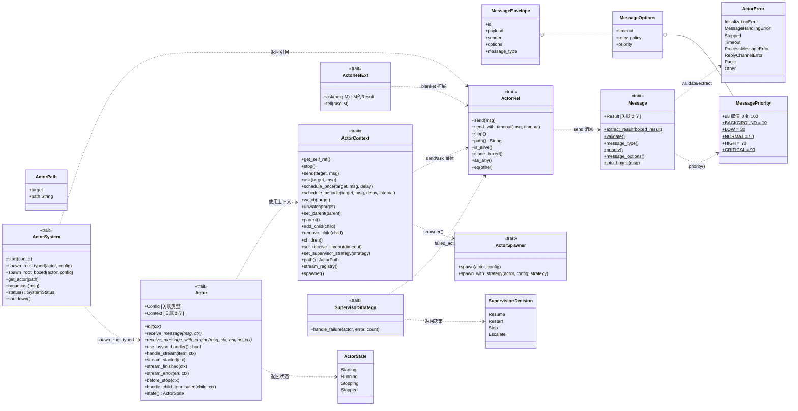

> 实现侧类（ActixActor/ActixActorRef/ThreadActor/ThreadActorRef 等与 trait 的 realize 关系）见 01 §6.2 模块图与 §3/§4 文字详设，此处类图聚焦规范层契约。

### 7.2 Actor 生命周期状态机

```mermaid
stateDiagram-v2
    direction LR
    [*] --> Starting : spawn<br/>(ActixActor::new / ThreadActor::new)

    Starting --> Running : actix: started()<br/>thread: ControlMessage::Start

    state Running {
        [*] : receive_message_with_engine<br/>逐条处理消息
        ProcessBatch : thread: process_batch_of_messages<br/>(max_messages_per_run 限批)
    }

    Running --> Stopping : stop 请求<br/>(StopMessage / ControlMessage..Stop / SystemShutdown)
    Stopping --> Stopped : actix: stopping()→Running..Stop<br/>thread: before_stop() 完成后
    Running --> Stopped : init 失败(thread 直接 Stopped)

    Stopped --> [*]

    note right of Starting
        Thread 后端额外约束：
        非 Running 状态收到普通消息
        → Err("Actor is not running")
    end note
    note left of Stopping
        HealthCheck 消息在任何状态
        返回当前 ActorState（thread）
    end note
```

### 7.3 Processor / Scheduler / Worker 状态机（thread 后端）

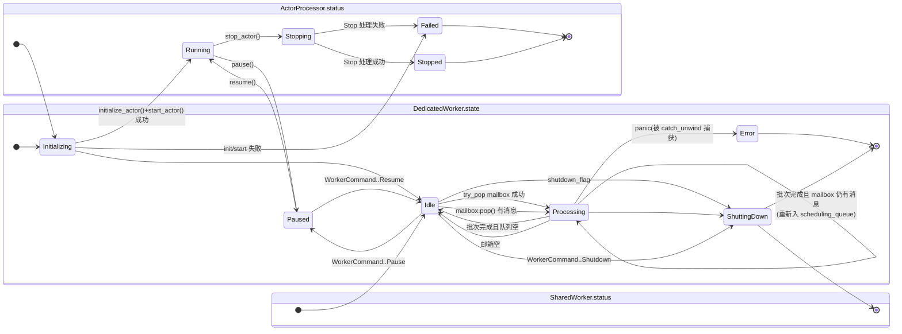

### 7.4 时序图 · Actix 后端 ask 全链路（双路径）

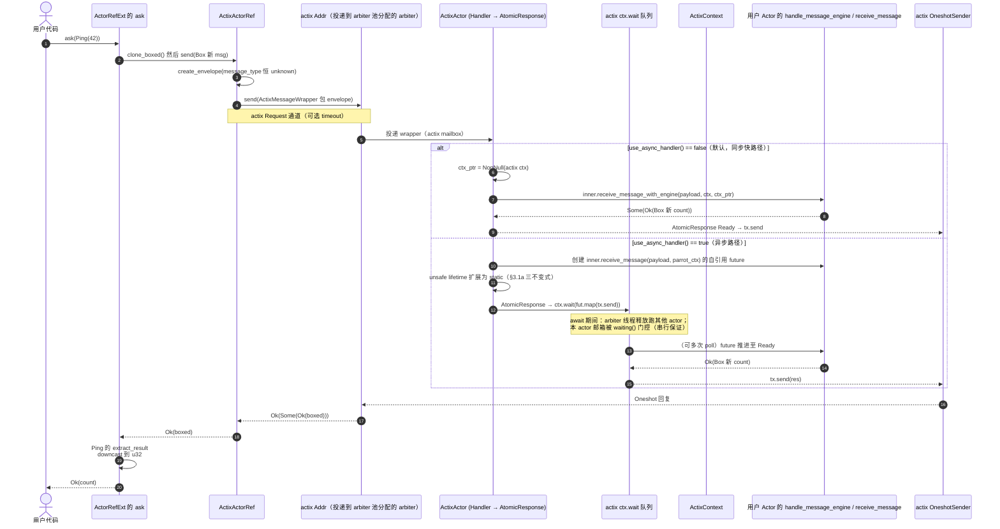

### 7.5 时序图 · Thread 后端 spawn 与消息处理

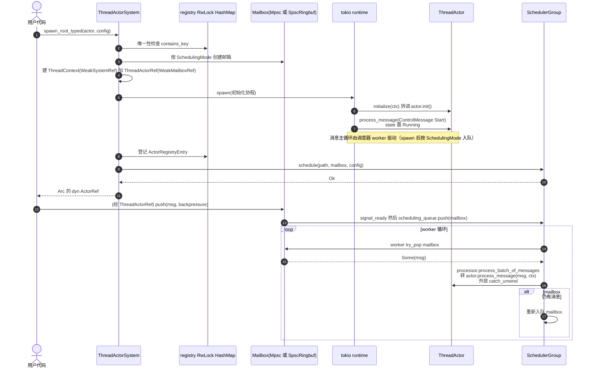

### 7.6 时序图 · Thread ask（oneshot 回复）

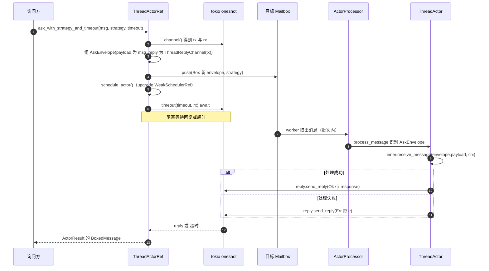

### 7.7 ER 图 · 运行时对象模型

```mermaid
erDiagram
    PARROT_ACTOR_SYSTEM ||--o{ REGISTERED_SYSTEM : "systems map 按名注册"
    REGISTERED_SYSTEM ||--o| DEFAULT_MARKER : "default_system"
    ACTIX_ACTOR_SYSTEM ||--o| ARBITER_POOL : "arbiters 懒构建 Option"
    ARBITER_POOL ||--|{ ARBITER_HANDLE : "workers Vec round-robin"
    ARBITER_HANDLE ||--o{ ACTIX_ACTOR : "start_in_arbiter 承载"
    ACTIX_ACTOR_SYSTEM ||--o{ ACTIX_REGISTRY_ENTRY : "actors map"
    ACTIX_REGISTRY_ENTRY ||--|| BOXED_ACTOR_REF : "值"
    BOXED_ACTOR_REF ||--|| ACTIX_ACTOR_REF : "Actix 后端实现体"
    ACTIX_ACTOR_REF }o--|| ACTIX_ADDR : "addr Arc"
    ACTIX_ADDR ||--|| ACTIX_ACTOR : "一对一投递"
    ACTIX_ACTOR ||--|| USER_ACTOR_A : "inner 包装"
    ACTIX_ACTOR ||--o| ACTIX_CONTEXT : "ctx Option"
    ACTIX_CONTEXT }o--|| ACTIX_ADDR : "addr Arc"
    ACTIX_CONTEXT |o--o| ACTIX_CONTEXT : "parent"
    ACTIX_CONTEXT ||--o{ BOXED_ACTOR_REF : "children"

    THREAD_ACTOR_SYSTEM ||--o{ THREAD_REGISTRY_ENTRY : "registry map"
    THREAD_REGISTRY_ENTRY ||--|| THREAD_ACTOR_REF_ARC : "actor_ref Arc"
    THREAD_REGISTRY_ENTRY ||--|| MAILBOX : "mailbox Arc"
    THREAD_REGISTRY_ENTRY |o--o| THREAD_ACTOR_REF_ARC : "supervisor即parent"
    THREAD_REGISTRY_ENTRY }o--|| THREAD_ACTOR_CONFIG : "config"
    THREAD_ACTOR_SYSTEM ||--|| SCHEDULER_GROUP : "持Arc"
    SCHEDULER_GROUP ||--|| SHARED_THREAD_POOL : "shared_scheduler"
    SCHEDULER_GROUP ||--|| DEDICATED_SCHEDULER : "dedicated_scheduler"
    SHARED_THREAD_POOL ||--|| SCHEDULING_QUEUE : "就绪邮箱队列"
    SCHEDULING_QUEUE }o--o{ MAILBOX : "排队引用"
    SHARED_THREAD_POOL ||--o{ SHARED_WORKER : "workers"
    SHARED_WORKER }o--o| THREAD_ACTOR_SYSTEM : "system Weak"
    DEDICATED_SCHEDULER ||--o{ DEDICATED_WORKER : "workers map"
    DEDICATED_WORKER }o--o| THREAD_ACTOR_SYSTEM : "Weak"
    DEDICATED_WORKER ||--|| MAILBOX : "专属邮箱"
    MAILBOX |o--o| ACTOR_PROCESSOR : "processor反关联"
    ACTOR_PROCESSOR ||--|| THREAD_ACTOR : "actor Mutex"
    ACTOR_PROCESSOR ||--|| THREAD_CONTEXT : "context Mutex"
    THREAD_ACTOR ||--|| USER_ACTOR_B : "inner 包装"
    THREAD_ACTOR ||--o{ ACTOR_PATH : "watchers Set"
    THREAD_CONTEXT }o--o| THREAD_ACTOR_SYSTEM : "system WeakSystemRef"
    THREAD_CONTEXT ||--|| ACTOR_PATH : "path"
    THREAD_CONTEXT ||--o{ BOXED_ACTOR_REF : "children map"
    THREAD_CONTEXT |o--o| BOXED_ACTOR_REF : "parent"
    THREAD_ACTOR_REF_ARC }o--o| MAILBOX : "mailbox Weak"
    THREAD_ACTOR_REF_ARC }o--o| SCHEDULER_GROUP : "scheduler Weak"
    ACTOR_PROCESSOR ||--|| PROCESSOR_STATS : "原子计数"
    PARROT_ACTOR_SYSTEM ||--o| ACTIX_ACTOR_SYSTEM : "Actix变体"

    USER_ACTOR_A : "impl parrot_api Actor"
    USER_ACTOR_B : "impl parrot_api Actor"
    ACTOR_PATH : "target加path字符串"
    BOXED_ACTOR_REF : "Box dyn ActorRef"
    THREAD_ACTOR_REF_ARC : "Arc ThreadActorRef"
```

要点：① 强引用链 system→scheduler→worker 向下，worker/context→system 全部 Weak 向上（防环）；② mailbox ↔ processor 双向可寻（mailbox 持 processor 引用，processor 持 mailbox Arc）；③ 同一抽象（ActorRef/Context/Mailbox）在两后端各有一套实现体，仅经规范层 trait 对外统一。

### 7.8 数据流图 · 消息类型擦除与恢复

```mermaid
flowchart LR
    subgraph CT["编译期"]
        DM["#[derive(Message)]<br/>type Result = u32"]
        DA["#[derive(ParrotActor)]<br/>Context 绑定"]
    end

    subgraph ST["强类型区（发送方）"]
        M["Ping(42): impl Message"]
    end

    subgraph ER["传输区（类型擦除）"]
        B1["Box::new(msg)<br/>BoxedMessage = Box&lt;dyn Any+Send&gt;"]
        ENV["MessageEnvelope<br/>{id,payload=B1,sender,<br/>options,message_type}"]
        WRAP["ActixMessageWrapper<br/>(actix 后端)<br/>或 AskEnvelope{payload,reply}<br/>(thread ask)"]
        MBX["Mailbox: push(BoxedMessage)"]
    end

    subgraph RR["恢复区（接收方）"]
        DC["msg.downcast_ref::&lt;Ping&gt;()"]
        H["用户 handle_message_engine<br/>match_message! 分派"]
        RES["message_response_ok!<br/>编译期断言返回类型"]
        B2["Ok(Box::new(result))<br/>再次擦除"]
    end

    subgraph BK["回程"]
        EXT["Message::extract_result<br/>downcast::&lt;u32&gt;() 恢复"]
        FINAL["Ok(42): M..Result"]
    end

    DM -.生成.-> M
    DA -.生成.-> H
    M -->|"into_boxed / Box::new"| B1 --> ENV --> WRAP --> MBX
    MBX -->|"worker/processor 取出"| DC --> H --> RES --> B2
    B2 -->|"回程信封/oneshot"| EXT --> FINAL

    style ER fill:#fef3c7
    style ST fill:#dcfce7
    style RR fill:#dcfce7
```

> 全链路共 **2 次装箱 + 2 次 downcast**（请求/响应各一轮）；类型契约由 derive（Result 关联类型）+ 宏（编译期断言）在两端锚定，中间传输完全类型无关。

### 7.9 共享线程池调度模型图

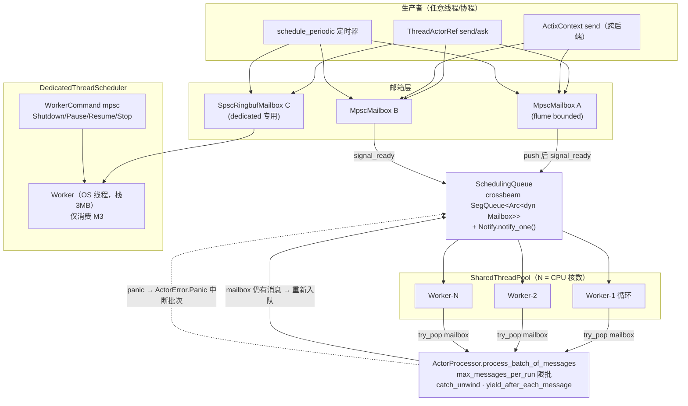

### 7.10 监督决策流程图（规范设计）

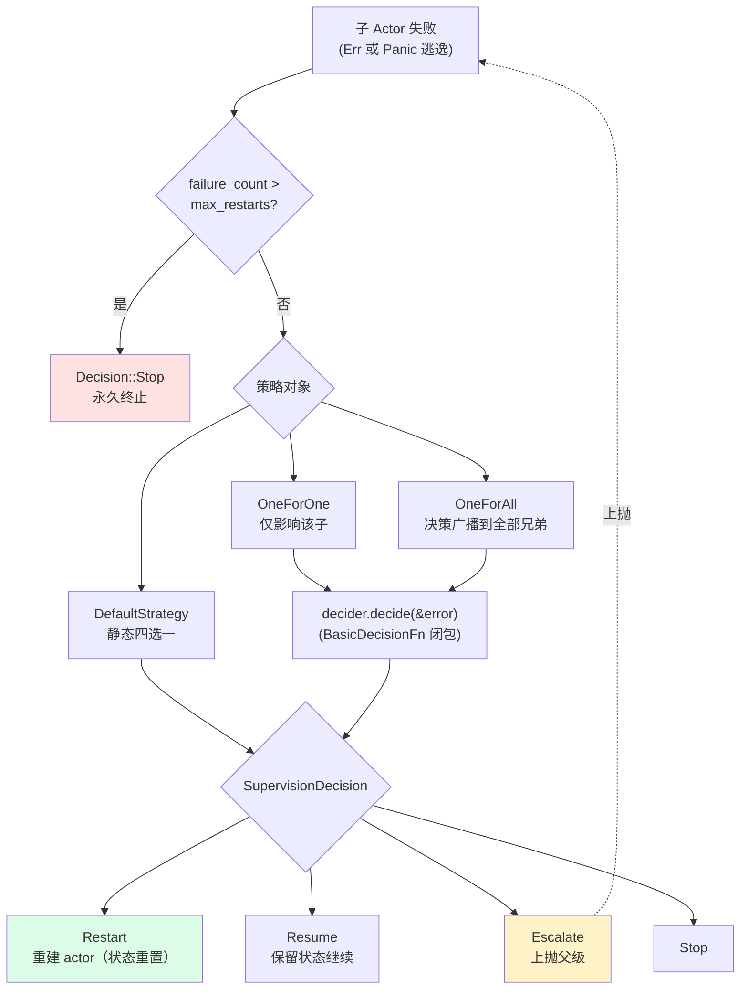

> ⚠️ 现状：此流程图描述的是**规范层已定义的决策语义**；实现层尚无 `handle_failure` 的调用方（thread 后端 `handle_actor_termination` 仅做"通知父级 ChildFailure + 移除注册表"，Restart/Resume/Escalate 执行器未落地）。`within` 时间窗参数未参与熔断判断。

### 7.11 系统关停时序图（双后端对比）

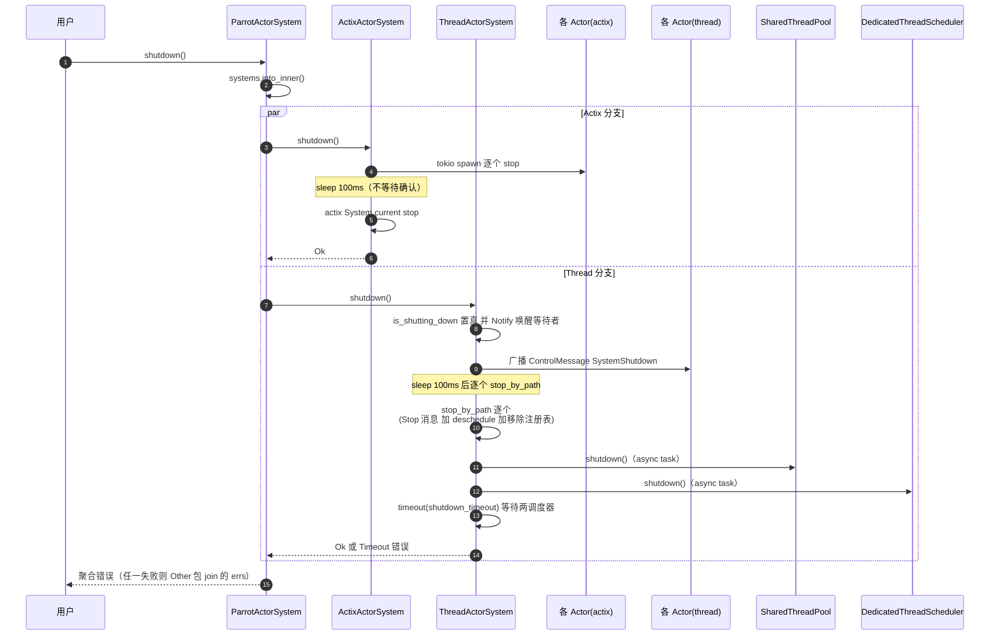

---

> 续读：[03 质量分析与改进路线](./TECH_DESIGN_03_质量分析与改进路线.md)（编译错误根因 / 未完成功能台账 / 设计债 / 改进路线）
